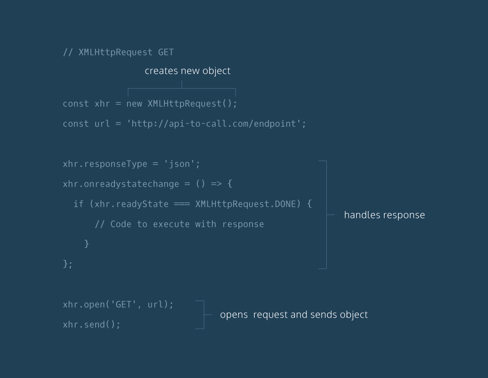
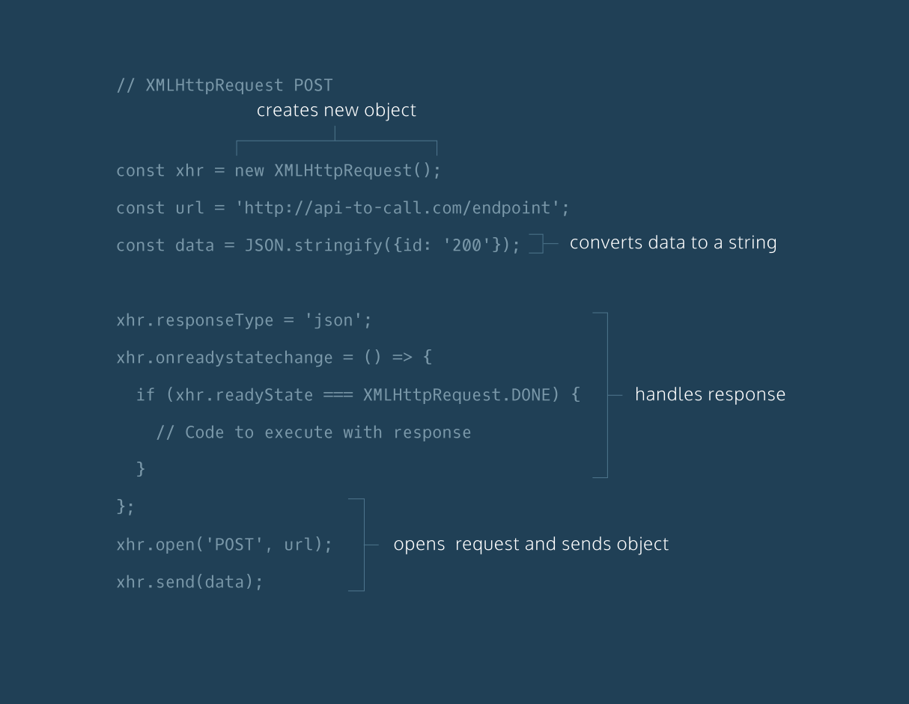

# Async Javascript  

[Ajax Documentation](https://developer.mozilla.org/en-US/docs/Web/Guide/AJAX)

There are four parts of a browser. 
1. Javascript consisting of memory heap and call stack
2. Web APIs like setTimeout, DOM, XMLHttpRequest etc
3. Event Queue or callback queue
4. Event loop

An asynchronous operation is one that allows the computer to “move on” to other tasks while waiting for the asynchronous operation to complete. Asynchronous programming means that time-consuming operations don’t have to bring everything else in our programs to a halt.

Js is single threaded. It means that it will execute next process untill it finishes with the current process.

Let's understand behavior of browser on a asynchronous operation. Consider the code - 
```
console.log('1'); // Line 1
setTimeout(() => {
  console.log('2'); // Line 2
}, 2000);
console.log('3'); // Line 3
```
Line 1 and 3 are synchronous calls and are outputted directly. On encountering setTimeout, since it's a web api, browser sends it to Web API and web api waits for 2 seconds. Then it sends the callback to event/callback queue. Now, here, event loop checks the call stack. If it's free, it pops callback from queue and adds to call stack for exection. If call stack is still not empty, it waits for it to get empty.

For example, consider the following code:
```
const btn = document.querySelector('button');
btn.addEventListener('click', () => {
  alert('You clicked me!');

  let pElem = document.createElement('p');
  pElem.textContent = 'This is a newly-added paragraph.';
  document.body.appendChild(pElem);
});
```
Here, addition of new paragraph will occur only when it executes and exits the alert process. So, output won't be displayed untill alert finishes.

JS Execution :  Task 1 -> Task 2 -> Task 3

__But__ many times, we got into situation when we have to complete a lengthy task but also, don't want the UI to be hold still till task finishes like, downloading an image and continue rendering other parts of website.

Synchronous execution posses one more issue in places where we are intracting with some process and its next process depends on result of previous process but previous process takes time. For example, downloading an image will take time depending on bandwidth and its display will depend on output of download.

```
let response = downloadImage();
displayImage(response.image);  //it should be hold untill image is downloaded completely
```

For such works, we need asynchronous methodology. It facilitates asynchronous behaviour in the execution using some type of callback mechanisms. As callback means *called back* will be executed once it finishes with other process like, displaying an image or destructuring JSON object once it is downloaded. 

__Note__ : Not all callbacks are asynchronous. Some are synchronous for eg, Array.forEach, Array.indexOf, etc

### Execution order of async code <a name="execution-order"></a>

```
console.log ('Starting');
let image;

fetch('coffee.jpg').then((response) => {
  console.log('It worked :)')
  return response.blob();
}).then((myBlob) => {
  let objectURL = URL.createObjectURL(myBlob);
  image = document.createElement('img');
  image.src = objectURL;
  document.body.appendChild(image);
}).catch((error) => {
  console.log('There has been a problem with your fetch operation: ' + error.message);
});

console.log ('All done!');
```

The browser will begin executing the code, see the first ```console.log()``` statement (Starting) and execute it, and then create the image variable.

It will then move to the next line and begin executing the ```fetch()``` block but, because ```fetch()``` executes asynchronously without blocking, code execution continues after the promise-related code, thereby reaching the final ```console.log()``` statement (All done!) and outputting it to the console.

Only once the ```fetch()``` block has completely finished running and delivering its result through the ```.then()``` blocks will we finally see the second ```console.log()``` message (```It worked :```)) appear. So the messages have appeared in a different order to what you might expect:

* Starting
* All done!
* It worked :)

### Event Queue
Async processes like promises, setTimeout, setInterval etc are put into an __event queue__, which runs after the main thread has finished processing so that they do not block subsequent JavaScript code from running. The queued operations will complete as soon as possible then return their results to the JavaScript environment.

## Cooperative asynchronous javascript (Timeouts and Intervals)
These are traditional methods for running code asynchronously after a set time period has elapsed. Depending on how processor-intensive these operations are, they can delay your async code even further, as any async code will execute only after the main thread is available.

1. ```setTimeout()```
setTimeout() executes a particular block of code once after a specified time has elapsed. It takes the following parameters:

  * A function to run, or a reference to a function defined elsewhere.
  * A number representing the time interval in milliseconds (1000 milliseconds equals 1 second) to wait before executing the code. If you specify a value of 0 (or omit the value), the function will run as soon as possible.
  * Zero or more values that represent any parameters you want to pass to the function when it is run.

  ```
  // With a named function
  let myGreeting = setTimeout(function sayHi(who) {
    alert('Hello '+who);
  }, 2000, 'Mr David');

  // With a function defined separately
  function sayHi(who) {
    alert('Hello '+who);
  }

  let myGreeting = setTimeout(sayHi, 2000, 'Mr David');
  ```

  * Clearing timeouts
  Finally, if a timeout has been created, you can cancel it before the specified time has elapsed by calling clearTimeout(), passing it the identifier of the setTimeout() call as a parameter. So to cancel our above timeout, you'd do this:
  ```
  clearTimeout(myGreeting);
  ```

2. ```setInterval()```
This works in a very similar way to setTimeout(), except that the function you pass as the first parameter is executed repeatedly at no less than the number of milliseconds given by the second parameter apart, rather than once. 
```
function displayTime() {
   let date = new Date();
   let time = date.toLocaleTimeString();
   document.getElementById('demo').textContent = time;
}

const createClock = setInterval(displayTime, 1000);
clearInterval(createClock);  // clearing interval
```

## Promise

Promises are objects that represent the eventual outcome of an asynchronous operation. A Promise object can be in one of three states:

* Pending: The initial state— the operation has not completed yet.
* Fulfilled: The operation has completed successfully and the promise now has a resolved value. For example, a request’s promise might resolve with a JSON object as its value.
* Rejected: The operation has failed and the promise has a reason for the failure. This reason is usually an Error of some kind.

All promises eventually settle, enabling us to write logic for what to do if the promise fulfills or if it rejects.


Constructing a Promise

```
const executorFunction = (resolve, reject) => {
  if (someCondition) {
      resolve('I resolved!');
  } else {
      reject('I rejected!'); 
  }
}
const myFirstPromise = new Promise(executorFunction);
```

```.then()``` is a higher order function that allows us to execute what to do after a promise has resolved. It takes two callback functions as arguments.When the promise settles, the appropriate handler will be invoked with that settled value.

* The first handler, sometimes called onFulfilled, is a success handler, and it should contain the logic for the promise resolving.
* The second handler, sometimes called onRejected, is a failure handler, and it should contain the logic for the promise rejecting.

We can invoke ```.then()``` with one, both, or neither handler! This allows for flexibility, but it can also make for tricky debugging. If the appropriate handler is not provided, instead of throwing an error, ```.then()``` will just return a promise with the same settled value as the promise it was called on. __One important feature of ```.then()``` is that it always returns a promise.__ Bear in mind that the value returned by a fulfilled promise becomes the parameter passed to the next .then() block's callback function.

```
let prom = new Promise((resolve, reject) => {
  let num = Math.random();
  if (num < .5 ){
    resolve('Yay!');
  } else {
    reject('Ohhh noooo!');
  }
});
 
const handleSuccess = (resolvedValue) => {
  console.log(resolvedValue);
};
 
const handleFailure = (rejectionReason) => {
  console.log(rejectionReason);
};
 
prom.then(handleSuccess, handleFailure);
```

### ```.catch()```: Responding to failure

```.catch()``` is a failure handler that will be invoked once a promise is rejected.
__Note__: ```.then()/.catch()``` blocks in promises are basically the async equivalent of a ```try...catch``` block in sync code. Bear in mind that synchronous ```try...catch``` won't work in async code.

```
prom
  .then((resolvedValue) => {
    console.log(resolvedValue);
  })
  .catch((rejectionReason) => {
    console.log(rejectionReason);
  });
```
We can also chain all blocks together and then, have only one ```.catch()``` handler if any fails.

### Chaining multiple promises
```
firstPromiseFunction()
.then((firstResolveVal) => {
  return secondPromiseFunction(firstResolveVal);
})
.then((secondResolveVal) => {
  console.log(secondResolveVal);
});
```

### ```.finally()```
the ```.finally()``` method is available, which can be chained onto the end of your regular promise chain allowing you to cut down on code repetition and do things more elegantly.
```
myPromise
.then(response => {
  doSomething(response);
})
.catch(e => {
  returnError(e);
})
.finally(() => {
  runFinalCode();
});
```

### Avoiding common mistakes using promises
1. Nesting promises instead of chaining them
```
returnsFirstPromise()
.then((firstResolveVal) => {
  return returnsSecondValue(firstResolveVal)
    .then((secondResolveVal) => {
      console.log(secondResolveVal);
    })
})
```

2. Forgetting to return a promise
Since forgetting to return our promise won’t throw an error, this can be a really tricky thing to debug!
```
returnsFirstPromise()
.then((firstResolveVal) => {
  returnsSecondValue(firstResolveVal)
})
.then((someVal) => {
  console.log(someVal);  // return a promise
})
```

### Maximizing concurrency with ```Promise.all()```
If we want a number of tasks to be done asynchronously without worrying about their order of execution, we can use ```Promise.all()``` to make multiple asynchronous operations happen together. It returns a single promise which can settle in one of the two ways:

* If every promise in the argument array resolves, the single promise returned from Promise.all() will resolve with an array containing the resolve value from each promise in the argument array.

* If any promise from the argument array rejects, the single promise returned from Promise.all() will immediately reject with the reason that promise rejected. This behavior is sometimes referred to as failing fast.

```
let myPromises = Promise.all([returnsPromOne(), returnsPromTwo(), returnsPromThree()]);
 
myPromises
  .then((arrayOfValues) => {
    console.log(arrayOfValues);
  })
  .catch((rejectionReason) => {
    console.log(rejectionReason);
  });
```
For promises that can fail, use `Promise.allSettled` to run all promises irrespective either fullfilled or rejected.

## Async Await : ES8 syntactic sugar for Async operations

### `async` keyword
The async keyword is used to write functions that handle asynchronous actions. We wrap our asynchronous logic inside a function prepended with the async keyword.

```
async function myFunc() {
  // Function body here
};
 
myFunc();
```

```
const myFunc = async () => {
  // Function body here
};
 
myFunc();
```

`async` functions always return a promise. This means we can use traditional promise syntax, like ```.then()``` and ```.catch``` with our async functions. An `async` function will return in one of three ways:

* If there’s nothing returned from the function, it will return a promise with a resolved value of `undefined`.
* If there’s a non-promise value returned from the function, it will return a promise resolved to that value.
* If a promise is returned from the function, it will simply return that promise

```
async function fivePromise() { 
  return 5;
}
 
fivePromise()
.then(resolvedValue => {
    console.log(resolvedValue);
  })  // Prints 5
```

### `await` operator
It can be used only inside an async function. It's an operator that __returns the resolved value of a promise__. Since promises resolve in an indeterminate amount of time, await halts, or pauses, the execution of our async function until a given promise is resolved.

Carefully consider the example given below:

```
const brainstormDinner = () => {
  return new Promise((resolve, reject) => {
  console.log(`I have to decide what's for dinner...`)
  setTimeout(() => {
    console.log('Should I make salad...?');
    setTimeout(() => {
      console.log('Should I make ramen...?');
      setTimeout(() => {
        console.log('Should I make eggs...?');
        setTimeout(() => {
          console.log('Should I make chicken...?');
          resolve('beans');
        }, 1000);
      }, 1000);
    }, 1000);
  }, 1000);
});
};

// Native promise version:
function nativePromiseDinner() {
  brainstormDinner().then((meal) => {
	  console.log(`I'm going to make ${meal} for dinner.`);
  });
}


// async/await version:
async function announceDinner() {
  let meal = await brainstormDinner(); // halts the announceDinner function untill it resolves
  console.log(`I'm going to make ${meal} for dinner.`);
}

announceDinner();
```

### Writing async functions
If we don't use the operator await, then execution doesn't halt and promise might not have been resolved or rejected. This will return an unfullfilled promise. See example below:
```
let myPromise = () => {
  return new Promise((resolve, reject) => {
    setTimeout(() => {
      resolve('Yay, I resolved!')
    }, 1000);
  });
}
async function noAwait() {
 let value = myPromise();
 console.log(value);
}
 
async function yesAwait() {
 let value = await myPromise();
 console.log(value);
}
 
noAwait(); // Prints: [object Promise]
yesAwait(); // Prints: Yay, I resolved!
```

### Handling dependent promises

Native chaining
```
function nativePromiseVersion() {
  returnsFirstPromise()
    .then((firstValue) => {
      console.log(firstValue);
      return returnsSecondPromise(firstValue);
    })
   .then((secondValue) => {
      console.log(secondValue);
    });
}
```

With async and await
```
async function asyncAwaitVersion() {
  let firstValue = await returnsFirstPromise();
  console.log(firstValue);
  let secondValue = await returnsSecondPromise(firstValue);
  console.log(secondValue);
}
```

### Handling independent promises

```
async function myAsyncFun() {
  let firstVal = await getPromise1();
  let secondVal = await getPromise2();
  let thirdVal = await getPromise3();
  console.log(firstVal, secondVal, thirdVal);
}
```

This doesn't facilitate concurrency. Instead, we can do like this
```
async function myAsyncFun() {
  let firstVal = getPromise1();
  let secondVal = getPromise2();
  let thirdVal = getPromise3();
  console.log(await firstVal, await secondVal, await thirdVal);
}
```
Here, we store the three `Promise` objects in variables, which has the effect of setting off their associated processes all running simultaneously. Next, we await their results — because the promises all started processing at essentially the same time, the promises will all fulfill at the same time.
We should use native `.then()` syntax for independent promises and avoid using it.

### `await Promise.all([])`
same as in native promises
If any promise gets rejected, then it will throw error if no catch block is available. Also, for resolved promises, it won't call the resolved callback function. So, every promise must resolve in fullfilled state.
```
async function asyncPromAll() {
  const resultArray = await Promise.all([asyncTask1(), asyncTask2(), asyncTask3(), asyncTask4()]);
  for (let i = 0; i<resultArray.length; i++){
    console.log(resultArray[i]); 
  }
}
```

### Handling errors
Using `try...catch`, we can catch both asynchronous and synchronous errors. Also, we can use traditional `.catch()` method on `async` functions as they always return a promise 
```
const hostDinnerParty = async () => {
  try {
    let beans = await cookBeanSouffle();
    console.log(`${beans} is served!`);
  }
  catch(error) {
    console.log(error);
    console.log('Ordering a pizza!');
  }
}

OR

hostDinnerParty().catch((rejectValue) => console.log(rejectValue));
```

### Benefits of `async/await` over native `.then()` 

* the `async...await` version more closely resembles synchronous code, which helps developers maintain and debug their code.
* `async...await` syntax also makes it easy to store and refer to resolved values from promises further back in our chain which is a much more difficult task with native promise syntax. So, we can directly refer to resolved values.
* with this, we can use `try...catch` to monitor where error was thrown unlike `.catch()` in which debugging is challenging as there is no indication of where in chain the error was thrown.

### Parallel, sequence and race in promises

```
const promisify = (item, delay) => 
	new Promise((resolve) => setTimeout(() => resolve(item), delay));

const a = () => promisify('a', 100);
const b = () => promisify('b', 5000);
const c = () => promisify('c', 3000);

// Sequence - One after the other
async function sequence() {
	const resA = await a();
	const resB = await b();
	const resC = await c();
	return `sequence is done: ${resA} ${resB} ${resC}`;
}

sequence().then(console.log);

// Parallel - all at once
async function parallel() {
	const promises = [a(), b(), c()];
	const [resA, resB, resC] = await Promise.all(promises);
	// resA, resB, resC will be available only when every promise in 
	// array is resolved
	return `parallel is done: ${resA} ${resB} ${resC}`;
}
parallel().then(console.log);

// Race - any one of them
async function race() {
	const promises = [a(), b(), c()];
	const res = await Promise.race(promises);
	// whichever promise finishes first, that will be printed
	return `race is done: ${res}`;
}
race().then(console.log);
```

## Choosing the right approach : __MUST SEE__

Here is a comparision among callbacks, native promises and async...await methods. [Click Here](https://developer.mozilla.org/en-US/docs/Learn/JavaScript/Asynchronous/Choosing_the_right_approach)


## Concurrency Model and Event Loop

### Runtime Concepts


1. Stack: function calls form a stack
2. Heap: Objects are allocated in a heap which is just a name to denote a large (mostly unstructured) region of memory.
3. Queue: A JavaScript runtime uses a message queue, which is a list of messages to be processed. Each message has an associated function which gets called in order to handle the message.

So, when engine gets a asynchronous code, be it `setTimeout()`, it waits for the delayed duration in WEB APIs, then, its callback is pushed into the queue. Now, __untill the stack become empty, none of the task in message queue is executed__. So, the duration specified in its implementation is the minimum time after which it will be executed.
Similarly, other asynchronous operations are performed. It does its job in Web APIs area, after completion, it is pushed into queue. Event loop will push it into stack and execute it. 


## AJAX Requests

Asynchronous JavaScript and XML (AJAX), enables requests to be made after the initial page load. Initially, AJAX was used only for XML formatted data, now it can be used to make requests that have many different formats.
`XMLHttpRequest` was introduced by Microsoft.



* Query String: A query string is separated from the URL using a ? character. After ?, you can then create a parameter which is a key value pair joined by a =.
`https://api.datamuse.com/words?key=value&anotherKey=anotherValue`



## Fetch Requests

Like XHR, fetch is also an API that is more powerful and flexible. It provides an interface for fetching resources across network. So, what we were able to accomplish with XHR, we can still do those along with more stuffs.
Also, using `async...await` with fetch makes asynchrounous calls with synchronous lines of code. So, `async...await` doesn't add any more functionality.

### Fetch get requests


### fetch post requests


### fetch get async requests


### fetch post async requests


Reference for XMLHttpRequest and Fetch API [Click Here](https://developer.mozilla.org/en-US/docs/Learn/JavaScript/Client-side_web_APIs/Fetching_data)

## Tricky Questions

Q. Output of the below code
```
const asyncHello = new Promise((resolve, reject) => { 
    setTimeout(resolve, 1000, 'Hello!'); 
}); 
 
console.log(typeof asyncHello);
```
Options:
A. String
B. Number
C. __Object__
D. Promise

Q. True or False: promise1 and promise2 both produce the same output.
```
const examplePromise1 = new Promise((resolve, reject) => { reject('Uh-oh!') });
const examplePromise2 = new Promise((resolve, reject) => { reject('Uh-oh!') });
 
const onFulfill = value => {console.log(value)};
const onReject = reason => {console.log(reason)};
 
const promise1 = examplePromise1.then(onFulfill, onReject);
 
const promise2 = examplePromise2.then(onFulfill).catch(onReject);
```

Q. How many parameters does a Promise constructor take?
``` const example = new Promise( ? ? ? ); ```

Q. Which of the executor function’s parameter is called if the asynchronous task completes successfully?
```const example = new Promise( (function1, function2) => { . . . } );```

Q. Difference between promises and callbacks?
Ans: Callbacks are just pieces of synchronous code. When we have a series of tasks that are inter-dependent among each other, it becomes messy and hard to read. For e.g, consider of ordering a pizza using callback code :
```
chooseToppings(function(toppings) {
  placeOrder(toppings, function(order) {
    collectOrder(order, function(pizza) {
      eatPizza(pizza);
    }, failureCallback);
  }, failureCallback);
}, failureCallback);
```
The operations at each level might take time to be executed like deciding toppings to be added. But, it won't wait.

Q. What will be output?
```
async function myFunction() { 
  return 'hello world';
}
 
myFunction()
.then((resolvedValue) => {
  console.log(resolvedValue);
})
```

Q. True or False: the async...await syntax has functionality that cannot be accomplished by native promises.

Q. Why AJAX has XML as we can fetch any resource type?
Ans: In the early days, this general technique was known as Asynchronous JavaScript and XML (Ajax), because it tended to use XMLHttpRequest to request XML data. This is normally not the case these days (you'd be more likely to use XMLHttpRequest or Fetch to request JSON), but the result is still the same, and the term "Ajax" is still often used to describe the technique.
