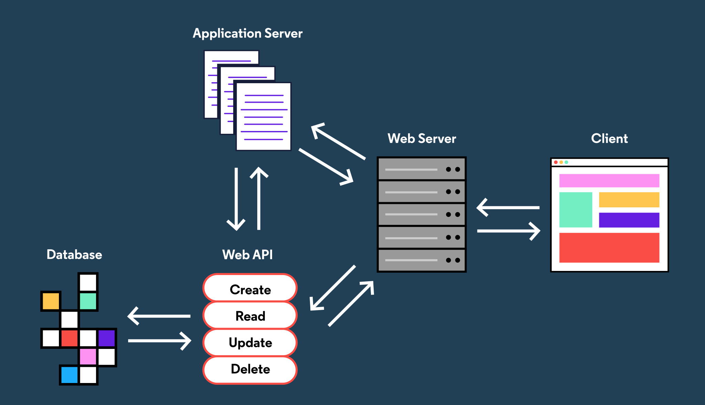

# Back-End Development

The collection of programming logic required to deliver dynamic content to a client, manage security, process payments, and myriad other tasks is sometimes known as the “application” or application server. The application server can be responsible for anything from sending an email confirmation after a purchase to running the complicated algorithms a search engine uses to give us meaningful results.

The back-ends of modern web applications include some sort of database, often more than one. Databases are collections of information. There are many different databases, but we can divide them into two types: relational databases and non-relational databases (also known as NoSQL databases). Whereas relational databases store information in tables with columns and rows, non-relational databases might use other systems such as key-value pairs or a document storage model. SQL, Structured Query Language, is a programming language for accessing and changing data stored in relational databases. Popular relational databases include MySQL and PostgreSQL while popular NoSQL databases include MongoDB and Redis.

In addition to the database itself, the back-end needs a way to programmatically access, change, and analyze the data stored there.

### Authentication and Authorization

Authentication is the process of validating the identity of a user. One technique for authentication is to use logins with usernames and passwords. These credentials need to be securely stored in the back-end on a database and checked upon each visit. Web applications can also use external resources for authentication. You’ve likely logged into a website or application using your Facebook, Google, or Github credentials; that’s also an authentication process.

Authorization controls which users have access to which resources and actions. Certain application views, like the page to edit a social media personal profile, are only accessible to that user. Other activities, like deleting a post, are often similarly restricted.

When building a robust web application back-end, we need to incorporate both authentication (Who is this user? Are they who they claim to be?) and authorization (Who is allowed to do and see what?) into our server-side logic to make sure we’re creating secure, personalized, and dynamic content.

### Tech Stack

The collection of technologies used to create the front-end and back-end of a web application is referred to as a stack. This is where the term full-stack developer comes from; rather than working in either the front-end or the back-end exclusively, a full-stack developer works in both.

For example, the MEAN stack is a technology stack for building web applications that uses MongoDB, Express.js, AngularJS, and Node.js: MongoDB is used as the database, Node.js with Express.js for the rest of the back-end, and Angular is used as a front-end framework. While the LAMP Stack, sometimes considered the archetypal stack, uses Linux, Apache, MySQL, and PHP.

