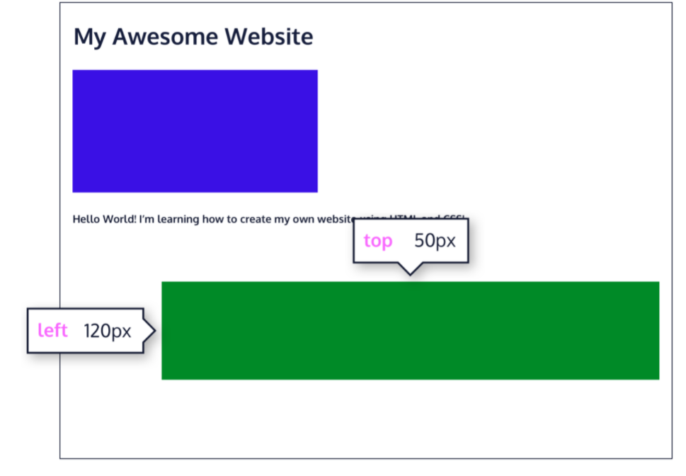
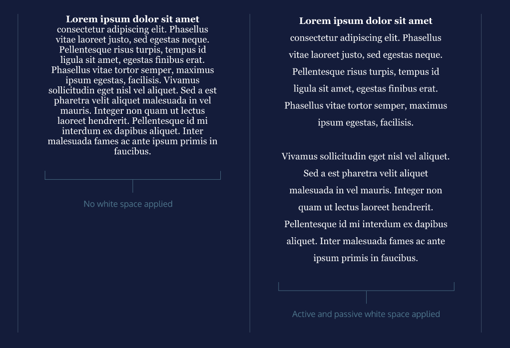

# CSS


### Inline Styling
```
<p style='color: red; font-size: 20px;'>I'm learning to code!</p>
```
It can't use media queries.

### Class Selector
```
<h1 class='green bold'> ... </h1>  //multiple classes
.brand {

}
```
We can add multiple classes to an HTML element’s class attribute by separating them with a space. This enables us to mix and match CSS classes to create many unique styles without writing a custom class for every style combination needed.

### ID
* If an HTML element needs to be styled uniquely, we can give it an ID using the id attribute.
```
<h1 id='large-title'> ... </h1>
#large-title {

}
```

### Attribute Selector
* The attribute selector can be used to target HTML elements that already contain attributes. Elements of the same type can be targeted differently by their attribute or attribute value. This alleviates the need to add new code, like the class or id attributes.

* And it can get more granular from there by adding type and/or attribute values. One way is by using type[attribute*=value]. In short, this code selects an element where the attribute contains any instance of the specified value. Let’s take a look at an example.

```


img[src*='winter'] {
  height: 50px;
}

img[src*='summer'] {
  height: 100px;
}
```

### Pseudo Class Selector
* :focus, :visited, :disabled, and :active are all pseudo-classes. Factors such as user interaction, site navigation, and position in the DOM can all give elements a different state with pseudo-class.

* A pseudo-class can be attached to any selector. It is always written as a colon : followed by a name. For example p:hover.

```
p:hover {
  background-color: lime;
}
```


## Selector Specificity
Specificity is the order by which the browser decides which CSS styles will be displayed. A best practice in CSS is to style elements while using the lowest degree of specificity so that if an element needs a new style, it is easy to override.

```
<h1 class='headline'>Breaking News</h1>
h1 {
  color: red;
}

.headline {
  color: firebrick;
}
```

## Selectors Chaining
```
h1.special {

}
```
The code above would select only the ```<h1>``` elements with a class of special. If a <p> element also had a class of special, the rule in the example would not style the paragraph.

## Descendant Combinator
CSS supports selecting elements that are nested within other HTML elements, also known as descendants.
```
<ul class='main-list'>
  <li> ... </li>
  <li> ... </li>
  <li> ... </li>
</ul>

.main-list li {

}
```
```.main-list``` selects the element with the.main-list class (the ```<ul>``` element). The descendant ```<li>```‘s are selected by adding li to the selector, separated by a space. This results in ```.main-list li``` as the final selector.

## Multiple Selectors
It saves our time from writing the same ruleset for multiple elements.
```
h1,
.menu {
  font-family: Georgia;
}
```

## ```!important```
It will override any style no matter how specific it is. As a result, it should almost never be used. Once ```!important``` is used, it is very hard to override.
```
p {
  color: blue !important;
}

.main p {
  color: red;
}
// resultant color of .main p is blue
```


## Box Model


It includes:
  1. width and height
  2. padding
  3. border: width, style, color (2px solid blue)
  4. margin

* The default box model that is __content-box__ has an awkward limitation. For e.g, consider the following figure and the CSS

  
  ```
  h1 {
    border: 1px solid black;
    height: 200px;
    width: 300px;
    padding: 10px;
  }
  ```
  Unfortunately, the border thickness and padding will affect the dimensions of the box. The actual rendered width will be 322px and height will be 222px instead of 300px and 200px.

* To override this drawback, we need to reset the box model to __border-box__ in this way
  ```
  * {
    box-sizing: border-box;
  }
  ```
  

### Margin Collapse

* No collapse on horizontal.
* Larger margin is selected in vertical collapse


## Display And Positioning
### Relative Position
  
  It shifts the container to a position specified by offset relative to it's static position. __Offset must be specified.__
  ```
  .green-box {
    background-color: green;
    position: relative;
    top: 50px;
    left: 120px;
  }
  ```
### Absolute Position
  
  The element will be positioned relative to its closest positioned parent element, while offset properties can be used to determine the final position from there. __Offset must be specified.__

### Fixed Position
  

### Sticky Position
  
  It keeps an element in the document flow as the user scrolls, but sticks to a specified position as the page is scrolled further.__Offset must be specified.__
  ```
  .box-bottom {
    background-color: darkgreen;
    position: sticky;
    top: 240px;
  }
  ```
  In the example above, the .box-bottom <div> will remain in its relative position, and scroll as usual. When it reaches 240 pixels from the top, it will stick to that position until it reaches the bottom of its parent container where it will “unstick” and rejoin the flow of the document.

### z-index
  

### inline-block display
  
  ```
  <div class="rectangle">
    <p>I’m a rectangle!</p>
  </div>
  <div class="rectangle">
    <p>So am I!</p>
  </div>
  <div class="rectangle">
    <p>Me three!</p>
  </div>
  .rectangle {
    display: inline-block;
    width: 200px;
    height: 300px;
  }
  ```
  There are three rectangular divs that each contain a paragraph of text. The ```.rectangle <div>```s will all appear inline (provided there is enough space from left to right) with a width of 200 pixels and height of 300 pixels, even though the text inside of them may not require 200 pixels by 300 pixels of space.

### Float property
  
  __floated element must have width specified__. Otherwise, the element will assume the full width of its containing element, and changing the float value will not yield any visible results.

### Clear property
The float property can also be used to float multiple elements at once. However, when multiple floated elements have different heights, it can affect their layout on the page. Specifically, elements can “bump” into each other and not allow other elements to properly move to the left or right.
The clear property specifies how elements should behave when they bump into each other on the page. It can take *left*, *right*, *both*.

### color
  hsl color scheme
  ```
  color: hsl(120, 60%, 70%)
  ```
  1. Hue is the first number. It refers to an angle on a color wheel. Red is 0 degrees, Green is 120 degrees, Blue is 240 degrees, and then back to Red at 360.
  2. Saturation refers to the intensity or purity of the color. The saturation increases towards 100% as the color becomes richer. The saturation decreases towards 0% as the color becomes grayer.
  3. Lightness refers to how light or dark the color is. Halfway, or 50%, is normal lightness. Imagine a sliding dimmer on a light switch that starts halfway. Sliding the dimmer up towards 100% makes the color lighter, closer to white. Sliding the dimmer down towards 0% makes the color darker, closer to black.

  Opacity: amount of transparency so that some or all overlapping part is visible through a covering element.
  Alpha: It's a decimal number between 0 and 1. It is the amount of background to mix with the foreground. When a color's alpha is below 1, any color behind it can be blended in.
  ```
  color: rgba(243,45,98,0.33);
  color: hsla(213, 34%, 56%, 0.12);
  color: transparent;  // equivalent to rgba(0,0,0,0)
  ```
  Alpha can be used with HSL, RGB and hex colors representation only but not name colors.


### Typography
  * Web safe fonts: fonts that will appear same across all browsers and OS.
  * Multiple words font must be enclosed in quotation. like ```font-family: Caslon,'Times New Roman'```
  

  * Font weight: controls how bold or thin the text appears. It has *bold*, *normal*, *lighter*, and *bolder* values or can be between 1(lightest) and 1000(boldest).
  ```
  font-wight: bold;
  ```
  * font-style: accepts *italic* or *normal*
  * Text layout is controlled by *letter-spacing*, *word-spacing*, *line-height*, *text-align*
  * Adding web fonts using ```<link>```
    ```
    <head>
      <!-- Add the link element for Google Fonts along with other metadata -->
      <link href="https://fonts.googleapis.com/css2?family=Roboto:wght@100&display=swap" rel="stylesheet">
    <head>

    p {
      font-family: 'Roboto', sans-serif;
    }
    ```

  * Adding web fonts using ```@font-face```
    ```
    @font-face {
        font-family: 'MyParagraphFont'; // user-defined name of the family
        src: url('fonts/Roboto.woff2') format('woff2'),  // local storage path or link to external website with format
            url('fonts/Roboto.woff') format('woff'),  //multiple formats of font inclusion
            url('fonts/Roboto.ttf') format('truetype');
      }

      // using the font
      p {
        font-family: 'MyParagraphFont', sans-serif;
      }
    ```

___________________


## Responsive Design

### Sizing Elementes

* em
  It is used to repersent the font-size of the current element or the default base font-size set by the browser if none is given. For example, if base font size in a browser is 16px, then 1em = 16px.

  ```
  .heading {
      font-size: 2em;
    }
  ```

* rem
  It stands for root em. It acts similar to em, but instead of checking parent elements to size font, it checks the root element. The root element is the ```<html>``` tag.
  ```
  html {
    font-size: 16px;
  }
  .main {
    font-size: 1.175rem;
  }
  ```

* precentages
  dimensions are relative to the parent of a child element
  ```
  .main {
    height: 300px;
    width: 500px;
  }

  .main .subsection {
    height: 50%;
    width: 50%;
  }
  ```
  __NOTE__ : Because the box model includes padding, borders, and margins, setting an element’s width to 100% may cause content to overflow its parent container. While tempting, 100% should only be used when content will not have padding, border, or margin.

  Percentages can also be used to set padding and margin. When % are used to set padding and margin, they are calculated based only on the width of the parent element. So, horizontal and vertical padding and margin are calculated based on width not height.

  ```Worth Noticing```
  *When using relative sizing, ems and rems should be used to size text and dimensions on the page related to text size (i.e. padding around text). This creates a consistent layout based on text size. Otherwise, percentages should be used.*

* Scaling images and videos

  ```
  .container {
      width: 50%;
      height: 200px;
      overflow: hidden;
    }

    .container img {
      max-width: 100%;
      height: auto; // image height will automatically scale proportionally with width
      display: block; //image will be displayed as block level elements
    }
  ```

* Scaling background Images

  ```
  body {
    background-image: url('#');
    background-repeat: no-repeat; //without repeating
    background-position: center;
    background-size: cover; //responsible for scaling
  }
  ```

* Media queries

  * Screen width or height
    ```
    @media only screen and (min-width: 300px) and (max-width: 500px) {

    }
    ```

  * screen resolution
    ```
    @media only screen and (min-resolution: 300dpi) {

    }
    ```

  * Multiple conditions
    use comma to separate multiple rules
    ```
    @media only screen and (min-width: 480px), (orientation: landscape) {
        /* CSS ruleset */
    }
    ```

  * Device Breakpoints
    Here is the breakpoint dimensions that should be checked for responsiveness across all devices
    


## Flexbox Layout

* Two important components of a flexbox layout:
  1. Flex containers: container that contains flex items. To designate an element as a flex container, set the element’s ```.display``` property to ```:flex``` or ```:inline-flex```. No other elements will appear on the same line. But child elements will not begin on new lines.
  2. Flex items: direct child element of a flex container.

  ```:flex``` vs ```:inline-flex```
    

  **NOTE** : All flex items shrink proportionally when the flex container is too small. However, if parent container is larger than necessary then, flex items won't stretch by default. The ```.flex-grow``` property has to specified.

  Even after specifying width property, width of elements will depend on size of screen.

### Flex container property

* ```.justify-content``` :
  how flex items spread out from left to right, along the main axis.
  ```
  .container {
      display: flex;
      justify-content: flex-end;
    }
  ```

* ```.align-items```:
  align flex items vertically within the container.
  ```
  .container {
      align-items: baseline;
    }
  ```

### Flex items property
  1. flex-grow : number that specifies how much the flex item grow if width is available
  2. flex-shrink : number that specifies how much the flex item shrink if width is unavailable
  3. flex-basis : width of the flex-item
  4. flex: Above all three values can be specified together with the property flex
  ```
  flex: 2 1 100px;  // flex-grow, flex-shrink, flex-basis
  ```
  5. flex-wrap : align more items on next line or create multiple rows. It accepts *wrap*, *nowrap*, *reverse-wrap*.
  6. align-content: if flex container has multiple rows of content, it is used to space rows from top to bottom.
  __Note__: align-items property is used to align items within a single row, whereas align-content is used to align multiple rows. AND it doesn't use main axis to position flex items
  7. flex-direction: there are two main axis, i.e, main(horizontal) and cross(vertical) axis. these two axis are interchangeable. We can switch them using *flex-direction* property. Accepted values: *row*, *row-reverse*, *column*, *column-reverse*.
  8. flex-flow: flex-direction and flex-wrap can be specified together as
  ```
  flex-flow: column wrap; // flex-direction, flex-wrap
  ```


## Grids and Spacing

### WHY grids
  1. Promote consistency within our designs
  2. Properly align elements on our page
  3. Provide ample spacing between content

### Grid Anatomy

There are three main components of a grid:
1. Columns: vertical sections that span the width of a page. Content can span multiple columns.
2. Gutter: negative space between each column. It hleps in ensuring the columns don't run together.
3. Margin: ensure content of your designs doesn't match up to the edges of browser window.

### Whitespace
  Whitespace or negative space refers to the emptiness between elements. Whether that's in the gutter of the columns or additional padding around a block of text.
  It is of two types:
  1. Passive whitespace: or micro whitespace. It is used to improve aesthetics of the layout. It is incorporated in CSS using *line-height* or *margin* properties.
    
  2. Active Whitespace: It is intentional and also called macro whitespace. It refers to enhancing the overall page structure through space to emphasize content or guide users from one point to next
    

### Grids vs Flexbox
  Flexbox is mostly useful for positioning items in a 1-D layout, but Grids is most useful for 2-D dimensional layout, providing many tools for aligning and moving elements across both rows and columns.

### Grid Properties
  1. *grid-template-columns*: defines the number of columns and sets the width of each column.
  ```
  .grid {
    display: grid;
    width: 100px;
    grid-template-columns: 20px 40% 60px;
  }
  ```
  2. *grid-template-rows*: defines the number of rows and sets the height of each row.
  3. *grid-template*: shorthand for grid-template-rows and grid-template-columns
  ```
  .grid {
    display: grid;
    width: 1000px;
    height: 500px;
    grid-template: 200px 300px / 20% 10% 70%;  // first row then column
  }
  ```
  4. measument using fr: fr or fraction is introduced for grid's content width and height.
  ```
  .grid {
    display: grid;
    width: 400px;
    height 500px;
    grid-template: 1fr 1fr 1fr / 3fr 50% 1fr;
  }
  ```
  5. repeat() function:
  ```
  .grid {
    grid-template: repeat(3,100px) / repeat(5, 50px);
  }
  ```
  6. grid gap: put blank space between every row and column in the grid
  ```
  .grid {
    display: grid;
    width: 320px;
    grid-template-columns: repeat(3, 1fr);
    grid-column-gap: 10px;
  }
  ```
  7. grid-row and grid-column: shorthand for grid-row-start and grid-row-end.
  grid-row-start/end specifies content that start from some grid number and spans over some grids.
  ```
  .grid {
    display: grid;
    border: 2px blue solid;
    height: 500px;
    width: 500px;
    grid-template: repeat(4, 1fr 2fr) / repeat(4, 3fr 2fr);
    grid-gap: 5px;
  }

  .a {
    grid-row-start: 5;
    grid-row-end: 7; // grid-row: 5/7; or grid-row: 5/span 2; means it will span grid number 5 and 6 only
    grid-column-start: 5;
    grid-column-end: 7; // grid-column: 5/7; or grid-column: 5/span 2;
  }
  ```
  8. grid-area: shorthand for grid-row-start, grid-column-start, grid-row-end, grid-column-end, all in one line

  

Practice Grid at https://codepip.com/games/grid-garden/
Check interactive documentation at https://developer.mozilla.org/en-US/docs/Web/CSS/CSS_Grid_Layout
