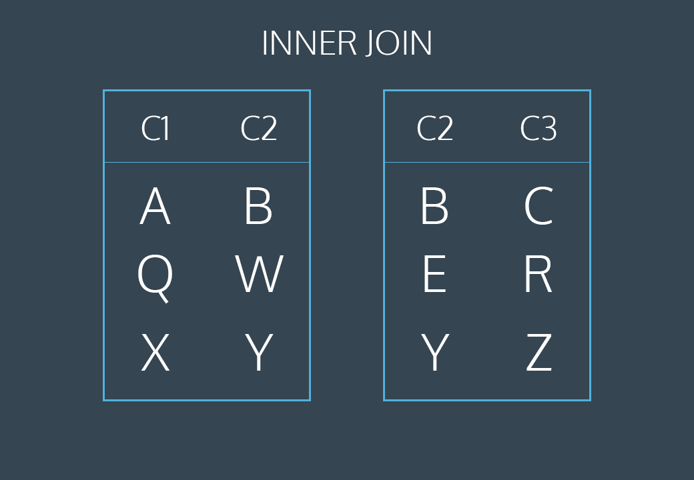
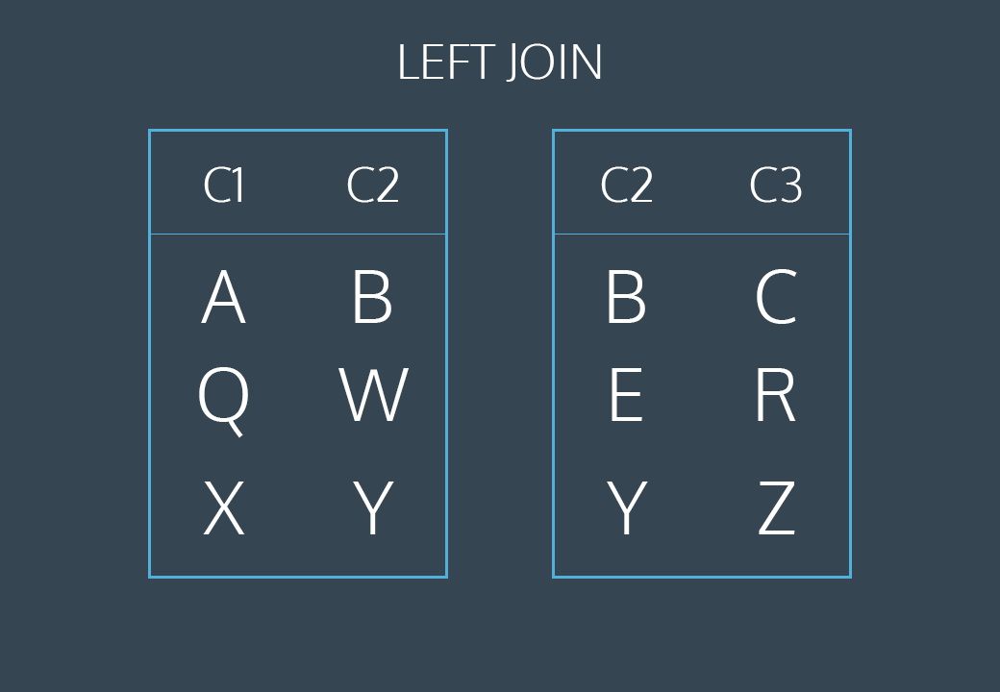
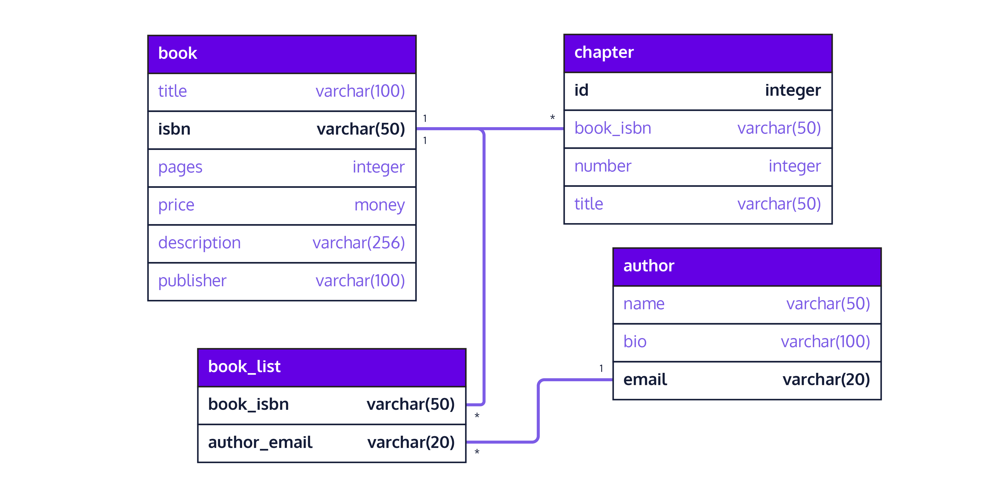

# Databases

## Database Introduction

### What is a Database?
A database is a set of data stored in a computer. This data is usually structured in a way that makes the data easily accessible.

Read more [here](https://www.g2.com/articles/what-is-a-database)

### What is a Relational Database?
A relational database is a type of database. It uses a structure that allows us to identify and access data in relation to another piece of data in the database. Often, data in a relational database is organized into tables.

### Tables: Rows and Columns
Tables can have hundreds, thousands, sometimes even millions of rows of data. These rows are often called records.

Tables can also have many columns of data. Columns are labeled with a descriptive name (say, age for example) and have a specific data type.

For example, a column called age may have a type of INTEGER (denoting the type of data it is meant to hold).

### What is a Relational Database Management System (RDBMS)?
A relational database management system (RDBMS) is a program that allows you to create, update, and administer a relational database. Most relational database management systems use the SQL language to access the database.

### What is SQL?
SQL (Structured Query Language) is a programming language used to communicate with data stored in a relational database management system. SQL syntax is similar to the English language, which makes it relatively easy to write, read, and interpret.

Many RDBMSs use SQL (and variations of SQL) to access the data in tables. For example, SQLite is a relational database management system. SQLite contains a minimal set of SQL commands (which are the same across all RDBMSs). Other RDBMSs may use other variants.

(SQL is often pronounced in one of two ways. You can pronounce it by speaking each letter individually like “S-Q-L”, or pronounce it using the word “sequel”.)

### Popular Relational Database Management Systems
SQL syntax may differ slightly depending on which RDBMS you are using. Here is a brief description of popular RDBMSs:

#### MYSQL

MySQL is the most popular open source SQL database. It is typically used for web application development, and often accessed using PHP.

The main advantages of MySQL are that it is easy to use, inexpensive, reliable (has been around since 1995), and has a large community of developers who can help answer questions.

Some of the disadvantages are that it has been known to suffer from poor performance when scaling, open source development has lagged since Oracle has taken control of MySQL, and it does not include some advanced features that developers may be used to.

#### PostgreSQL

PostgreSQL is an open source SQL database that is not controlled by any corporation. It is typically used for web application development.

PostgreSQL shares many of the same advantages of MySQL. It is easy to use, inexpensive, reliable and has a large community of developers. It also provides some additional features such as foreign key support without requiring complex configuration.

The main disadvantage of PostgreSQL is that it can be slower in performance than other databases such as MySQL. It is also slightly less popular than MySQL.

#### Oracle DB

Oracle Corporation owns Oracle Database, and the code is not open sourced.

Oracle DB is for large applications, particularly in the banking industry. Most of the world’s top banks run Oracle applications because Oracle offers a powerful combination of technology and comprehensive, pre-integrated business applications, including essential functionality built specifically for banks.

The main disadvantage of using Oracle is that it is not free to use like its open source competitors and can be quite expensive.

#### SQL Server

Microsoft owns SQL Server. Like Oracle DB, the code is close sourced.

Large enterprise applications mostly use SQL Server.

Microsoft offers a free entry-level version called Express but can become very expensive as you scale your application.

#### SQLite

SQLite is a popular open source SQL database. It can store an entire database in a single file. One of the most significant advantages this provides is that all of the data can be stored locally without having to connect your database to a server.

SQLite is a popular choice for databases in cellphones, PDAs, MP3 players, set-top boxes, and other electronic gadgets. The SQL courses on Codecademy use SQLite.

### Conclusion
Relational databases store data in tables. Tables can grow large and have a multitude of columns and records. Relational database management systems (RDBMSs) use SQL (and variants of SQL) to manage the data in these large tables. The RDBMS you use is your choice and depends on the complexity of your application.

## SQL

### Intro

SQL, Structured Query Language, is a programming language designed to manage data stored in relational databases. SQL operates through simple, declarative statements. This keeps data accurate and secure, and helps maintain the integrity of databases, regardless of size.

The SQL language is widely used today across web frameworks and database applications. Knowing SQL gives you the freedom to explore your data, and the power to make better decisions. By learning SQL, you will also learn concepts that apply to nearly every data storage system.

### Relations

A __table__ is a collection of data organized into rows and columns. Tables are sometimes referred to as relations.

A __column__ is a set of data values of a particular type. Here, id, name, and age are the columns.

A __row__ is a single record in a table. The first row in the celebs table has:

* An id of 1
* A name of Justin Bieber
* An age of 22

All data stored in a relational database is of a certain data type. Some of the most common data types are:

* INTEGER, a positive or negative whole number
* TEXT, a text string
* DATE, the date formatted as YYYY-MM-DD
* REAL, a decimal value

### Table Creation

CREATE statements allow us to create a new table in the database. You can use the CREATE statement anytime you want to create a new table from scratch. The statement below creates a new table named celebs.

```
CREATE TABLE celebs (
   id INTEGER,
   name TEXT,
   age INTEGER
);
```

### Insert

The INSERT statement inserts a new row into a table.

We can use the INSERT statement when you want to add new records. The statement below enters a record for Justin Bieber into the celebs table.

```
INSERT INTO celebs (id, name, age)
VALUES (1, 'Justin Bieber', 22);
```

### Select

SELECT statements are used to fetch data from a database. In the statement below, SELECT returns all data in the name column of the celebs table.

```
SELECT name FROM celebs;
```

### Alter

The ALTER TABLE statement adds a new column to a table. You can use this command when you want to add columns to a table. The statement below adds a new column twitter_handle to the celebs table.

```
ALTER TABLE celebs
ADD COLUMN twitter_handle TEXT;
```

`NULL` is a special value in SQL that represents missing or unknown data. Here, the rows that existed before the column was added have `NULL` (∅) values for `twitter_handle`.

### Update

The UPDATE statement edits a row in a table. You can use the UPDATE statement when you want to change existing records. The statement below updates the record with an id value of 4 to have the twitter_handle @taylorswift13.

```
UPDATE celebs
SET twitter_handle = '@taylorswift13'
WHERE id = 4;
```

### Delete

The DELETE FROM statement deletes one or more rows from a table. You can use the statement when you want to delete existing records. The statement below deletes all records in the celeb table with no twitter_handle:

```
DELETE FROM celebs
WHERE twitter_handle IS NULL;
```

### Constraints

Constraints that add information about how a column can be used are invoked after specifying the data type for a column. They can be used to tell the database to reject inserted data that does not adhere to a certain restriction. The statement below sets constraints on the celebs table.

```
CREATE TABLE celebs (
   id INTEGER PRIMARY KEY,
   name TEXT UNIQUE,
   date_of_birth TEXT NOT NULL,
   date_of_death TEXT DEFAULT 'Not Applicable'
);
```

1. PRIMARY KEY columns can be used to uniquely identify the row. Attempts to insert a row with an identical value to a row already in the table will result in a constraint violation which will not allow you to insert the new row.

2. UNIQUE columns have a different value for every row. This is similar to PRIMARY KEY except a table can have many different UNIQUE columns.

3. NOT NULL columns must have a value. Attempts to insert a row without a value for a NOT NULL column will result in a constraint violation and the new row will not be inserted.

4. DEFAULT columns take an additional argument that will be the assumed value for an inserted row if the new row does not specify a value for that column.


### AS

```
SELECT name AS 'Titles'
FROM movies;
```

`AS` is a keyword in SQL that allows you to rename a column or table using an alias. The new name can be anything you want as long as you put it inside of single quotes. Here we renamed the `name` column as `Titles`.

Some important things to note:

* Although it’s not always necessary, it’s best practice to surround your aliases with single quotes.
* When using AS, the columns are not being renamed in the table. The aliases only appear in the result.


### Distinct

`DISTINCT` is used to return unique values in the output. It filters out all duplicate values in the specified column(s).

```
SELECT DISTINCT tools
FROM inventory;
```

### where

```
SELECT *
FROM movies
WHERE imdb_rating > 8;
```

### Like

```
SELECT *
FROM movies
WHERE name LIKE 'Se_en';
```

`LIKE` is a special operator used with the WHERE clause to search for a specific pattern in a column.

* `name LIKE 'Se_en'` is a condition evaluating the name column for a specific pattern.

* `Se_en` represents a pattern with a wildcard character.

The `_` means you can substitute any individual character here without breaking the pattern. The names `Seven` and `Se7en` both match this pattern.

`%` is a wildcard character that matches zero or more missing letters in the pattern. For example:

* `A%` matches all movies with names that begin with letter ‘A’
* `%a` matches all movies that end with ‘a’

### Is Null

Unknown values are indicated by `NULL`.

It is not possible to test for `NULL` values with comparison operators, such as = and !=.

Instead, we will have to use these operators:

* `IS NULL`
* `IS NOT NULL`

### Between

The BETWEEN operator is used in a WHERE clause to filter the result set within a certain range. It accepts two values that are either numbers, text or dates.

```
SELECT *
FROM movies
WHERE year BETWEEN 1990 AND 1999;
```

When the values are text, BETWEEN filters the result set for within the alphabetical range.

In this statement, `BETWEEN` filters the result set to only include movies with `name`s that begin with the letter ‘A’ up to, but not including ones that begin with ‘J’.
```
SELECT *
FROM movies
WHERE name BETWEEN 'A' AND 'J';
```

However, if a movie has a name of simply ‘J’, it would actually match. This is because `BETWEEN` goes up to the second value — up to ‘J’. So the movie named ‘J’ would be included in the result set but not ‘Jaws’.

### Order By

```
SELECT *
FROM movies
ORDER BY name;

-- sorting by desc --

SELECT *
FROM movies
WHERE imdb_rating > 8
ORDER BY year DESC;
```

* `DESC` is a keyword used in `ORDER BY` to sort the results in descending order (high to low or Z-A).

* `ASC` is a keyword used in `ORDER BY` to sort the results in ascending order (low to high or A-Z).

The column that we ORDER BY doesn’t even have to be one of the columns that we’re displaying.

__Note__: `ORDER BY` always goes after `WHERE` (if WHERE is present).

### LIMIT

```
SELECT *
FROM movies
LIMIT 10;
```

`LIMIT` is a clause that lets you specify the maximum number of rows the result set will have. This saves space on our screen and makes our queries run faster.

Here, we specify that the result set can’t have more than 10 rows.

`LIMIT` always goes at the very end of the query. Also, it is not supported in all SQL databases.

### Case

```
SELECT name,
 CASE
  WHEN imdb_rating > 8 THEN 'Fantastic'
  WHEN imdb_rating > 6 THEN 'Poorly Received'
  ELSE 'Avoid at All Costs'
 END
FROM movies;
```

A `CASE` statement allows us to create different outputs (usually in the SELECT statement). It is SQL’s way of handling if-then logic.

* Each WHEN tests a condition and the following THEN gives us the string if the condition is true.
* The ELSE gives us the string if all the above conditions are false.
* The CASE statement must end with END.

In the result, you have to scroll right because the column name is very long. To shorten it, we can rename the column to ‘Review’ using AS:

```
SELECT name,
 CASE
  WHEN imdb_rating > 8 THEN 'Fantastic'
  WHEN imdb_rating > 6 THEN 'Poorly Received'
  ELSE 'Avoid at All Costs'
 END AS 'Review'
FROM movies;
```

### Order of execution of queries

[Click Here](https://jvns.ca/blog/2019/10/03/sql-queries-don-t-start-with-select/)


## Aggregate Functions

### Count

The fastest way to calculate how many rows are in a table is to use the COUNT() function.

COUNT() is a function that takes the name of a column as an argument and counts the number of non-empty values in that column.

```
SELECT COUNT(*)
FROM table_name;
```

### Sum

SQL makes it easy to add all values in a particular column using SUM().

SUM() is a function that takes the name of a column as an argument and returns the sum of all the values in that column.

```
SELECT SUM(downloads)
FROM fake_apps;
```

### Max/Min

The MAX() and MIN() functions return the highest and lowest values in a column, respectively.

```
SELECT MAX(downloads)
FROM fake_apps;
```

### Average

SQL uses the AVG() function to quickly calculate the average value of a particular column.

The statement below returns the average number of downloads for an app in our database:

```
SELECT AVG(downloads)
FROM fake_apps;
```

### Round

By default, SQL tries to be as precise as possible without rounding. We can make the result table easier to read using the ROUND() function.

ROUND() function takes two arguments inside the parenthesis:

1. a column name
2. an integer

It rounds the values in the column to the number of decimal places specified by the integer.

```
SELECT ROUND(price, 0)
FROM fake_apps;
```

### Column Reference

SQL lets us use column reference as numbers that are ordered according to as they appear in after select.

For example:

```
Select name, roll from students where 1 like '%ku%';
```

1 for name, 2 for roll.

### Group By

GROUP BY is a clause in SQL that is used with aggregate functions. It is used in collaboration with the SELECT statement to arrange identical data into groups.

__The GROUP BY statement comes after any WHERE statements, but before ORDER BY or LIMIT__.

```
SELECT year,
   AVG(imdb_rating)
FROM movies
GROUP BY year
ORDER BY year;
```

Using Column Reference

```
SELECT ROUND(imdb_rating),
   COUNT(name)
FROM movies
GROUP BY 1
ORDER BY 1;
```

### Having

Having is similar to `where` clause but it is used with aggregate functions.

* When we want to limit the results of a query based on values of the individual rows, use WHERE.
* When we want to limit the results of a query based on an aggregate property, use HAVING.

__HAVING statement always comes after GROUP BY, but before ORDER BY and LIMIT.__

```
SELECT year,
   genre,
   COUNT(name)
FROM movies
GROUP BY 1, 2
HAVING COUNT(name) > 10;
```

### Aggregate functions

It computes a single result set from a set of values


## Working With multiple tables

```
SELECT orders.order_id,
   customers.customer_name
FROM orders
JOIN customers
  ON orders.customer_id = customers.customer_id;
```

### Inner Join

When we perform a simple JOIN (often called an inner join) our result only includes rows that match our ON condition.

Consider the following animation, which illustrates an inner join of two tables on `table1.c2 = table2.c2`:



If there are two tables and the primary key of one table is being referenced as foreign key in other table, we can directly join them using the below query:

```
SELECT person.name AS name, email.email AS email
FROM person, email
WHERE person.id = email.person_id;
```

### Left Joins

What if we want to combine two tables and keep some of the un-matched rows?

SQL lets us do this through a command called LEFT JOIN. A left join will keep all rows from the first table, regardless of whether there is a matching row in the second table.



```
SELECT *
FROM table1
LEFT JOIN table2
  ON table1.c2 = table2.c2;
```

### Role of pk and fk in joins

The most common types of joins will be joining a foreign key from one table with the primary key from another table. For instance, when we join orders and customers, we join on customer_id, which is a foreign key in orders and the primary key in customers.

### Cross Join

Sometimes, we just want to combine all rows of one table with all rows of another table.

For instance, if we had a table of shirts and a table of pants, we might want to know all the possible combinations to create different outfits.

```
SELECT shirts.shirt_color,
   pants.pants_color
FROM shirts
CROSS JOIN pants;
```

__Notice that cross joins don’t require an ON statement. You’re not really joining on any columns!__

**A more common usage of CROSS JOIN is when we need to compare each row of a table to a list of values.**

### Union

Sometimes we just want to stack one dataset on top of the other. Well, the UNION operator allows us to do that.

SQL has strict rules for appending data:

* Tables must have the same number of columns.
* The columns must have the same data types in the same order as the first table.

```
SELECT *
FROM table1
UNION
SELECT *
FROM table2;
```

### With

Our marketing department might want to know a bit more about our customers. For instance, they might want to know how many magazines each customer subscribes to. We can easily calculate this using our orders table:

```
SELECT customer_id,
   COUNT(subscription_id) AS 'subscriptions'
FROM orders
GROUP BY customer_id;
```

This query is good, but a customer_id isn’t terribly useful for our marketing department, they probably want to know the customer’s name.

We want to be able to join the results of this query with our customers table, which will tell us the name of each customer. We can do this by using a WITH clause.

```
with previous_query as (
  SELECT customer_id,
   COUNT(subscription_id) AS 'subscriptions'
FROM orders
GROUP BY customer_id
)
select customers.customer_name, previous_query.subscriptions from previous_query join customers on customers.customer_id = previous_query.customer_id;
```

* The WITH statement allows us to perform a separate query (such as aggregating customer’s subscriptions)
* previous_results is the alias that we will use to reference any columns from the query inside of the WITH clause
* We can then go on to do whatever we want with this temporary table (such as join the temporary table with another table)

Essentially, we are putting a whole first query inside the parentheses () and giving it a name. After that, we can use this name as if it’s a table and write a new query using the first query.

## Writing sub-queries

[How to write sub-queries](https://mode.com/sql-tutorial/sql-sub-queries/)

## SQL Exercises

[exercie](https://dreamy-cabbage-87c3f6.netlify.app/)
[series of practical exercises and quizzes for students of SQL](https://sqlzoo.net/)


## PostgreSQL contraints

### Datatypes

PostgreSQL offers several ways a DB engineer can ensure that correct data is entered into a column or table. One of the most basic methods is built into the CREATE TABLE syntax that you’ve probably already seen before.

In a CREATE TABLE statement we specify the data type for each column of a table (e.g., int, text, timestamp, etc.). In doing so, we’re telling PostgreSQL which types of values can be inserted into each column in the table. You can refer to the complete list of available data types in the [PostgreSQL documentation](https://www.postgresql.org/docs/10/datatype.html).

| Name  |	  Description |
| ------------ | ----------|
boolean |	true/false
varchar or varchar(n) |	text with variable length, up to n characters (if specified)
date |	calendar date
integer |	whole number value between -2147483648 and +2147483647
numeric(a, b) |	decimal with total digits (a) and digits after the decimal point (b)
time |	time of day (no time zone)

To create a table that stores information about volunteers for the conference we could write the following:

```
CREATE TABLE volunteers (
    id integer,
    name varchar,
    hours_available integer,
    phone_number varchar(12),
    email varchar
);
```

In the statement above, we’ve ensured that our volunteers table will have:

* Integer values for data in columns id and hours_available
* Text values data in columns name, phone_number, and email

However, data types don’t prevent all unexpected data from being inserted into a table. For example, we’ve defined phone_number as varchar(12) and might expect a 10-digit phone number formatted as XXX-XXX-XXXX. Consider the following issues that may arise:

* An incomplete value formatted like XXX-XXXX will be accepted because it’s under 12 characters.
* A value like +X XXX-XXX-XXXX will cause PostgreSQL to raise an error because it’s longer than 12 characters, even though it’s a valid entry.

Another potential issue caused by relying only on PostgreSQL data types stems from the fact that PostgreSQL will try to interpret incoming data as the data type the column has been defined as. This process, called type casting, can have mixed results.

* If one tries to insert 1.5 into our table’s hours_available column, PostgreSQL will cast this value to integer, round the data, and insert it into the table as 2.
* If one tries to insert 1.5 into the email column, PostgreSQL will insert this into the database by casting 1.5 to '1.5' even though '1.5' is not a valid email address.

### NOT NULL constraint in PostgreSQL

If we know which columns cannot be `NULL` before creating our table, we can add a `NOT NULL` constraint following the datatype in the table’s `CREATE TABLE` statement.

```
CREATE TABLE talks (
    id integer,
    title varchar NOT NULL,
    speaker_id integer NOT NULL,
    estimated_length integer,
    session_timeslot timestamp NOT NULL
);
```

### Alter column in PostgreSQL

`NOT NULL` constraint can be added later after table
creation.

```
ALTER TABLE talks
ALTER COLUMN session_timeslot SET NOT NULL;
```

Droping constraint

```
ALTER TABLE talks
ALTER COLUMN session_timeslot DROP NOT NULL;
```

But if column already has some null values, it will raise an error.
If the table we’re attempting to add a constraint on doesn’t meet the constraint, we can backfill the table so that it does adhere to the constraint. Backfilling is a term occasionally used in DB engineering to refer to the process of adding or updating past values. In this case, we can fill our target column’s NULL values with a placeholder value using the query below.

```
UPDATE talks
SET title = 'TBD'
WHERE title IS NULL;
```

With the table updated so that there are no longer any nulls in title, and we can now apply the NOT NULL constraint.

### Check constraint in postgreSQL

It is used to check if the data to be inserted satisfies a condition. It returns either true or false. It can be applied column wise while creating table, or over the table using `alter` command.

```
Create table talks (
  estimated_length integer NOT NULL check(estimated_length>0)
);

--OR--

ALTER TABLE talks
ADD CHECK (estimated_length > 0);
```

Applying check to multiple columns require a single separate line while creating table or it can be done with altering table. It can be applied to multiple columns like:

```
alter table attendees add check(standard_tickets_reserved + vip_tickets_reserved = total_tickets_reserved);
```

### Unique constraint in postgreSQL

```
ALTER TABLE attendees
ADD UNIQUE (email);

--Multiple columns--

ALTER TABLE talks
ADD UNIQUE (speaker_id, session_timeslot)

--while creating column, a separate single line--

UNIQUE (speaker_id, session_timeslot)
```

### Primary key

A primary key is a column (or set of columns) that uniquely identifies a row within a database table. A table can only have one primary key, and in order to be selected as a primary key a column (or set of columns) should:

* Uniquely identify that row in the table (like a UNIQUE constraint)
* Contain no null values (like a NOT NULL constraint)

Implementing a `PRIMARY KEY` constraint is similar to simultaneously enforcing a `UNIQUE` and `NOT NULL` constraints on a column (or set of columns). Although `UNIQUE` `NOT NULL` and `PRIMARY KEY` constraints function very similarly, tables are limited to one PRIMARY KEY, but not limited in how many columns can have both `UNIQUE` and `NOT NULL` constraints.

In addition to defining relationships between tables, primary keys also improve your data model in several other ways:

* Many joins will use the primary key from one table to join data with another table
* Primary keys can improve query performance
* Primary keys help to enforce data integrity within a table by ensuring that rows can be uniquely identified

```
alter table speakers add primary key (id);
```

### Composite Primary key

Sometimes, none of the columns in a table can uniquely identify a record. When this happens, we can designate multiple columns in a table to serve as the primary key, also known as a composite primary key.

```
CREATE TABLE popular_recipes (
  recipe_id varchar(20),
  ingredient_id varchar(20),
  downloaded integer,
  PRIMARY KEY (recipe_id, ingredient_id)
);
```

### foreign key in postgreSQL

The property that ensures data can be validated by referencing another table in the data model is called referential integrity. Referential integrity can be enforced by adding a FOREIGN KEY on the child table that references the primary key of a parent table.

If the parent table doesn’t contain the data a user is attempting to insert, PostgreSQL will reject the insert or update and throw an error.

```
ALTER TABLE registrations
ADD FOREIGN KEY (talk_id)
REFERENCES talks (id);
```

By default, a foreign key constraint will prevent an engineer from deleting or updating a row of a parent table that is referenced by some child table. This behavior is sometimes explicitly specified in a `CREATE TABLE` statement using `REFERENCES talks (id) ON DELETE RESTRICT` or `REFERENCES talks (id) ON UPDATE RESTRICT`.

However, another strategy you may consider is adding a CASCADE clause. Rather than preventing changes, CASCADE clauses (ON UPDATE CASCADE, ON DELETE CASCADE) __cause the updates or deletes to automatically be applied to any child tables__.

For example, suppose we’d like to set up our database to automatically unregister attendees from a talk that’s been cancelled. To do this we could apply ON DELETE CASCADE to our foreign key constraint.

```
ALTER TABLE registrations
ADD FOREIGN KEY (talk_id)
REFERENCES talks (id) ON DELETE CASCADE
```

When we try to delete a value from talks, we also notice that all registrations for talk_id = 1 are removed as well. This preserves referential integrity by removing any row associated with this talk.

### Review

Constraints are rules a DB engineer defines as part of the data model to gain more control over what values are allowed in specific columns and tables.

Specifically, Constraints:

* Reject rows containing values that shouldn’t be inserted into a database table, which can help with preserving data integrity and quality.

* Raise an error when they’re violated, which can also help with debugging applications that write to the database.

There are quite a few types of constraints:

* Data types — Are your first line of defense, these rules aren’t constraints but can help reject incorrect data from your database.

* `NOT NULL` constraints — Reject incoming rows from your table when critical information is missing from a row.

* `CHECK` constraints — Give you more control over what rules you’d like to apply to your tables. These constraints will allow you to reject a row if it fails the criteria you’ve defined.

* `UNIQUE` constraints — Help with defining unique values in a table, they also create an index which can improve query and join performance.

* `PRIMARY KEY` constraints — A column or combination of columns that uniquely identify a row and are both NOT NULL and UNIQUE. PRIMARY KEYs are unique to a table, and will often be used in joins between tables.

* `FOREIGN KEY` constraints — Allow you to maintain referential integrity between two tables by validating the entry in one also appears in the other. Referential integrity depends on FOREIGN KEY constraints.

[PostgreSQL Constraints DOCS](https://www.postgresql.org/docs/10/ddl-constraints.html)

## CRUD

It stands for Create, Read, Update, Delete.

When we are building APIs, we want our models to provide four basic types of functionality. The model must be able to Create, Read, Update, and Delete resources. Computer scientists often refer to these functions by the acronym CRUD. A model should have the ability to perform at most these four functions in order to be complete. If an action cannot be described by one of these four operations, then it should potentially be a model of its own.

The CRUD paradigm is common in constructing web applications, because it provides a memorable framework for reminding developers of how to construct full, usable models. For example, let’s imagine a system to keep track of library books. In this hypothetical library database, we can imagine that there would be a books resource, which would store book objects. Let’s say that the book object looks like this:

```
“book”: {
  "id": <Integer>,
  “title”: <String>,
  “author”: <String>,
  “isbn”: <Integer>
}
```

To make this library system usable, we would want to make sure there were clear mechanisms for completing the CRUD operations:

__Create__ — This would consist of a function which we would call when a new library book is being added to the catalog. The program calling the function would supply the values for “title”, “author”, and “isbn”. After this function is called, there should be a new entry in the books resource corresponding to this new book. Additionally, the new entry is assigned a unique id, which can be used to access this resource later.

__Read__ — This would consist of a function which would be called to see all of the books currently in the catalog. This function call would not alter the books in the catalog - it would simply retrieve the resource and display the results. We would also have a function to retrieve a single book, for which we could supply the title, author, or ISBN. Again, this book would not be modified, only retrieved.

__Update__ — There should be a function to call when information about a book must be changed. The program calling the function would supply the new values for “title”, “author”, and “isbn”. After the function call, the corresponding entry in the books resource would contain the new fields supplied.

__Delete__ — There should be a function to call to remove a library book from the catalog. The program calling the function would supply one or more values (“title”, “author”, and/or “isbn”) to identify the book, and then this book would be removed from the books resource. After this function is called, the books resource should contain all of the books it had before, except for the one just deleted.

### CRUD And Rest

In a REST environment, CRUD often corresponds to the HTTP methods POST, GET, PUT, and DELETE, respectively. These are the fundamental elements of a persistent storage system.

Throughout the rest of the article, we will recommend standards and response codes that are typically followed by developers when creating RESTful applications. Conventions may differ so feel free to experiment with different return values and codes as you become comfortable with the CRUD paradigm.

Imagine we are working with a system that is keeping track of meals and their corresponding prices for a restaurant. Let’s look at how we would implement CRUD operations.

#### Create
To create resources in a REST environment, we most commonly use the HTTP POST method. POST creates a new resource of the specified resource type.

For example, let’s imagine that we are adding a new food item to the stored list of dishes for this restaurant, and the dish objects are stored in a dishes resource. If we wanted to create the new item, we would use a POST request:

Request:
```POST http://www.myrestaurant.com/dishes/```

Body:
```
{
  "dish": {
    "name": “Avocado Toast”,
    "price": 8
  }
}
```

This creates a new item with a name value of “Avocado Toast” and a price value of 8. Upon successful creation, the server should return a header with a link to the newly-created resource, along with a HTTP response code of 201 (CREATED).

Response:
```Status Code - 201 (CREATED)```

Body -

```
{
  "dish": {
    "id": 1223,
    "name": “Avocado Toast”,
    "price": 8
  }
}
```

From this response, we see that the dish with name “Avocado Toast” and price 8 has been successfully created and added to the dishes resource.

#### Read

To read resources in a REST environment, we use the GET method. Reading a resource should never change any information - it should only retrieve it. If you call GET on the same information 10 times in a row, you should get the same response on the first call that you get on the last call.

GET can be used to read an entire list of items:

Request:
```GET http://www.myrestaurant.com/dishes/```

Response: Status Code - 200 (OK)

Body -
```
{
  "dishes": [
    {
      "id": 1,
      "name": “Spring Rolls”,
      "price": 6
    },
    {
      "id": 2,
      "name": “Mozzarella Sticks”,
      "price": 7
    },
    ...
    {
      "id": 1223,
      "name": “Avocado Toast”,
      "price": 8
    },
    {
      "id": 1224,
      "name": “Muesli and Yogurt”,
      "price": 5
    }
  ]
}
```

GET requests can also be used to read a specific item, when its id is specified in the request:

Request:
```GET http://www.myrestaurant.com/dishes/1223```

Response: Status Code - 200 (OK) Body -

```
{
  "id": 1223,
  "name": “Avocado Toast”,
  "price": 8
}
```

After this request, no information has been changed in the database. The item with id 1223 has been retrieved from the dishes resource, and not modified. When there are no errors, GET will return the HTML or JSON of the desired resource, along with a 200 (OK) response code. If there is an error, it most often will return a 404 (NOT FOUND) response code.

#### Update

PUT is the HTTP method used for the CRUD operation, Update.

For example, if the price of Avocado Toast has gone up, we should go into the database and update that information. We can do this with a PUT request.

Request:
```PUT http://www.myrestaurant.com/dishes/1223```

Body -

```
{
  "dish": {
    "name": “Avocado Toast”,
    "price": 10
  }
}
```

This request should change the item with id 1223 to have the attributes supplied in the request body. This dish with id 1223 should now still have the name “Avocado Toast”, but the price value should now be 10, whereas before it was 8.

Response: Status Code - 200 (OK) Body - not necessary

The response includes a Status Code of 200 (OK) to signify that the operation was successful, but it need not return a response body.

#### Delete

The CRUD operation Delete corresponds to the HTTP method DELETE. It is used to remove a resource from the system.

Let’s say that the world avocado shortage has reached a critical point, and we can no longer afford to serve this modern delicacy at all. We should go into the database and delete the item that corresponds to “Avocado Toast”, which we know has an id of 1223.

Request:
```DELETE http://www.myrestaurant.com/dishes/1223```

Such a call, if successful, returns a response code of 204 (NO CONTENT), with no response body. The dishes resource should no longer contain the dish object with id 1223.

Response: Status Code - 204 (NO CONTENT) Body - None

Calling GET on the dishes resource after this DELETE call would return the original list of dishes with the {"id": 1223, "name": “Avocado Toast”, "price": 10} entry removed. All other dish objects in the dishes resource should remain unchanged. If we tried to call a GET on the item with id 1223, which we just deleted, we would receive a 404 (NOT FOUND) response code and the state of the system should remain unchanged.

Calling DELETE on a resource that does not exist should not change the state of the system. The call should return a 404 response code (NOT FOUND) and do nothing.

### CRUD Practice

The functions to Create, Read, Update, and Delete resources are fundamental components of a usable storage model. You have now seen a couple of examples for how the CRUD paradigm can help us design systems. Now, try to use CRUD to list out routes for a new example model. Imagine we are trying to design a system that keeps track of workout classes, including the name of each class, who teaches it, and the duration of the class. An example class object would look like:

```
{
  "class": {
    "id": 1
    "name": “Pure Strength”,
    “trainer”: “Bicep Bob”,
    "duration": 1.5
   }
}
```

All of the classes are stored in a classes resource at `www.musclecademy.com/classes`.

For each CRUD operation, write out answers to the following questions:

* What routes would you need to implement to provide your workout class model with this CRUD functionality and what are their corresponding HTTP verbs?
* What effect would each route have on the database?
* What response body would each route return?
* What response code would each route return?

### CRUD Practice Answers

1. Create

Route: POST /classes

Effect on Database: Adds the class provided in the request body to the database

Response Body: `{ "class": The Newly-Created Class }`

Success Response Code: 201

2. Read (All Classes)

Route: `GET /classes`

Effect on Database: None

Response Body: `{ "classes": [ Array of All Saved Classess ] }`

Success Response Code: 200

3. Read (One Class)

Route: `GET /classes/:id`

Effect on Database: None

Response Body: `{ "class": The class with the specified ID }`

Success Response Code: 200

4. Update

Route: `PUT /classes/:id`

Effect on Database: Updates the class with the specified ID to have the class information provided in the request body

Response Body: `{ "class": The updated class now saved in the database }`

Success Response Code: 200

5. Delete

Route: `DELETE /classes/:id`

Effect on Database: Removes the class with the specified ID from the database

Response Body: None

Success Response Code: 204

As you get more practice with designing storage systems, incorporating CRUD operations into your models will become easier and easier.

## A comparision b/w sqlite, mysql, postgresql

[sqlite-vs-mysql-vs-postgresql](https://www.digitalocean.com/community/tutorials/sqlite-vs-mysql-vs-postgresql-a-comparison-of-relational-database-management-systems)

## Installing and Using PostgreSQL Locally

.png)
.png)

Read complete [here](https://www.codecademy.com/articles/installing-and-using-postgresql-locally)


## Online Postgresql

[click here](https://postgresapp.com/)

## pgAdmin

pgAdmin is a popular open-source management tool for PostgreSQL. This is helpful if you are interested in using a graphical interface to help with the creation, maintenance, and use of database objects.

[Click here](https://www.pgadmin.org/docs/pgadmin4/latest/index.html)

## Off Platform Project: Making a Database of Movies

### Project Instructions

### Making a Database of Movies

Welcome! This is likely your first off-platform project in PostgreSQL. Because of this, the goals of this project are relatively straightforward: let’s get comfortable using our PostgreSQL client (most likely Postbird) to interact with our PostgreSQL server! In this project, we’ll focus on creating tables, inserting data into those tables, and running some basic queries to see that data.

Let’s get started!

#### Part 1 — Creating Tables

Let’s begin by creating a table to store some of our favorite movies. Open up your Postgres client, connect to a database, and create a table named films that has a TEXT column to store the name of a film, and an INTEGER column to store a release_year for each film.

If you’re using Postbird for your client, you can connect to a database by using the dropdown menu in the top left corner. You can then create a new table in two different ways:

* You can go to the Query tab and write your CREATE TABLE statement as if you were writing SQL on Codecademy. Pressing “Run Query” will run your CREATE TABLE statement.
* You can use the plus symbol in the bottom left corner of Postbird to create a new table. This will open a pop-up window that asks for the table name. After giving the table a name, you’ll be directed to the “Structure” tab where you can use the interface to create more columns. Notice that when you create a new table using this method, some columns will be created by default (for us, a column named id was created by default). Many clients will have a way to use a GUI (graphical user interface) to do tasks that you could do yourself by writing lines of SQL. When using a GUI it’s good practice to think about what lines of SQL the GUI is running behind the scenes.

#### Part 2 — Saving Our Favorite Movies

Let’s go ahead and insert our favorite movies into our films table! We’ll need to know the name and release year to create new entries.

Since you likely don’t know all release dates off the top of your head, check out IMDb! It’s a great place to search for and discover information about film industry trends and specific movies. Fun fact: IMDb is also using Postgres behind the scenes!

Some of our favorites at Codecademy include The Matrix (1999), Monster’s Inc. (2001), and Call Me By Your Name (2017).

Write some INSERT statements to add some of your favorite movies to your table!

If you’re working in Postbird, you can write your INSERT statements in the Query tab. Once again, clicking “Run Query” will run those statements. If you want to take a look at the values in your table without writing SELECT statements, you can take a look at the Content tab after running your INSERT statements.

Be careful not to add a movie multiple times to your table! If you do, you can write DELETE queries in the Query tab to remove rows from the table. Alternatively, you can use the GUI! You can do this by going to the Content tab, right-clicking on rows in your table, and selecting “Delete Row”.

#### Part 3 — Browsing movies

We can use the Content tab to look at our table, but let’s get some practice writing SELECT statements. Note that you can add a WHERE clause to filter your results a bit. For example, adding WHERE release_year = 1999 to the end of your SELECT statement will find all of the movies released in 1999.

Can you find all of the movies you entered to your table that were released the year you were born?

Take a look at how the results of a SELECT statement is displayed in the bottom half of the Postbird Query tab.

Finally, if you want to experiment with Postbird’s GUI, try using the Content tab to do that same filter. You should see a search bar that lets you filter your table based on certain columns. Can you use the GUI to find all movies in your table released after the year you were born? Again, think about the SQL statements that the GUI is running behind the scenes.

#### Part 4 — Adding Supplementary Information

While the release year for movies is one helpful fact to store, having more information about a movie might help us better make a selection for movie night.

Some additional data we may want to store is:

* Runtime (in minutes)
* Category (e.g. Action, Comedy, Drama, etc.)
* Rating
* Box Office Earnings — note that for this column, we used the BIGINT data type because we wanted to store numbers in the billions!

There are many more!

Pick a few new attributes and add new columns to the films table. To do so, we’ll need to make use of ALTER TABLE statements in the Query tab.

When you add a column, take a look at the Content tab. What values are entered in the existing rows for the new column?

Once again, you could use Postbird’s GUI to take care of this for you! In the “Structure” tab, you can add new columns. When you use this GUI, notice that you might get an error if you keep “Allow null” unchecked. Again, think about what SQL is being written behind the scenes depending on whether that box is checked or not.

#### Part 5 — Backfilling Data

After we added those new columns, you’ll notice that the values for those columns are NULL for all rows that were already in the table. Populating missing data retroactively from when the table and initial data was originally inserted is often called “backfilling.”

Let’s spend some time adding this additional information to the rows already in our films table. To do so, you can use the Query tab to write UPDATE statements. Those statements will also use SET and WHERE clauses to set values of the new columns.

You can also use Postbird’s GUI to fill in these missing values. If you go to the Content tab, you can double click on values to edit those values directly! Notice how the GUI will prevent you from adding data that doesn’t meet the column’s data type. For example, the GUI will prevent you from adding letters to an INTEGER column.

#### Part 6 — Adding Constraints
For our last task, let’s add some constraints to our films table to ensure it’s protected against entering improperly formatted data.

First, let’s remind ourselves that data types are a form of constraint. We’ve seen this already when we tried to edit values in the table that didn’t match the data types.

There are many other types of constraints beyond data types! Right now, it’s possible for us to add two movies with the same name. Let’s add a UNIQUE constraint to the name column so you can’t add duplicate names (note that we realize this probably isn’t a great constraint… There surely are many movies with the same name. A better unique constraint might be some id number. But for now, let’s stick with name.)

We could have made the constraint when we first made the table, but now that the table is already created, we’ll have to use an ALTER TABLE statement. Here’s an example of adding a unique constraint to an already existing table — in this example, we’re adding a constraint onto the release_year column (which isn’t a very good idea to do!):

```
ALTER TABLE films
ADD CONSTRAINT unique_release UNIQUE (release_year);
```

Once you’ve added the constraint, take the time to experiment with it. Here are a few things that would be good to try:

* Look at the Structure tab to verify the existence of the constraint.
* Try violating the constraint. Try inserting a new movie with a duplicate name. What happens?
* Try updating a row’s name so it is a duplicate with an existing row’s name. What happens? You could try this either through writing SQL or through the GUI’s Content tab.
* Try adding another constraint that is already violated by the data in the table. For example, what happens if you try to add a UNIQUE constraint to the release_year column, but there are already multiple movies with the release_year of 1999?
Reflection

Nice work! By working on this project, you practiced writing SQL statements to create tables, insert data into those tables, edit that data, and add a few constraints. However, more importantly, you became more experienced with your PostgreSQL client. As our PostgreSQL projects become more complicated, it is important to be familiar with the tools that you’re using. We encourage you to continue experimenting with the features of whatever PostgreSQL client you are using!


## Postgresql Official Tutorial

[here](https://www.postgresql.org/docs/current/tutorial-start.html)

## Postgresql Exercises

[here](https://pgexercises.com/)

## Database Design

### Relational Database Schema Design Overview

[Read here](https://medium.com/@kimtnguyen/relational-database-schema-design-overview-70e447ff66f9)

### 10 Best Design Practices

[Read here](https://medium.com/quick-code/10-best-database-design-practices-1f10f3441730)

## Design Relational Databases

### Introduction

Like an architectural blueprint, a database schema is documentation that helps its audience such as a database designer, administrator and other users interact with a database. It gives an overview of the purpose of the database along with the data that makes up the database, how the data is organized into tables, how the tables are internally structured and how they relate to one another.

When designing a database schema consider the following steps:

* Define the purpose of your database
* Find the information that make up the database
* Organize your information into tables
* Structure your tables into columns of information
* Avoid redundant data that leads to inaccuracy and waste in space
* Identify the relationships between your tables and implement them

The last two items ensure data accuracy and integrity anytime you need to add or update information in the database. It also makes querying the database much more efficient.

You can design database schemas by hand or by software. Here are a few examples of free online database design tools:

* [DbDiagram.io](http://dbdiagram.io/) - a free, simple tool to draw ER diagrams by just writing code, designed for developers and data analysts.
* [SQLDBM](http://sqldbm.com/home) - SQL Database Modeler
* [DB Designer](http://dbdesigner.net/) - online database schema design and modeling tool

Below is a sample database schema diagram generated from DbDiagram.io. Let’s take a look at what it entails.

The purpose of this database is to maintain a book inventory. The information in the database is organized into four tables and they are book, chapter, author, and book_list. What data are we storing about a book? What is the book_list table used for?

In this particular schema diagram, the symbols 1 and * on the lines denote a one-to-many relationship between these tables:

* book and chapter
* book and book_list
* author and book_list



### Information Schema

As part of an international SQL standard, the information schema is a database containing meta information about objects in the database including tables, columns and constraints. This schema provides users with read-only views of many topics of interest.

For example, to determine if a column has been designated correctly as a primary key, we can query a special view, `key_column_usage`, generated from this database. This view identifies all columns in the current database that are restricted by some constraint such as primary key or foreign key.

Suppose you would like to find out the constraints that have been placed on certain columns in a table, such as `recipe`, you would type the following query.

```
SELECT
  constraint_name, table_name, column_name
FROM
  information_schema.key_column_usage
WHERE
  table_name = 'recipe';


  --- Result ---

  constraint_name | table_name | column_name
-----------------+------------+-------------
 recipe_pkey     | recipe     | id
(1 row)
```

### Database Relationships

1. One-to-one relationship

In a one-to-one relationship, a row of table A is associated with exactly one row of table B and vice-versa. For example, a person may only have one passport assigned to them. Conversely, a passport may only be issued to one person. A car may only have one vehicle identification number assigned to it and vice-versa. A driver may only have one driver’s license issued to them in their home state.

Let’s elaborate on the last example further. Let’s say we have a driver table with the following columns:

* name
* address
* date_of_birth
* license_id

We also have a license table with the following columns:

* id
* state_issued
* date_issued
* date_expired

In the `driver` table, the primary key that uniquely identifies a driver would be the `license_id`. Similarly, the primary key that uniquely identifies a driver’s license in the `license` table would be the `id` itself. To establish a one-to-one relationship in PostgreSQL between these two tables, we need to designate a foreign key in one of the tables. We can pick the `license_id` from driver to be the foreign key in the `license` table. However, doing this is not enough to ensure that duplicate rows will not exist in the `license` table.

To enforce a strictly one-to-one relationship in PostgreSQL, we need another keyword, `UNIQUE`. By appending this keyword to the declaration of the foreign key, we should be all set.

```
CREATE TABLE driver (
    license_id char(20) PRIMARY KEY,
    name varchar(20),
    address varchar(100),
    date_of_birth date
);

CREATE TABLE license (
    id integer PRIMARY KEY,
    state_issued varchar(20),
    date_issued date,
    date_expired  date,
    license_id char(20) REFERENCES driver(license_id) UNIQUE
);
```

2. One-to-many relationship

As opposed to one-to-one, a one-to-many relationship cannot be represented in a single table. Why? Because there will be multiple rows that need to exist for a primary key and this will result in redundant data that breaks the constraint placed upon a primary key.

For example, consider a table where we want one person to be able to have many email addresses. However, if there is a primary key in the table, such as id, the following rows will be rejected by the database.

```
name   id (PK)     email
Cody   2531       cody@yahoo.com
Cody   2531       cody@google.com
Cody   2531       cody@bing.com
```

To resolve this, we need to represent a one-to-many relationship with two tables - a parent and a child table. Analogous to a parent-child relationship where a parent can have multiple children, a parent table will house a primary key and the child table will house both primary and foreign keys. The foreign key binds the child table to the parent table.

The following illustration shows the one-to-many relationship between `person` and `email` tables.

It is enforced as a foreign key on the table.

3. Many-to-many relationship

Consider the following examples of many to many relationships:

* A student can take many courses while a course can have enrollments from many students.
* A recipe can have many ingredients while an ingredient can belong to many different recipes.
* A customer can patronize many banks while a bank can service many different customers.

In each of the above examples, we see that a many-to-many relationship can be broken into two one-to-many relationships.

* To implement a many-to-many relationship in a relational database, we would create a third cross-reference table also known as a join table. It will have these two constraints:
* foreign keys referencing the primary keys of the two member tables.
* a composite primary key made up of the two foreign keys.

Let’s elaborate on this further with the `recipe` and `ingredient` many-to-many relationship. Let’s say a recipe table has the following columns:

* `id` (primary key)
* `name`
* `serving_size`
* `preparation_time`
* `cook_time`

An ingredient table has the following columns:

* `id` (primary key)
* `name`
* `amount`

A third cross-reference table, recipes_ingredients, will support the following columns:

* `recipe_id` (foreign key referencing recipe table’s id)(primary key)
* `ingredient_id` (foreign key referencing ingredient table’s id) (primary key)

Both `recipe_id` and `ingredient_id` also serve as a composite primary key for `recipes_ingredients`.


```
create table books_authors (
  book_isbn varchar(50) references book(isbn),
  author_email varchar(100) references author(email),
  primary key (book_isbn, author_email)
);

select constraint_name, table_name, column_name from information_schema.key_column_usage where table_name='books_authors';
```

Quering the data on basis of third table

```
SELECT column_one AS alias_one, column_two AS alias_two
FROM table_one, table_two, joined_table
WHERE table_one.primary_key = joined_table.foreign_key_one
AND table_two.primary_key = joined_table.foreign_key_two

--OR--

SELECT column_one AS alias_one, column_two AS alias_two
FROM table_one
INNER JOIN joined_table
ON table_one.primary_key = joined_table.foreign_key_one
INNER JOIN table_two
ON table_two.primary_key = joined_table.foreign_key_two
```


