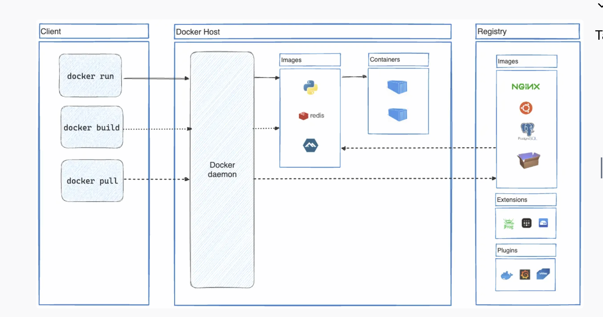

# Docker
Docker is an open platform for developing, shipping, and running applications. Docker enables you to separate your applications from your infrastructure so you can deliver software quickly. With Docker, you can manage your infrastructure in the same ways you manage your applications. By taking advantage of Docker's methodologies for shipping, testing, and deploying code, you can significantly reduce the delay between writing code and running it in production.

## Docker Platform
Docker provides the ability to package and run an application in a loosely isolated environment called a container. The isolation and security lets you run many containers simultaneously on a given host. Containers are lightweight and contain everything needed to run the application, so you don't need to rely on what's installed on the host. You can share containers while you work, and be sure that everyone you share with gets the same container that works in the same way.

Docker provides tooling and a platform to manage the lifecycle of your containers:

- Develop your application and its supporting components using containers.
- The container becomes the unit for distributing and testing your application.
- When you're ready, deploy your application into your production environment, as a container or an orchestrated service. This works the same whether your production environment is a local data center, a cloud provider, or a hybrid of the two.


### Advantages of Docker

- fast, consistent delivery of applications
- responsive deployment and scaling
- running more workloads on same hardware

## Docker Architecture

Docker uses a client-server architecture. The Docker client talks to the Docker daemon, which does the heavy lifting of building, running, and distributing your Docker containers. The Docker client and daemon can run on the same system, or you can connect a Docker client to a remote Docker daemon. The Docker client and daemon communicate using a REST API, over UNIX sockets or a network interface. Another Docker client is Docker Compose, that lets you work with applications consisting of a set of containers.



### Docker Daemon
Docker daemon (`dockerd`) listens for API requests and executes them. It manages the docker objects such as containers, images, networks and volumes. A daemon can communicate to another daemons to manage services.

### Docker Client
Docker client (`docker`) is the primary way end-users interact with docker. When you use commands such as `docker run`, the client sends these commands to `dockerd`, which carries them out. The docker command uses the Docker API. The Docker client can communicate with more than one daemon.

### Docker Registry
A Docker registry stores Docker images. Docker Hub is a public registry that anyone can use, and Docker looks for images on Docker Hub by default. You can even run your own private registry.

When you use the `docker pull` or `docker run` commands, Docker pulls the required images from your configured registry. When you use the `docker push` command, Docker pushes your image to your configured registry.

#### Registry vs Repository

Both are similar but not identical. Registry is the centralized storage location of the docker images while repository is collection of related containers within a registry. Think of it as a folder where you organize your images based on projects. Each repository contains one or more container images.

### Docker Objects
When you are using docker, you are creating images, containers, networks, volumes, plugins and other objects.

#### Images
An image is a ready-only template with instructions for creating a container. Often an image is based on some other image with some customizations.

#### Containers
A container is a runnable instance of an image. You can create, start, stop, move, or delete a container using the Docker API or CLI. You can connect a container to one or more networks, attach storage to it, or even create a new image based on its current state.

By default, a container is relatively well isolated from other containers and its host machine. You can control how isolated a container's network, storage, or other underlying subsystems are from other containers or from the host machine.

A container is defined by its image as well as any configuration options you provide to it when you create or start it. When a container is removed, any changes to its state that aren't stored in persistent storage disappear.


##### Container vs VM
Without getting too deep, a VM is an entire operating system with its own kernel, hardware drivers, programs, and applications. Spinning up a VM only to isolate a single application is a lot of overhead.

A container is simply an isolated process with all of the files it needs to run. If you run multiple containers, they all share the same kernel, allowing you to run more applications on less infrastructure.

##### Using container with VM
Quite often, you will see containers and VMs used together. As an example, in a cloud environment, the provisioned machines are typically VMs. However, instead of provisioning one machine to run one application, a VM with a container runtime can run multiple containerized applications, increasing resource utilization and reducing costs.


## Behind Docker

Docker is written in Go. Docker uses a technology called namespaces to provide the isolated workspace called the container. When you run a container, Docker creates a set of namespaces for that container.

These namespaces provide a layer of isolation. Each aspect of a container runs in a separate namespace and its access is limited to that namespace.


## Docker Compose

Running containers each time is tedious due to long command as well can be inconsistent as it's error prone.

With docker compose, we can define all our containers and configuration in a YAML file. On including it in code repository, anyone else can clone your repository and get it running in a matter of snap.

### Dockerfile vs docker compose

A Dockerfile provides instructions to build a container image while a Compose file defines your running containers. Quite often, a Compose file references a Dockerfile to build an image to use for a particular service.

## Dockerfile

A Dockerfile is a text-based document that's used to create a container image. It provides instructions to the image builder on the commands to run, files to copy, startup command, and more.

Dockerfile to produce ready-to-run Python application -
```
FROM python:3.12
WORKDIR /usr/local/app

# Install the application dependencies
COPY requirements.txt ./
RUN pip install --no-cache-dir -r requirements.txt

# Copy in the source code
COPY src ./src
EXPOSE 5000

# Setup an app user so the container doesn't run as the root user
RUN useradd app
USER app

CMD ["uvicorn", "app.main:app", "--host", "0.0.0.0", "--port", "8080"]
```

##### Common Instructions

- `FROM <image>` - this specifies the base image that the build will extend.
- `WORKDIR <path>` - this instruction specifies the "working directory" or the path in the image where files will be copied and commands will be executed.
- `COPY <host-path> <image-path>` - this instruction tells the builder to copy files from the host and put them into the container image.
- `RUN <command>` - this instruction tells the builder to run the specified command.
- `ENV <name> <value>` - this instruction sets an environment variable that a running container will use.
- `EXPOSE <port-number>` - this instruction sets configuration on the image that indicates a port the image would like to expose.
- `USER <user-or-uid>` - this instruction sets the default user for all subsequent instructions.
- `CMD ["<command>", "<arg1>"]` - this instruction sets the default command a container using this image will run.

All dockerfile instructions can be found [here](https://docs.docker.com/reference/dockerfile/).

Overall, it does following - 
- Determine base image
- Install application dependencies
- Copy in any relevant source code or binaries
- Configure the final image

### Building image
Images are build with a Dockerfile. Command is -
```
docker build .
```

`.` is the path or url to build context. At this location, builder will find the Dockerfile. When you run a build, the builder pulls the base image, if needed, and then runs the instructions specified in the Dockerfile.

```
docker build .
[+] Building 3.5s (11/11) FINISHED                                              docker:desktop-linux
 => [internal] load build definition from Dockerfile                                            0.0s
 => => transferring dockerfile: 308B                                                            0.0s
 => [internal] load metadata for docker.io/library/python:3.12                                  0.0s
 => [internal] load .dockerignore                                                               0.0s
 => => transferring context: 2B                                                                 0.0s
 => [1/6] FROM docker.io/library/python:3.12                                                    0.0s
 => [internal] load build context                                                               0.0s
 => => transferring context: 123B                                                               0.0s
 => [2/6] WORKDIR /usr/local/app                                                                0.0s
 => [3/6] RUN useradd app                                                                       0.1s
 => [4/6] COPY ./requirements.txt ./requirements.txt                                            0.0s
 => [5/6] RUN pip install --no-cache-dir --upgrade -r requirements.txt                          3.2s
 => [6/6] COPY ./app ./app                                                                      0.0s
 => exporting to image                                                                          0.1s
 => => exporting layers                                                                         0.1s
 => => writing image sha256:9924dfd9350407b3df01d1a0e1033b1e543523ce7d5d5e2c83a724480ebe8f00    0.0s
```

After this, we can run 
```
docker run sha256:9924dfd9350407b3df01d1a0e1033b1e543523ce7d5d5e2c83a724480ebe8f00
```

which will start the container.

### Tagging Image

Tagging images is the method to provide an image with a memorable name. However, there is a structure to the name of an image. A full image name has the following structure:

```
[HOST[:PORT_NUMBER]/]PATH[:TAG]
```

For example - 

- `nginx`, equivalent to `docker.io/library/nginx:latest`: this pulls an image from the `docker.io` registry, the `library` namespace, the `nginx` image repository, and the `latest` tag.
- `docker/welcome-to-docker`, equivalent to `docker.io/docker/welcome-to-docker:latest`: this pulls an image from the `docker.io` registry, the `docker` namespace, the `welcome-to-docker` image repository, and the `latest` tag

To tag an image during a build - 
```
docker build -t my-username/my-image .
```

If already build - 
```
docker image tag my-username/my-image another-username/another-image:v1
```

### Publishing Image

Push the image - 
```
docker push my-username/my-image
```


### Build cache
When you run the `docker build` command to create a new image, Docker executes each instruction in your Dockerfile, creating a layer for each command and in the order specified. For each instruction, Docker checks whether it can reuse the instruction from a previous build. If it finds that you've already executed a similar instruction before, Docker doesn't need to redo it. Instead, it’ll use the cached result. This way, your build process becomes faster and more efficient, saving you valuable time and resources.

Using the build cache effectively lets you achieve faster builds by reusing results from previous builds and skipping unnecessary work. In order to maximize cache usage and avoid resource-intensive and time-consuming rebuilds, it's important to understand how cache invalidation works. Here are a few examples of situations that can cause cache to be invalidated:

- Any changes to the command of a `RUN` instruction invalidates that layer. Docker detects the change and invalidates the build cache if there's any modification to a `RUN` command in your Dockerfile.

- Any changes to files copied into the image with the `COPY` or `ADD` instructions. Docker keeps an eye on any alterations to files within your project directory. Whether it's a change in content or properties like permissions, Docker considers these modifications as triggers to invalidate the cache.

- Once one layer is invalidated, all following layers are also invalidated. If any previous layer, including the base image or intermediary layers, has been invalidated due to changes, Docker ensures that subsequent layers relying on it are also invalidated. This keeps the build process synchronized and prevents inconsistencies.

## Docker concepts

### Publishing ports

Each component - a React frontend, a Python API, and a Postgres database - runs in its own sandbox environment, completely isolated from everything else on your host machine. This isolation is great for security and managing dependencies, but it also means you can’t access them directly. For example, you can’t access the web app in your browser.

Publishing a port provides the ability to break through a little bit of networking isolation by setting up a forwarding rule.

```
docker run -d -p HOST_PORT:CONTAINER_PORT nginx
```

Example - 
```
docker run -d -p 8080:80 nginx
```

#### Publishing to ephemeral port

At times, you may want to simply publish the port but don’t care which host port is used. In these cases, you can let Docker pick the port for you. To do so, simply omit the HOST_PORT configuration.

```
docker run -p 80 nginx
```

Once the container is running, using `docker ps` will show you the port that was chosen:

#### Publishing all ports

When creating a container image, the EXPOSE instruction is used to indicate the packaged application will use the specified port. These ports aren't published by default.

With the `-P` or `--publish-all` flag, you can automatically publish all exposed ports to ephemeral ports. This is quite useful when you’re trying to avoid port conflicts in development or testing environments.

```
docker run -P nginx
```

#### Using docker-compose

```
services:
  app:
    image: docker/welcome-to-docker
    ports:
      - 8080:80
```

### Overriding container defaults

When a Docker container starts, it executes an application or command. The container gets this executable (script or file) from its image’s configuration. Containers come with default settings that usually work well, but you can change them if needed. These adjustments help the container's program run exactly how you want it to.

For example, if you have an existing database container that listens on the standard port and you want to run a new instance of the same database container, then you might want to change the port settings the new container listens on so that it doesn’t conflict with the existing container. Sometimes you might want to increase the memory available to the container if the program needs more resources to handle a heavy workload or set the environment variables to provide specific configuration details the program needs to function properly.

The `docker run` command offers a powerful way to override these defaults and tailor the container's behavior to your liking. The command offers several flags that let you to customize container behavior on the fly.

#### Overriding network port

```
docker run -d -p HOST_PORT:CONTAINER_PORT postgres
```

#### Overriding environment varialbles

```
docker run -e foo=bar postgres env
```

Using a .env file -
```
docker run --env-file .env postgres env
```

#### Limiting resources -

```
docker run -e POSTGRES_PASSWORD=secret --memory="512m" --cpus="0.5" postgres
```

### Persisting Container Data

When a container starts, it uses the files and configuration provided by the image. Each container is able to create, modify, and delete files and does so without affecting any other containers. When the container is deleted, these file changes are also deleted.

While this ephemeral nature of containers is great, it poses a challenge when you want to persist the data. For example, if you restart a database container, you might not want to start with an empty database. 

#### Container Volumes

Volumes are a storage mechanism that provide the ability to persist data beyond the lifecycle of an individual container. Think of it like providing a shortcut or symlink from inside the container to outside the container.

Volumes content can be seen by Docker Desktop - Volumes view.

```
docker volume create log-data
```

When starting a container with the following command, the volume will be mounted (or attached) into the container at `/logs`:

```
docker run -d -p 80:80 -v log-data:/logs docker/welcome-to-docker
```

If the volume `log-data` doesn't exist, Docker will automatically create it for you.

Removing volumes - 
```
docker rm -f new-db
```

### Sharing files between container and host

Consider a scenario where you have a web application container that requires access to configuration settings stored in a file on your host system. This file may contain sensitive data such as database credentials or API keys. Storing such sensitive information directly within the container image poses security risks, especially during image sharing. To address this challenge, Docker offers storage options that bridge the gap between container isolation and your host machine's data.

Docker offers two primary storage options for persisting data and sharing files between the host machine and containers: volumes and bind mounts.


#### Volumes vs bind mounts

If you want to ensure that data generated or modified inside the container persists even after the container stops running, you would opt for a volume.

If you have specific files or directories on your host system that you want to directly share with your container, like configuration files or development code, then you would use a bind mount. It's like opening a direct portal between your host and container for sharing. Bind mounts are ideal for development environments where real-time file access and sharing between the host and container are crucial.

#### Sharing files

With volumes - 

```
docker run -v /HOST/PATH:/CONTAINER/PATH -it nginx
```

With bind mount - 
```
docker run --mount type=bind,source=/HOST/PATH,target=/CONTAINER/PATH,readonly nginx
```

> Docker recommends using the --mount syntax instead of -v. It provides better control over the mounting process and avoids potential issues with missing directories.


#### File permissions

When using bind mounts, it's crucial to ensure that Docker has the necessary permissions to access the host directory. To grant read/write access, you can use the `:ro` flag (read-only) or `:rw` (read-write) with the `-v` or `--mount` flag during container creation. For example, the following command grants read-write access permission.

```
docker run -v HOST-DIRECTORY:/CONTAINER-DIRECTORY:rw nginx
```

Read-only bind mounts let the container access the mounted files on the host for reading, but it can't change or delete the files. With read-write bind mounts, containers can modify or delete mounted files, and these changes or deletions will also be reflected on the host system. Read-only bind mounts ensures that files on the host can't be accidentally modified or deleted by a container.


### Multi container applications

Starting up single container is easy. One best practice for containers is that each container should do one thing and do it well. While there are exceptions to this rule, avoid the tendency to have one container do multiple things.

Now you might ask, "Do I need to run these containers separately? If I run them separately, how shall I connect them all together?"

While docker run is a convenient tool for launching containers, it becomes difficult to manage a growing application stack with it. Here's why:

- Imagine running several docker run commands (frontend, backend, and database) with different configurations for development, testing, and production environments. It's error-prone and time-consuming.
- Applications often rely on each other. Manually starting containers in a specific order and managing network connections become difficult as the stack expands.
- Each application needs its docker run command, making it difficult to scale individual services. Scaling the entire application means potentially wasting resources on components that don't need a boost.
- Persisting data for each application requires separate volume mounts or configurations within each docker run command. This creates a scattered data management approach.
- Setting environment variables for each application through separate docker run commands is tedious and error-prone.

The solution is docker compose.

Docker Compose defines your entire multi-container application in a single YAML file called compose.yml. This file specifies configurations for all your containers, their dependencies, environment variables, and even volumes and networks. With Docker Compose:

- You don't need to run multiple docker run commands. All you need to do is define your entire multi-container application in a single YAML file. This centralizes configuration and simplifies management.
- You can run containers in a specific order and manage network connections easily.
- You can simply scale individual services up or down within the multi-container setup. This allows for efficient allocation based on real-time needs.
- You can implement persistent volumes with ease.
- It's easy to set environment variables once in your Docker Compose file.