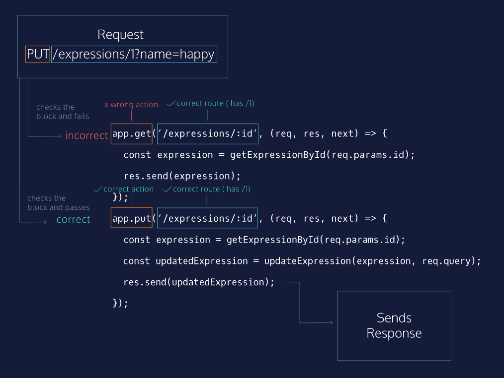

# Express JS

Express is a powerful but flexible Javascript framework for creating web servers and APIs. It can be used for everything from simple static file servers to JSON APIs to full production servers.

## Getting Started With Express

### Creating A Server

```javascript
const express = require('express');
const app = express();

const PORT = process.env.PORT || 4001;

app.listen(PORT, () => {
    console.log(`Server started listening at ${PORT}`);
})
```

### Sending A response

HTTP follows a one request-one response cycle. Each client expects exactly one response per request, and each server should only send a single response back to the client per request.

Express servers send responses using the `.send()` method on the response object. `.send()` will take any input and include it in the response body.

```javascript
const monsters = [{ type: 'werewolf' }, { type: 'hydra' }, { type: 'chupacabra' }];
app.get('/monsters', (req, res, next) => {
  res.send(monsters);
});
```

In this example, a `GET /monsters` request will match the route, Express will call the callback function, and the `res.send()` method will send back an array of spooky monsters.

In addition to `.send()`, `.json()` can be used to explicitly send JSON-formatted responses. `.json()` sends any JavaScript object passed into it.

### Matching route paths


Express tries to match requests by route, meaning that if we send a request to `<server address>:<port number>/api-endpoint`, the Express server will search through any registered routes in order and try to match `/api-endpoint`.

Express searches through routes in the order that they are registered in your code. The first one that is matched will be used, and its callback will be called.

In the example above, you can see two `.get() `routes registered at /another-route and /expressions. When a `GET /expressions` request arrives to the Express server, it first checks `/another-route`‘s path because it is registered before the `/expressions` route. Because `/another-route` does not match the path, Express moves on to the next registered middleware. Since the route matches the path, the callback is invoked, and it sends a response.

If there are no matching routes registered, or the Express server has not sent a response at the end of all matched routes, it will automatically send back a 404 Not Found response, meaning that no routes were matched or no response was ultimately sent by the registered routes.

### Using parameters in getting a filtered resource

Routes become much more powerful when they can be used dynamically. Express servers provide this functionality with named route parameters. Parameters are route path segments that begin with : in their Express route definitions. They act as wildcards, matching any text at that path segment. For example `/monsters/:id` will match both`/monsters/1` and `/monsters/45`.

Express parses any parameters, extracts their actual values, and attaches them as an object to the request object: `req.params`. This object’s keys are any parameter names in the route, and each key’s value is the actual value of that field per request.

```
const monsters = { hydra: { height: 3, age: 4 }, dragon: { height: 200, age: 350 } };
// GET /monsters/hydra
app.get('/monsters/:name', (req, res, next) => {
  console.log(req.params) // { name: 'hydra' };
  res.send(monsters[req.params.name]);
});
```

### Setting status codes

Express allows us to set the status code on responses before they are sent. Response codes provide information to clients about how their requests were handled. Until now, we have been allowing the Express server to set status codes for us. For example, any `res.send()` has by default sent a 200 OK status code.

The `res` object has a `.status()` method to allow us to set the status code, and other methods like `.send()` can be chained from it.

```
const monsterStoreInventory = { fenrirs: 4, banshees: 1, jerseyDevils: 4, krakens: 3 };
app.get('/monsters-inventory/:name', (req, res, next) => {
  const monsterInventory = monsterStoreInventory[req.params.name];
  if (monsterInventory) {
    res.send(monsterInventory);
  } else {
    res.status(404).send('Monster not found');
  }
});
```

### Using queries

Query strings appear at the end of the path in URLs, and they are indicated with a `?` character. For instance, in `/monsters/1?name=chimera&age=1`, the query string is name=chimera&age=1 and the path is `/monsters/1/`

Query strings do not count as part of the route path. Instead, the Express server parses them into a JavaScript object and attaches it to the request body as the value of req.query. The `key: value` relationship is indicated by the = character in a query string, and key-value pairs are separated by &. In the above example route, the `req.query` object would be `{ name: 'chimera', age: '1' }`.

```
const monsters = { '1': { name: 'cerberus', age: '4'  } };
// PUT /monsters/1?name=chimera&age=1
app.put('/monsters/:id', (req, res, next) => {
  const monsterUpdates = req.query;
  monsters[req.params.id] = monsterUpdates;
  res.send(monsters[req.params.id]);
});
```

When updating, many servers will send back the updated resource after the updates are applied so that the client has the exact same version of the resource as the server and database.

### Matching By HTTP Verb + Path

Express matches routes using both path and HTTP method verb. In the diagram to the right, we see a request with a PUT verb and `/expressions` (remember that the query is not part of the route path). The path for the first route matches, but the method verb is wrong, so the Express server will continue to the next registered route. This route matches both method and path, and so its callback is called, the necessary updating logic is executed, and the response is sent.



### Post HTTP Verb

POST is the HTTP method verb used for creating new resources. Because POST routes create new data, their paths do not end with a route parameter, but instead end with the type of resource to be created.

For example, to create a new monster, a client would make a POST request to `/monsters`. The client does not know the id of the monster until it is created and sent back by the server, therefore POST `/monsters/:id` doesn’t make sense because a client couldn’t know the unique id of a monster before it exists.

Express uses `.post()` as its method for POST requests. POST requests can use many ways of sending data to create new resources, including query strings.

The HTTP status code for a newly-created resource is 201 Created.

```
app.post('/expressions', (req, res, next) => {
  const newExpression = createElement('expressions', req.query);
  if(newExpression) {
    expressions.push(newExpression);
    res.status(201).send(newExpression);
  }
  else {
    res.status(400).send();
  }
})
```

### Delete Resource

DELETE is the HTTP method verb used to delete resources. Because DELETE routes delete currently existing data, their paths should usually end with a route parameter to indicate which resource to delete.

Express uses `.delete()` as its method for DELETE requests.

Servers often send a 204 No Content status code if deletion occurs without error.

```
app.delete('/expressions/:id', (req, res, next) => {
  const expressionId = getIndexById(req.params.id, expressions);
  if(expressionId !== -1) {
    expressions.splice(expressionId, 1);
    res.status(204).send('Deleted Successfully');
  }
  else {
    res.status(404).send('Not Found');
  }
})
```

### Complete Example of all HTTP methods and their usage

```
const express = require('express');
const app = express();

// Serves Express Yourself website
app.use(express.static('public'));

const { getElementById, getIndexById, updateElement,
        seedElements, createElement } = require('./utils');

const expressions = [];
seedElements(expressions, 'expressions');
const animals = [];

const PORT = process.env.PORT || 4001;
// Use static server to serve the Express Yourself Website
app.use(express.static('public'));

app.get('/expressions', (req, res, next) => {
  res.send(expressions);
});

app.get('/expressions/:id', (req, res, next) => {
  const foundExpression = getElementById(req.params.id, expressions);
  if (foundExpression) {
    res.send(foundExpression);
  } else {
    res.status(404).send();
  }
});

app.put('/expressions/:id', (req, res, next) => {
  const expressionIndex = getIndexById(req.params.id, expressions);
  if (expressionIndex !== -1) {
    updateElement(req.params.id, req.query, expressions);
    res.send(expressions[expressionIndex]);
  } else {
    res.status(404).send();
  }
});

app.post('/expressions', (req, res, next) => {
  const receivedExpression = createElement('expressions', req.query);
  if (receivedExpression) {
    expressions.push(receivedExpression);
    res.status(201).send(receivedExpression);
  } else {
    res.status(400).send();
  }
});

app.delete('/expressions/:id', (req, res, next) => {
  const expressionIndex = getIndexById(req.params.id, expressions);
  if (expressionIndex !== -1) {
    expressions.splice(expressionIndex, 1);
    res.status(204).send();
  } else {
    res.status(404).send();
  }
});

app.listen(PORT, () => {
  console.log(`Listening on port ${PORT}`);
});
```


## Express Routers

Express provides functionality to alleviate this problem: Routers. Routers are mini versions of Express applications — they provide functionality for handling route matching, requests, and sending responses, but they do not start a separate server or listen on their own ports. Routers use all the .get(), .put(), .post(), and .delete() routes that you know and love.

### Express.Router()

An Express router provides a subset of Express methods. To create an instance of one, we invoke the .Router() method on the top-level Express import.

To use a router, we mount it at a certain path using app.use() and pass in the router as the second argument. This router will now be used for all paths that begin with that path segment. To create a router to handle all requests beginning with /monsters, the code would look like this:

```
const express = require('express');
const app = express();

const monsters = {
  '1': {
    name: 'godzilla',
    age: 250000000
  },
  '2': {
    name: 'manticore',
    age: 21
  }
}

const monstersRouter = express.Router();

app.use('/monsters', monstersRouter);

monstersRouter.get('/:id', (req, res, next) => {
  const monster = monsters[req.params.id];
  if (monster) {
    res.send(monster);
  } else {
    res.status(404).send();
  }
});
```

Inside the monstersRouter, all matching routes are assumed to have `/monsters` prepended, as it is mounted at that path. `monstersRouter.get('/:id')` matches the full path `/monsters/:id`.

When a `GET /monsters/1` request arrives, Express matches `/monsters` in `app.use()` because the beginning of the path (`'/monsters'`) matches. Express’ route-matching algorithm enters the monstersRouter‘s routes to search for full path matches. Since `monstersRouter.get('/:id)` is mounted at `/monsters`, the two paths together match the entire request path (/monsters/1), so the route matches and the callback is invoked. The 'godzilla' monster is fetched from the monsters array and sent back.

### Using Multiple Router Files
Generally, we will keep each router in its own file, and require them in the main application. This allows us to keep our code clean and our files short.

To do this with monstersRouter, we would create a new file `monsters.js` and move all code related to /monsters requests into it.

```
// monsters.js
const express = require('express');
const monstersRouter = express.Router();

const monsters = {
  '1': {
    name: 'godzilla',
    age: 250000000
  },
  '2': {
    Name: 'manticore',
    age: 21
  }
}

monstersRouter.get('/:id', (req, res, next) => {
  const monster = monsters[req.params.id];
  if (monster) {
    res.send(monster);
  } else {
    res.status(404).send();
  }
});

module.exports = monstersRouter;
```

This code contains all the monsters specific code. In a more full-fledged API, this file would contain multiple routes. To use this router in another file, we use module.exports so that other files can access monstersRouter. The only other new line of code required is that Express must be required in each file, since we’ll need to create a router with `express.Router()`.

Our main.js file could then be refactored to import the monstersRouter:

```
// main.js
const express = require('express');
const app = express();
const monstersRouter = require('./monsters.js');

app.use('/monsters', monstersRouter);
```

## Express Middleware

Middleware is code that executes between a server receiving a request and sending a response. It operates on the boundary, so to speak, between those two HTTP actions.

In Express, middleware is a function. Middleware can perform logic on the request and response objects, such as: inspecting a request, performing some logic based on the request, attaching information to the response, attaching a status to the response, sending the response back to the user, or simply passing the request and response to another middleware. Middleware can do any combination of those things or anything else a Javascript function can do.

```
app.use((req, res, next) => {
  console.log('Request received');
  next();
});
```

An Express application is essentially a series of middleware function calls.

It is precisely this service that we leverage Express for. In addition to performing the routing that allows us to communicate appropriate data for each separate endpoint, we can perform application logic we need by implementing the necessary middleware.

### `next()`

The middleware stack is processed in the order they appear in the application file, such that middleware defined later happens after middleware defined before. It’s important to note that this is regardless of method — an app.use() that occurs after an app.get() will get called after the app.get(). Observe the following code:

```
app.use((req, res, next) => {
  console.log("A sorcerer approaches!");
  next();
});

app.get('/magic/:spellname', (req, res, next) => {
  console.log("The sorcerer is casting a spell!");
  next();
});

app.get('/magic/:spellname', (req, res, next) => {
  console.log(`The sorcerer has cast ${req.params.spellname}`);
  res.status(200).send();
});

app.get('/magic/:spellname', (req, res, next) => {
  console.log("The sorcerer is leaving!");
});

// Accessing http://localhost:4001/magic/fireball
// Console Output:
// "A sorcerer approaches!"
// "The sorcerer is casting a spell!"
// "The sorcerer has cast fireball"
```

In the above code, the routes are called in the order that they appear in the file, provided the previous route called next() and thus passed control to the next middleware. We can see that the final matching call was not printed. This is because the previous middleware did not invoke the next() function to run the following middleware.

An Express middleware is a function with three parameters: (req, res, next). The sequence is expressed by a set of callback functions invoked progressively after each middleware performs its purpose. The third argument to a middleware function, next, should get explicitly called as the last part of the middleware’s body. This will hand off the processing of the request and the construction of the response to the next middleware in the stack.

### express routes are middleware

Express routes are middleware. Every route created in Express is also a middleware function handling the request and response objects at that part of the stack. Express routes also have the option of sending a response body and status code and closing the connection. These two features are a byproduct of Express routes being middleware, because all Express middleware functions have access to the request, the response, and the next middleware in the stack.

### route level middleware

`app.use([path,] callback [, callback...])`

In documentation for many programming languages, optional arguments for functions are placed in square brackets ([]). This means that `app.use()` takes an optional path parameter as its first argument. We can now write middleware that will run for every request at a specific path.

```
app.use([path,] callback [, callback...])
```

In documentation for many programming languages, optional arguments for functions are placed in square brackets ([]). This means that app.use() takes an optional path parameter as its first argument. We can now write middleware that will run for every request at a specific path. This parameter can be array consisting of multiple paths.

In the example above the console will print '`User has hit endpoint /sorcerer`', if someone visits our web page’s ‘`/sorcerer`’ endpoint. Since the method `app.use()` was used, it won’t matter if the user is performing a GET,a POST, or any other kind of HTTP request. Since the path was given as an argument to `app.use()`, this middleware function will not execute if the user hits a different path (for instance: '`/spells`' or '`/sorcerer/:sorcerer_id`').

### Middleware Stack

we can provide a callback to many middlewares to avoid redundancy. See example below

```
const authenticate = (req, res, next) => {
  ...
};

const validateData = (req, res, next) => {
  ...
};

const getSpell = (req, res, next) => {
  res.status(200).send(getSpellById(req.params.id));
};

const createSpell = (req, res, next) => {
  createSpellFromRequest(req);
  res.status(201).send();
};

const updateSpell = (req, res, next) => {
  updateSpellFromRequest(req);
  res.status(204).send();
}

app.get('/spells/:id', authenticate, getSpell);

app.post('/spells', authenticate, validateData, createSpell);

app.put('/spells/:id', authenticate, validateData, updateSpell);
```

We can authenticate an user. If he is valid, we can call next to execute next callback that is validateData else error response can be send from that without calling the next middleware.

__next()__ serves a crucial purpose either to keep processing the request or just drop it. In case, no next() is called and no response is send, it will lead to timeout and client will again send the request.

### Open-Source Middleware: Logging

Knowing how to write middleware, we should now feel inspired to solve all the problems that come at us by writing code. It’s encouraging to know how to fix an issue. If we find a solution we don’t need to write, however, it will allow us to work faster and more intelligently to focus on the problems that differentiate our application from others.

To illustrate: if we needed to write a web server from scratch every time we wanted to build a web application, we’d waste a lot of time solving problems that have been solved countless times before and ignoring perfectly good pre-existing solutions. Luckily for us web developers, Express already exists as an open-source package that we can install and use to build upon. There is a huge ecosystem of Javascript packages that will solve so many of the problems that developers frequently run into.

In the workspace you’ll see what code looks like using unnecessary custom solutions and lots of lines calling console.log(). It’s not bad code, but it introduces complexity that could be avoided. Time spent thinking about and writing code that accomplishes common tasks is time that could be better spent on thinking about and writing code that is unique to your application.

We will replace the logging code in the workspace with morgan, an open-source library for logging information about the HTTP request-response cycle in a server application. morgan() is a function that will return a middleware function, to reiterate: the return value of morgan() will be a function, that function will have the function signature (req, res, next) that can be inserted into an app.use(), and that function will be called before all following middleware functions. Morgan takes an argument to describe the formatting of the logging output. For example, morgan('tiny') will return a middleware function that does a “tiny” amount of logging. With morgan in place, we’ll be able to remove the existing logging code. Once we see how fast it is to add logging with morgan, we won’t have to spend time in the future trying to figure out how to replicate that functionality.

```
const morgan = require('morgan');
app.use(morgan('tiny)); // tiny logging
app.use(morgan('dev')); //HTTP method, path, status code, response time, content length and color change
```

### Open-Source Middleware: Body Parsing

```
const bodyParser = require('body-parser');
app.use(bodyParser.json()); //parses body in json format
```

Though custom callback is good, it is not sufficient for every scenerio.

### Custom Error-Handling Middleware

Error handling middleware needs to be the last app.use() in your file. If an error happens in any of our routes, we want to make sure it gets passed to our error handler. The middleware stack progresses through routes as they are presented in a file, therefore the error handler should sit at the bottom of the file. How do we write it?

```
app.use((err, req, res, next) => {
  console.error(err.stack);
  res.status(500).send('Something broke!');
});
```

Based on the code above, we can see that error-handling middleware is written much like other kinds of middleware. The biggest difference is that there is an additional parameter in our callback function, err. This represents the error object, and we can use it to investigate the error and perform different tasks depending on what kind of error was thrown. For now, we only want to send an HTTP 500 status response to the user.

Express has its own error-handler, which catches errors that we haven’t handled. But if we anticipate an operation might fail, we can invoke our error-handling middleware. We do this by passing an error object as an argument to next(). Usually, next() is called without arguments and will proceed through the middleware stack as expected. When called with an error as the first argument, however, it will call any applicable error-handling middleware.

```
app.use((req, res, next) => {
  const newValue = possiblyProblematicOperation();
  if (newValue === undefined) {
    let undefinedError = new Error('newValue was not defined!');
    return next(undefinedError);
  }
  next();
});

app.use((err, req, res, next) => {
  const status = err.status || 500;
  res.status(status).send(err.message);
});
```

In this segment we assign the return value of the function `possiblyProblematicOperation()` to newValue. Then we check to see if this function returned anything at all. If it didn’t, we create a new Error and pass it to `next()`. This prompts the error-handling middleware to send a response back to the user, but many other error-handling techniques could be employed (like logging, re-attempting the failed operation, and/or emailing the developer).


## Router Parameters

### Introduction

When building interfaces with Express, we will run into the pattern of expecting certain information in a requested URL and using that information to identify the data that is being requested. To give an example:

```
app.get('/sorcerers/:sorcererName', (req, res, next) => {
  const sorcerer = Sorcerers[req.params.sorcererName];
  res.send(sorcerer.info);
});

app.get('/sorcerers/:sorcererName/spellhistory', (req, res, next) => {
  const sorcerer = Sorcerers[req.params.sorcererName];
  const spellHistory = Spells[sorcerer.id].history;
  res.send(spellHistory);
});
```

In the above code we need to extract the request parameter :sorcererName from the url in both instances, and end up duplicating the necessary code so that it appears in both routes. When working with routes that require parameters, we might find ourselves in a position where multiple different routes require the same parameter and use it to identify the same piece of data. While writing this duplicate code will get the job done, copy-and-pasting functionality does leave a bitter taste in the mouth of the principled developer. We should investigate if there is a better way to accomplish this.

### router.param()

Express, luckily, is mindful of the pain-point of replicated parameter-matching code and has a method specifically for this issue. When a specific parameter is present in a route, we can write a function that will perform the necessary lookup and attach it to the req object in subsequent middleware that is run.

```
app.param('spellId', (req, res, next, id) => {
  let spellId = Number(id);
    try {
      const found = SpellBook.find((spell) => {
        return spellId === spell.id;
      })
      if (found) {
        req.spell = found;
        next();
      } else {
        next(new Error('Your magic spell was not found in any of our tomes'));
      };
    } catch (err) {
      next(err)
    }
});
```

In the code above we intercept any request to a route handler with the :spellId parameter. Note that in the app.param function signature, `'spellId'` does not have the leading `:`. The actual ID will be passed in as the fourth argument, id in this case, to the app.param callback function when a request arrives.

We look up the spell in our SpellBook array using the `.find()` method. If SpellBook does not exist, or some other error is thrown in this process, we pass the error to the following middleware (hopefully we’ve written some error-handling middleware, or included some externally-sourced error-handling middleware). If the spell exists in SpellBook, the `.find()` method will store the spell in found, and we attach it as a property of the request object (so future routes can reference it via `req.spell`). If the requested spell does not exist, `.find()` will store undefined in found, and we let future middlewares know there was an error with the request by creating a new Error object and passing it to `next()`.

Note that inside an `app.param` callback, you should use the fourth argument as the parameter’s value, not a key from the `req.params` object.

Also, don't change any path any of the router.

### Merge Parameters

Complexity is all around us. Buildings are made from bricks and many droplets of water make a cloud. When we want to create something complex in software, we model out our base components and use composition to create these relationships.

When we’re building web endpoints, we might want to access some property of a complex object. In order to do this in Express, we can design a nested router. This would be a router that is invoked within another router. In order to pass parameters the parent router has access to, we pass a special configuration object when defining the router.

```
const sorcererRouter = express.Router();
const familiarRouter = express.Router({mergeParams: true});

sorcererRouter.use('/:sorcererId/familiars', familiarRouter);

sorcererRouter.get('/', (req, res, next) => {
  res.status(200).send(Sorcerers);
  next();
});

sorcererRouter.param('sorcererId', (req, res, next, id) => {
  const sorcerer = getSorcererById(id);
  req.sorcerer = sorcerer;
  next();
});

familiarRouter.get('/', (req, res, next) => {
  res.status(200).send(`Sorcerer ${req.sorcerer} has familiars ${getFamiliars(sorcerer)}`);
});

app.use('/sorcerer', sorcererRouter);
```

In the code above we define two endpoints: `/sorcerer` and `/sorcerer/:sorcererId/familiars`. The familiars are nested into the sorcerer endpoint — indicating the relationship that a sorcerer has multiple familiars. Take careful note of the `{mergeParameters: true}` argument that gets passed when creating the familiarRouter. This argument tells Express that the familiarRouter should have access to parents passed into its parent router, that is, the sorcererRouter. We then tell express that the path for the familiarRouter is the same as the path for the sorcererRouter with the additional path `/:sorcererId/familiars`. We then can create a family of routes (a router) built by appending routes to familiarRouter‘s base: `/sorcerer/:sorcererId/familiars`.


## CORS

.png)
.png)
.png)
.png)
.png)
.png)
.png)
.png)
.png)
.png)
.png)
.png)
.png)
.png)


## API Documentation

[Adding Swagger to node projects](https://blog.cloudboost.io/adding-swagger-to-existing-node-js-project-92a6624b855b)

[YAML Tutorial](https://www.cloudbees.com/blog/yaml-tutorial-everything-you-need-get-started)

[API Development in Node.js with Swagger](https://scotch.io/tutorials/speed-up-your-restful-api-development-in-node-js-with-swagger)

[Swagger and Node js](https://mherman.org/blog/swagger-and-nodejs/)

## Resources

[Writing express middlewares](https://expressjs.com/en/guide/writing-middleware.html)

[Using Express middleware](https://expressjs.com/en/guide/using-middleware.html)

[Error Handling in express](https://expressjs.com/en/guide/error-handling.html)

## Review: Node/Express.js

Node/Express.js
Review
Congratulations! The goal of this unit was to learn about the popular back-end environment, Node.js, and how to create back-end servers and APIs in JavaScript using the popular Express.js framework. With this knowledge, you have the foundation for creating compelling, dynamic web servers. In the next unit, you will learn how to write tests for your back-end server.

Having completed this unit, you are now able to:

Understand Node.js
Create a server with express
Design/serve RESTful APIs
Understand what CORS is
Explain routing
If you are interested in learning more about these topics, here are some additional resources:

Reading: [Eloquent Javascript Chapter 20: Node.js, Marijn Haverbeke](https://eloquentjavascript.net/20_node.html)
Tutorial: [Express web framework (Node.js/JavaScript), MDN](https://developer.mozilla.org/en-US/docs/Learn/Server-side/Express_Nodejs)
Article: [Going out to eat and understanding the basics of Express.js, Kevin Kononenko](https://www.freecodecamp.org/news/going-out-to-eat-and-understanding-the-basics-of-express-js-f034a029fb66/)
Resource: Express.js: [Express Middleware Modules](https://expressjs.com/en/resources/middleware.html)
