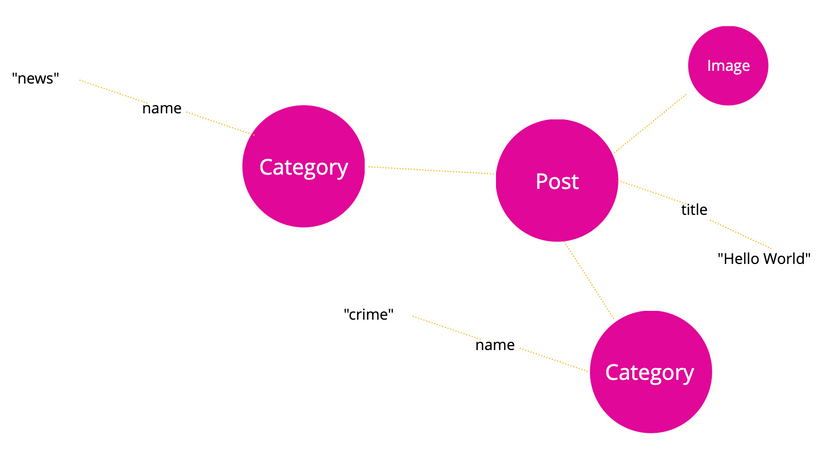
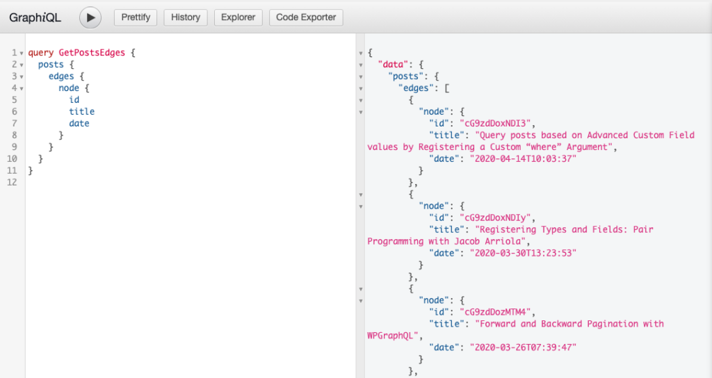
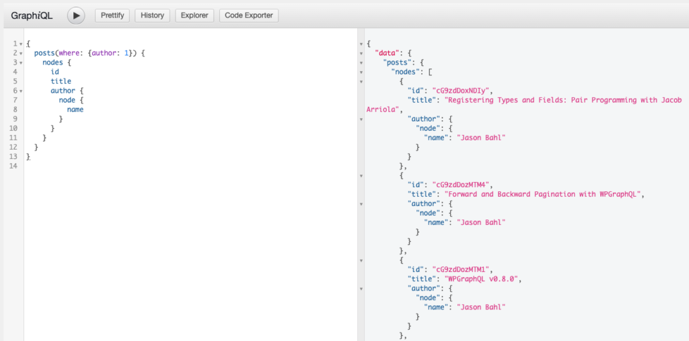
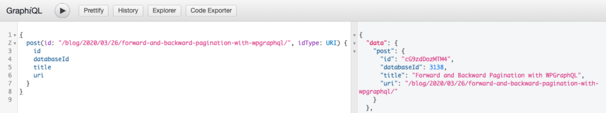
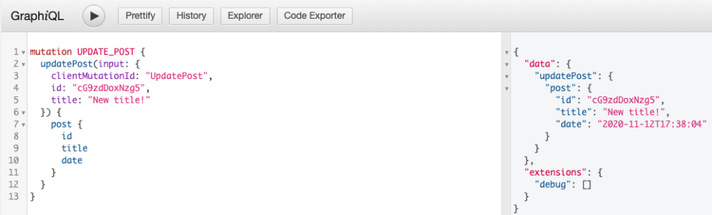
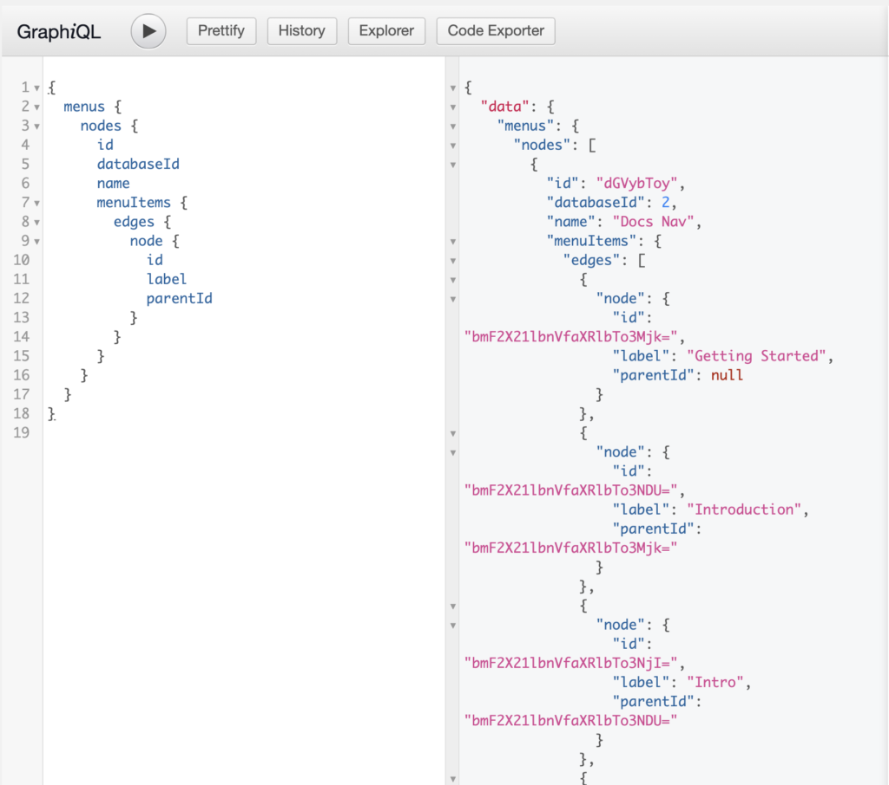

# GraphQL

## WordPress GraphQL

WPGraphQL treats WordPress data like an application data graph.

What this means, is that every uniquely identifiable object is considered a "node".

Posts, Pages, Comments, Terms, Users are all considered nodes. And Nodes can have fields that resolve to concrete data.

For example a "Post" node might have a "title" that resolves to the value "Hello World".



**An application data graph doesn't have a beginning or an end. It has nodes with fields, and WPGraphQL provides entry points to pluck nodes out of the Graph using GraphQL Queries.**

Take the following query, for example.

```
{
  post(id: \"cG9zdDo2NTY4\") {
    id
    title
    categories {
      nodes {
        name
      }
    }
  } 
}
```

This Query enters the Graph at a specific node, asks for the id and title of that node, and the `categories` associated with it and their `name`.

The Query would return results like the following:

```
{
  data: {
    post: {
      id: \"cG9zdDo2NTY4\",
      title: \"Hello World\"
      categories: {
        nodes: [
          {
            name: \"news\"
          },
          {
            name: \"crime\"
          }
        ]
      }
    }
  }
}
```


Which, visually represented would look like the following, where the Post is returned, the 2 connected categories, and their names, but the request stops there, as it did not ask to traverse any deeper connections to the categories, or other connections of the Post, such as the connected Image.

Note: *Any plugin can only extend WPGraphQL schema by adding more fields but they can't de-register or remove types from schema.*


:point_right: WPGraphQL generates opaque global IDs for entities by hashing the underlying loader type and the database id. So, objects loaded by the Post loader get a global ID of `base_64_encode( 'post:' . $database_id );`. So, a Post with the database ID of 1 would have a global ID of `cG9zdDox`.

### Advantages of WPGraphQL

- With GraphQL, since you ask for the exact fields you need, this means that behind the scenes fewer functions are executing to get the data. For example, if you don't ask for the post's content, filters such as 'the_content' (which can be expensive for some sites) don't execute and this has real impact on processing time

- Strongly typed schema and introspection
  GraphQL enables tooling (like GraphiQL pictured above) because it's centered around a strongly typed schema. What this means is that every field in a GraphQL API declares what type of data it will return. Whether it's a String, Integer, Float, Boolean or another GraphQL Type, the type of data that can be returned is known ahead of time.

- performance - 

  Let's start by looking at an example, and then we'll break it down.

  Below are screenshots of the same WordPress site asking for 100 posts from the WP REST API and 100 posts from WPGraphQL with the Chrome network tab open.

  REST:

  - Download size: 335 kb
  - Time: 7.91s

  WPGraphQL

  - Download size: 6.4 kb
  - Time: 67 ms

- Dataloader and n+1 problem solved-
  Another reason why WPGraphQL can be faster than the WP REST API is that it uses the "DataLoader" pattern to load resources.

  What this means, is that when you ask for a resource, instead of loading the full resource right away, it places the ID of the resource in a temporary buffer, then comes back later and loads all resources in the buffer at once.

  Let's take a look at what this means using our example query from above:

  ```
  query {
    posts( first: 5 ) {
      id
      title
      date
      author {
        name
        avatar {
          url
        }
      }
    }
  }
  ```

  This query will end up executing a WP_Query to get 5 posts. Then it will loop through the 5 posts and instead of getting the Author object immediately, it places the Author ID from the Post in a temporary buffer.

  Then, one WP_User_Query is made to get all 5 Authors of the 5 posts.

  So, instead of:

  - SQL Query to get 5 (n) posts
  - SQL Query to get Author of Post 1
  - SQL Query to get Author of Post 2
  - SQL Query to get Author of Post 3
  - SQL Query to get Author of Post 4
  - SQL Query to get Author of Post 5

  It becomes:

  - SQL Query to get 5 (n) posts
  - SQL Query to get Authors 1, 2, 3, 4, 5

  With GraphQL, the amount of SQL connections needed to resolve data is much less than in typical ways WordPress data is consumed.

- fewer functions executing
  With GraphQL, since you ask for the exact fields you need, this means that behind the scenes fewer functions are executing to get the data. For example, if you don't ask for the post's content, filters such as 'the_content' (which can be expensive for some sites) don't execute and this has real impact on processing time

- multiple root resources

  WPGraphQL also enables multiple root resources to be fetched at the same time.

  Let's say you needed a list of Posts and a list of Categories. With the WP REST API you would need to hit 2 enpdoints: /posts and /categories.

  With WPGraphQL, you can ask for both resources in a single request:

  ```
  query GET_POSTS_AND_CATEGORIES {
    posts {
      nodes {
        id
        title
      }
    }
    categories {
      nodes {
        id
        name
      }
    }
  }
  ```

- Batch queries

  WPGraphQL also supports batch queries. What this means is that multiple separate queries can be sent to the WPGraphQL server to be processed at the same time. Client tools such as [Apollo Link Batch HTTP](https://www.apollographql.com/docs/link/links/batch-http/) allow for different components to declare their data dependencies, and if the components are used on the same screen, the queries can be batched to one HTTP request and WPGraphQL can process them and return the results at once.

  Below is a screenshot showing this concept in action.

  When an array of GraphQL Queries is sent to WPGraphQL, they are processed and returned in the same order they were sent.

  This allows for components in applications to declare their data needs with a GraphQL Query, without sacrificing server processing efficiency.


## Using WPGraphQL

### List of posts

```
query GetPostsEdges {
  posts {
    edges {
      node {
        id
        title
        date
      }
    }
  }
}
```



### Filtering a list of posts

#### Query posts written by a specific author

```
{
  posts(where: {author: 1}) {
    nodes {
      id
      title
      author {
        node {
          name
        }
      }
    }
  }
}
```



#### Query posts by specific title
Use `(where: {title: "foasfd"})`

#### Query post by specific search keyword
Use `(where: {search: "graphql"})`

#### Query post by [global Id](https://www.wpgraphql.com/docs/wpgraphql-concepts/)

```
{
  post( id: "cG9zdDozMzM=" ) {
    id
    databaseId
    title
  }
}
```
#### Single post by database ID
```
{
  post( id: 333, idType: DATABASE_ID ) {
    id
    databaseId
    title
  }
}
```


#### Single post by URI


#### Single post by slug
```
{
  post(id: "forward-and-backward-pagination-with-wpgraphql", idType: SLUG) {
    id
    databaseId
    title
    uri
  }
}
```
:point_right: We can't query hierarchical posts as there could be a number of posts with same slug. For example, we could have /company/about and /products/about both as Pages with an about slug.

### Mutations

#### Create post

```
mutation CREATE_POST {
  createPost(input: {
    clientMutationId: "CreatePost"
    title: "New Post Title"
  }) {
    post {
      id
      title
      date
    }
  }
}
```

This Mutation will only succeed for users with proper capabilities to create posts (of the post type being created).

Successful mutation


Unsuccessful mutation


#### Update post
In order to update a post, ID must be known beforehand and to be provided as input.
```
mutation UPDATE_POST {
  updatePost(input: {
    clientMutationId: "UpdatePost",
    id: "cG9zdDoxNzg5",
    title: "New title!"
  }) {
    post {
      id
      title
      date
      slug
    }
  }
}
```
Successful mutation


Unsuccessful mutation


#### Delete post
ID of post must be known and to be provided as input.

```
mutation DELETE_POST {
  deletePost(input: {
    clientMutationId:"DeletePost"
    id:"cG9zdDoxNzg5"
  }) {
    deletedId
    post {
      id
    }
  }
}
```

Successful mutation


Failed mutation


### GraphQL with custom post types

In order to use Custom Post Types with WPGraphQL, you must configure the Post Type to `show_in_graphql` using the following fields:

- show_in_graphql (boolean): true or false
- graphql_single_name (string): camel case string with no punctuation or spaces. Needs to start with a letter (not a number). Important to be different than the plural name.
- graphql_plural_name (string): camel case string with no punctuation or spaces. Needs to start with a letter (not a number). Important to be different than the single name.

#### Registering

```
add_action( 'init', function() {
   register_post_type( 'docs', [
      'show_ui' => true,
      'labels'  => [
        //@see https://developer.wordpress.org/themes/functionality/internationalization/
        'menu_name' => __( 'Docs', 'your-textdomain' ),
      ],
      'show_in_graphql' => true,
      'hierarchical' => true,
      'graphql_single_name' => 'document',
      'graphql_plural_name' => 'documents',
   ] );
} );
```

To expose data of a post type which has been registered by others, do it using `register_post_type_args`

```
add_filter( 'register_post_type_args', function( $args, $post_type ) {

  // Change this to the post type you are adding support for
  if ( 'docs' === $post_type ) {
    $args['show_in_graphql'] = true;
    $args['graphql_single_name'] = 'document';
    $args['graphql_plural_name'] = 'documents';
  }

  return $args;

}, 10, 2 );
```

#### Querying custom post type

Querying content in a Custom Post type is similar to querying [Posts & Pages](https://www.wpgraphql.com/docs/posts-and-pages/). The difference being that the `graphql_single_name` and `graphql_plural_name` will be shown in the Schema.

Suppose, custom post type is registered and `graphql_plural_name` is `docs`, then querying docs posts will be like
```
{
  docs {
    nodes {
      id
      title
    }
  }
}
```
And if `graphql_single_name` is `doc`, it will be 
```
{
  doc( id: "validIdGoesHere" ) {
    id
    title
  }
}
```

#### Post type supports and interfaces

All post types have the `ContentNode` Interface applied to their GraphQL Type.

WPGraphQL exposes fields that a post type has registered support for using the post_type_supports, and leaves out fields that a post type does not support.

Supported fields are applied to the GraphQL Type using [Interfaces](https://www.wpgraphql.com/docs/interfaces/).

An example, would be the title field.

If your Custom Post Type supports the `title` field, the GraphQL Type representing your post type will have the `NodeWithTitle` Interface applied to it.

#### Mutating custom post type
It is similar to mutating posts and pages.

### Querying menu

In WordPress, Navigation Menus consist of 2 types of entities: Menus and MenuItems.

- Menu: is the entity that groups MenuItems together.
- MenuItem: The individual items in a Menu. Each MenuItem can be a custom link, or a reference to a connected object such as a Post, Page, Category, Tag, or other entity. MenuItems can have hierarchical relationships with other MenuItems, meaning MenuItems can be nested with parent/child relationships.

### List of menus

```
{
  menus {
    nodes {
      id
      databaseId
      name
      menuItems {
        edges {
          node {
            id
            label
            parentId
          }
        }
      }
    }
  }
}
```



#### Menu by name

```
query GET_MENU_BY_NAME {
  menu(id: "Docs Nav", idType: NAME) {
    count
    id
    databaseId
    name
    slug
    menuItems {
      nodes {
        id
        databaseId
        title
        url
        cssClasses
        description
        label
        linkRelationship
        target
        parentId
      }
    }
  }
}
```

#### list to menu items

```
query MENU_ITEMS {
  menuItems(where: {location: "PRIMARY"}) {
    nodes {
      key: id
      parentId
      title: label
      url
    }
  }
}
```

#### Flat menu to hierarchical menu
WPGraphQL returns flat menu, we need to convert them into hierarchical menu items. A menu is hierarchical or not can be identified by `parentId`
```
const flatListToHierarchical = (
    data = [],
    {idKey='key',parentKey='parentId',childrenKey='children'} = {}
) => {
    const tree = [];
    const childrenOf = {};
    data.forEach((item) => {
        const newItem = {...item};
        const { [idKey]: id, [parentKey]: parentId = 0 } = newItem;
        childrenOf[id] = childrenOf[id] || [];
        newItem[childrenKey] = childrenOf[id];
        parentId
            ? (
                childrenOf[parentId] = childrenOf[parentId] || []
            ).push(newItem)
            : tree.push(newItem);
    });
    return tree;
};
```
:point_right: [flat to hierarchical menu](https://github.com/wp-graphql/wpgraphql.com/blob/master/src/utils/index.js)

#### menu mutation
WPGraphQL does not yet support mutations for menus or menu items.

### Settings query

WPGraphQL respects settings that have been registered by WordPress core and exposes these settings to the GraphQL API for querying and mutating.

The Schema is created by adding an Object Type to the Schema representing the field group, and registering each field to that GraphQL Object Type.

For example, WordPress core provides a title, description and url field in the "general settings" group, so these settings can be queried like so:

```
{
  generalSettings {
    title
    description
    url
  }
}
```

Response:

```
{
  "data": {
    "generalSettings": {
      "title": "Name of Your Site",
      "description": "Just another WordPress site",
      "url": "https://example.com"
    }
  }
}
```

#### Registering custom settings

```
/**
 * Registers a text field setting for WordPress 4.7 and higher.
 **/
function register_my_setting() {
    $args = [
      'type' => 'string',
      'sanitize_callback' => 'sanitize_text_field',
      'default' => NULL,
      'show_in_graphql' => true, // This tells WPGraphQL to show this setting in the Schema
    ];
    register_setting( 'my_options_group', 'my_option_name', $args );
}

add_action( 'init', 'register_my_setting' );
```

Since we set the `show_in_graphql` parameter to true the setting will now appear in the GraphQL schema under it's group name.

This can be queried like:
```
{
  myOptionsGroupSettings {
    myOptionName
  }
}
```

*Note* - **If a setting is registered without a group defined it will appear under generalSettings.**

#### Querying all settings

Site settings can be queried in two different ways. As mentioned before, you register your own setting group, say `catGifSettings`, and you would see your setting group and fields appear in the GraphQL schema. You can query this data in two different ways. First, by accessing all of the site setting groups at once using the `allSettings` root query field which will return all of the settings fields with the setting group name prepended.

```
{
  allSettings {
    generalSettingsDateFormat
    generalSettingsDescription
    generalSettingsLanguage
    generalSettingsStartOfWeek
    generalSettingsTimeFormat
    generalSettingsTimezone
    generalSettingsTitle
    generalSettingsUrl
    readingSettingsPostsPerPage
    discussionSettingsDefaultCommentStatus
    discussionSettingsDefaultPingStatus
    writingSettingsDefaultCategory
    writingSettingsDefaultPostFormat
    writingSettingsUseSmilies
  }
}
```

Will return 

```
{
  "data": {
    "allSettings": {
      "generalSettingsDateFormat": "F j, Y",
      "generalSettingsDescription": "Just another WordPress site",
      "generalSettingsLanguage": "",
      "generalSettingsStartOfWeek": 0,
      "generalSettingsTimeFormat": "g:i a",
      "generalSettingsTimezone": "America/Denver",
      "generalSettingsTitle": "Example Site Title",
      "generalSettingsUrl": "http://example.com",
      "readingSettingsPostsPerPage": 10,
      "discussionSettingsDefaultCommentStatus": "open",
      "discussionSettingsDefaultPingStatus": "open",
      "writingSettingsDefaultCategory": 1,
      "writingSettingsDefaultPostFormat": "",
      "writingSettingsUseSmilies": true
    }
  }
}
```

#### Site settings by setting group

Site settings can also be queried by setting group name. Field names will be the camel case version of the setting, no longer prepended by the group name since you are using it to query with.

For example, fields in the General Settings group can be accessed like so:

```
{
  generalSettings {
    dateFormat
    description
    language
    startOfWeek
    timeFormat
    timezone
    title
    url
  }
}
```

Will return 

```
{
  "data": {
    "generalSettings": {
      "dateFormat": "F j, Y",
      "description": "Just another WordPress site",
      "language": "",
      "startOfWeek": 0,
      "timeFormat": "g:i a",
      "timezone": "America/Denver",
      "title": "Example Site Title",
      "url": "http://example.com"
    }
  }
}
```

#### Mutating settings
Settings can be updated using GraphQL through a mutation. Custom settings would follow the `allSettings` naming conventions where the group name is prepended before the setting field name.

Here's an example of a Mutation to update the Site's title:

```
mutation {
  updateSettings(input: {generalSettingsTitle: "New Title"}) {
    generalSettings {
      title
    }
  }
}
```

### Widgets

WPGraphQL doesn't support query or mutation on widgets.

### Themes

#### List of themes
```
{
  themes {
    nodes {
      id
      name
      version
    }
  }
}
```
Authenticated users with the "edit_themes" capability can query a list of Themes and see all available themes for the site.

A public user or a user without "edit_themes" capability can make the same query and only the active theme will be returned.

The active theme is considered a public entity in WordPress and can be publicly accessed and WPGraphQL respects this access control right.

#### Mutating themes

WPGraphQL doesn't support mutation for themes

### Plugins query

Plugins can only be queried by authenticated users with proper capabilities to update plugins.

#### List of plugins

```
{
  plugins {
    nodes {
      id
      authorUri
      pluginUri
      description
      version
      author
    }
  }
}
```

If an authenticated user with "update_plugins" capabilities queries for plugins, they will get a list of plugins in response. This can be helpful for developers or site administrators that need to get plugin information quickly.

#### Plugin by id

```
{
  plugin(id: \"cGx1Z2luOmFkdmFuY2VkLWN1c3RvbS1maWVsZHMtcHJvL2FjZi5waHA=\") {
    id
    name
    version
    description
  }
}
```

#### Mutating plugin
WPGraphQL doesn't currently support mutation on plugins.
