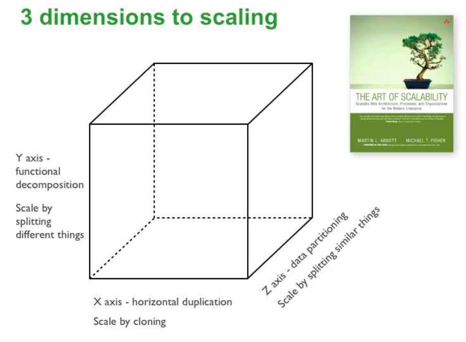
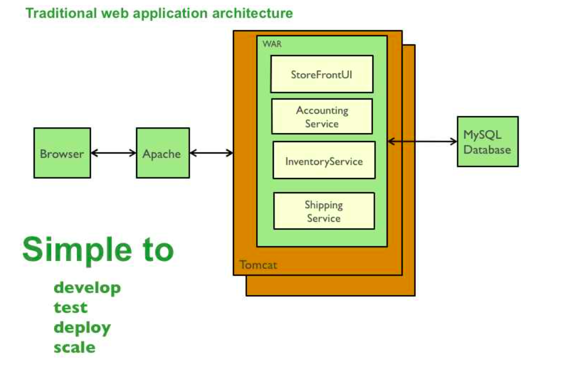

# Microservice

## [The Scale Cube](https://microservices.io/articles/scalecube.html)

### X-axis scaling
X-axis scaling consists of running multiple copies of an application behind a load balancer. If there are N copies then each copy handles 1/N of the load. This is a simple, commonly used approach of scaling an application.

One drawback of this approach is that because each copy potentially accesses all of the data, caches require more memory to be effective. Another problem with this approach is that it does not tackle the problems of increasing development and application complexity.

### Y-axis scaling
Unlike X-axis and Z-axis, which consist of running multiple, identical copies of the application, Y-axis axis scaling splits the application into multiple, different services. Each service is responsible for one or more closely related functions. There are a couple of different ways of decomposing the application into services. One approach is to use verb-based decomposition and define services that implement a single use case such as checkout. The other option is to decompose the application by noun and create services responsible for all operations related to a particular entity such as customer management. An application might use a combination of verb-based and noun-based decomposition.

### Z-axis scaling
When using Z-axis scaling each server runs an identical copy of the code. In this respect, it’s similar to X-axis scaling. The big difference is that each server is responsible for only a subset of the data. Some component of the system is responsible for routing each request to the appropriate server. One commonly used routing criteria is an attribute of the request such as the primary key of the entity being accessed. Another common routing criteria is the customer type. For example, an application might provide paying customers with a higher SLA than free customers by routing their requests to a different set of servers with more capacity.

Z-axis scaling has a number of benefits.

- Each server only deals with a subset of the data.
- This improves cache utilization and reduces memory usage and I/O traffic.
- It also improves transaction scalability since requests are typically distributed across multiple servers.
- Also, Z-axis scaling improves fault isolation since a failure only makes part of the data in accessible.

Z-axis scaling has some drawbacks.

- One drawback is increased application complexity.
- We need to implement a partitioning scheme, which can be tricky especially if we ever need to repartition the data.
- Another drawback of Z-axis scaling is that doesn’t solve the problems of increasing development and application complexity. To solve those problems we need to apply Y-axis scaling.

## Pattern: Monolithic Architecture

Building an app with monolithic architecture means all different components are packed into a single bundle and deployed. Like a single JAVA WAR file or a single directory of NodeJS code.

### Context
You are developing a server-side enterprise application. It must support a variety of different clients including desktop browsers, mobile browsers and native mobile applications. The application might also expose an API for 3rd parties to consume. It might also integrate with other applications via either web services or a message broker. The application handles requests (HTTP requests and messages) by executing business logic; accessing a database; exchanging messages with other systems; and returning a HTML/JSON/XML response. There are logical components corresponding to different functional areas of the application.

### Benefits
- simple to develop
- simple to deploy - single file/directory
- simple to scale - run multiple copies behind a load balancer

### Drawbacks
As the application size becomes larger and team size grows, these are drawbacks
- tightly coupled
- overloaded IDE
- overloaded web container
- CI/CD is difficult and time consuming
- scaling is difficult - can only scale in one dimension. More and more copies, but each copy will access all of the data, leaving caching in-effective, more memory consumption, I/O traffic. Can't scale component wise like if one component is CPU intesive and other is memory intensive
- requires a long term commitment to tech stack

## Pattern: Microservices

Define an architecture that structures the application as a set of loosely coupled, collaborating services. This approach corresponds to the Y-axis of the Scale Cube. Each service is:

Highly maintainable and testable - enables rapid and frequent development and deployment
Loosely coupled with other services - enables a team to work independently the majority of time on their service(s) without being impacted by changes to other services and without affecting other services
Independently deployable - enables a team to deploy their service without having to coordinate with other teams
Capable of being developed by a small team - essential for high productivity by avoiding the high communication head of large teams
Services communicate using either synchronous protocols such as HTTP/REST or asynchronous protocols such as AMQP. Services can be developed and deployed independently of one another. Each service has its own database in order to be decoupled from other services. Data consistency between services is maintained using the Saga pattern

