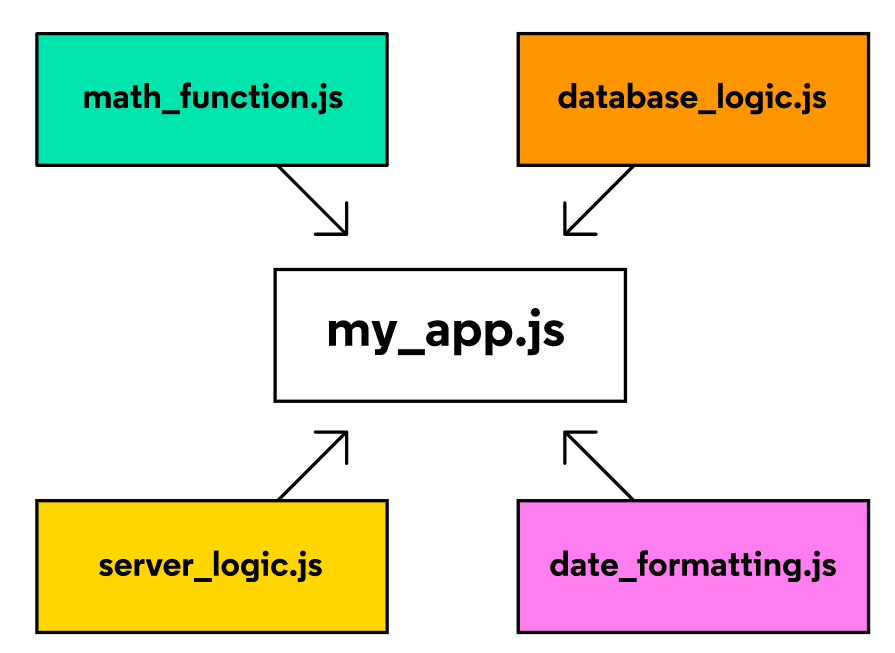

Node JS
--------------------------------------
## Introduction

The problem with native Javascript to run only in browser was overcome by NodeJS. Node can be used to write server-side applications with access to OS, file system, and everything else required to build fully-functional applications.
__Node.js is a Javascript runtime, environment that is written in C, C++, and Javascript and is built on the open-source V8 Javascript engine that also powers JS on browsers.__

__Node is single threaded.__

## Why Node?

Node uses 'an event driven, non-blocking I/O model'. Node JS is built well to handle asynchronous Javascript code to perform many asynchronous activities such as reading and writing to file, handling connections to DB servers, or handling requests to web server. It uses a callback-based system to handle asynchronous activities.

```
const fs = require('fs');

fs.readFile('./script.js', function(error, data) {
  // error is null if no error occurred, but an Error object if it did
  if (error) {
   throw error;
  }
  // the file data will be passed into the callback if no error was thrown
  console.log(data);
});
```

### Runtime Environments

There are two runtime environments that javascript is executed in and they have their own implementation of various javascript methods.
1. Node runtime: ```process.env.PWD``` prints the current working directory
2. Browser's runtime: ```window.alert()``` executes only in browser.

## The Node REPL

REPL is an abbreviation for read–eval–print loop. It’s a program that loops, or repeatedly cycles, through three different states: a read state where the program reads input from a user, the eval state where the program evaluates the user’s input, and the print state where the program prints out its evaluation to a console. Then it loops through these states again.

## `process` object

Node has a global `process` object with useful methods and information about the current process.

The `process.env` property is an object which stores and controls information about the environment in which the process is currently running. For example, the `process.env` object contains a `PWD` property which holds a string with the directory in which the current process is located. It can be useful to have some `if/else` logic in a program depending on the current environment— a web application in a development phase might perform different tasks than when it’s live to users. We could store this information on the `process.env`. One convention is to add a property to process.env with the key `NODE_ENV` and a value of either `production` or `development`.

```
console.log(process.env);
console.log(process.memoryUsage()); // an object consiting heap meomory used, toal memory etc
console.log(prcess.argv[2]) // node app.js deepak -> prints deepak
```

## Event-Driven Architecture

Node provides an EventEmitter class which we can access by requiring in the events core module:

```
// Require in the 'events' core module
let events = require('events');

// Create an instance of the EventEmitter class
let myEmitter = new events.EventEmitter();

let newUserListener = (data) => {
  console.log(`We have a new user: ${data}.`);
};

// Assign the newUserListener function as the listener callback for 'new user' events
myEmitter.on('new user', newUserListener)

// Emit a 'new user' event
myEmitter.emit('new user', 'Lily Pad') //newUserListener will be invoked with 'Lily Pad'
```

Each event emitter instance has an `.on()` method which assigns a listener callback function to a named event. The `.on()` method takes as its first argument the name of the event as a string and, as its second argument, the listener callback function.

Each event emitter instance also has an `.emit()` method which announces a named event has occurred. The `.emit()` method takes as its first argument the name of the event as a string and, as its second argument, the data that should be passed into the listener callback function.

## User Input/Output

When we use `console.log()` we prompt the computer to output information to the console. In the Node environment, the console is the terminal, and the `console.log()` method is a “thin wrapper” on the `.stdout.write()` method of the process object. stdout stands for standard output.

In Node, we can also receive input from a user through the terminal using the `stdin.on()` method on the process object:

```
process.stdin.on('data', (userInput) => {
  let input = userInput.toString()
  console.log(input)
});
```

Here, we were able to use `.on()` because under the hood `process.stdin` is an instance of `EventEmitter`. When a user enters text into the terminal and hits enter, a `'data'` event will be fired and our anonymous listener callback will be invoked. The `userInput` we receive is an instance of the Node Buffer class, so we convert it to a string before printing.

## Errors

The Node environment has all the standard JavaScript errors such as `EvalError`, `SyntaxError`, `RangeError`, `ReferenceError`, `TypeError`, and `URIError` as well as the JavaScript Error class for creating new error instances. Within our own code, we can generate errors and throw them, and, with synchronous code in Node, we can use error handling techniques such as `try...catch` statements.

Many asynchronous Node APIs use error-first callback functions: callback functions which have an error as the first expected argument and the data as the second argument. If the asynchronous task results in an error, it will be passed in as the first argument to the callback function. If no error was thrown, the first argument will be `undefined`.

```
const errorFirstCallback = (err, data)  => {
  if (err) {
    console.log(`There WAS an error: ${err}`);
  } else {
     // err was falsy
      console.log(`There was NO error. Event data: ${data}`);
  }
}
```

## Modular Programming

Modules are reusable pieces of code in a file that can be exported and then imported for use in another file. A modular program is one whose components can be separated, used individually, and recombined to create a complex system.


Benefits of isolating code into separate files called modules are:
1. find, fix and debug easily
2. reuse and recycle logic
3. keep information private and protected
4. prevent naming collisions and assign scopes separately

### Modules in Node runtime

Every JavaScript file that runs in a Node environment is treated as a distinct module. The functions and data defined within each module can be used by any other module, as long as those resources are properly exported and imported.

* Export a module:
```
/* converters.js */
function celsiusToFahrenheit(celsius) {
  return celsius * (9/5) + 32;
}

module.exports.celsiusToFahrenheit = celsiusToFahrenheit;

module.exports.fahrenheitToCelsius = function(fahrenheit) {
  return (fahrenheit - 32) * (5/9);
};
```

* Import a module:
```
/* water-limits.js */
const converters = require('./converters.js');
const { celsiusToFahrenheit, farenheitToCelsius } = require('./converter.js'); // destructuring to be more selective

const freezingPointC = 0;
const boilingPointC = 100;

const freezingPointF = converters.celsiusToFahrenheit(freezingPointC);
const boilingPointF = converters.celsiusToFahrenheit(boilingPointC);

console.log(`The freezing point of water in Fahrenheit is ${freezingPointF}`);
console.log(`The boiling point of water in Fahrenheit is ${boilingPointF}`);
```

### Modules in Browser runtime or using ES 6 syntax:
For applying the module to HTMl, do it like this:
```
<script type="module" src="main.js"></script>
```
* export a module
```
/* dom-functions.js */
export const toggleHiddenElement = (domElement) => {
  // logic omitted...
}

export const changeToFunkyColor = (domElement) => {
  // logic omitted...
}
```
* Import a module:
```
import { toggleHiddenElement, changeToFunkyColor } from '../modules/dom-functions.js';
import { greet as greetInHindi } from 'greeterHindi.js'
```
* Default Export and imports
Every module also has the option to export a single value to represent the entire module called the default export
Exporting
```
const resources = {
  valueA,
  valueB
}
export { resources as default };
export { resA, resB };

OR

export default resources;
```
Importing
```
// This will work...
import resources from 'module.js'
const { valueA, valueB } = resources;

// This will not work...
import { valueA, valueB } from 'module.js'
```

__require__ is used to import modules in Node runtime
__module.exports__ is used to export modules in Node runtime
__export default resA__ is used to export module in ES6 syntax
__import__ is used to import module in ES6 syntax

## Readable Streams

One of the simplest uses of streams is reading and writing to files line-by-line. To read files line-by-line, we can use the `.createInterface()` method from the `readline` core module. `.createInterface()` returns an EventEmitter set up to emit `'line'` events:

```
const readline = require('readline');
const fs = require('fs');

const myInterface = readline.createInterface({
  input: fs.createReadStream('text.txt')  // fs.createReadStream('text.txt') which will create a stream from the text.txt file.
});

myInterface.on('line', (fileLine) => {
  console.log(`The line read: ${fileLine}`);
});
```

## Writeable Stream

We can create a writeable stream to a file using the `fs.createWriteStream()` method:

```
const fs = require('fs')

const fileStream = fs.createWriteStream('output.txt');

fileStream.write('This is the first line!');
fileStream.write('This is the second line!');
fileStream.end();
```

In the code above, we set the output file as output.txt. Then we `.write()` lines to the file. Unlike a readable stream, which ends when it has no more data to read, a writable stream could remain open indefinitely. We can indicate the end of a writable stream with the `.end()` method.

## Creating an HTTP Server

Node was designed with back end development needs as a top priority. One of these needs is the ability to create web servers, computer processes that listen for requests from clients and return responses. A Node core module designed to meet these needs is the http module. This module contains functions which simplify interacting with HTTP and streamline receiving and responding to requests.

The http.createServer() method returns an instance of an http.server. An http.server has a method .listen() which causes the server to “listen” for incoming connections. When we run http.createServer() we pass in a custom callback function (often referred to as the requestListener). This callback function will be triggered once the server is listening and receives a request.

Let’s break down how the requestListener callback function works:

* The function expects two arguments: a request object and a response object.
* Each time a request to the server is made, Node will invoke the provided requestListener callback function, passing in the request and response objects of the incoming request.
* Request and response objects come with a number of properties and methods of their own, and within the requestListener function, we can access information about the request via the request object passed in.
* The requestListener is responsible for setting the response header and body.
* The requestListener must signal that the interaction is complete by calling the response.end() method.

```
const http = require('http');

let requestListener = (request, response) => {
  response.writeHead(200, {'Content-Type': 'text/plain' });
  response.write('Hello World!\n');
  response.end();
};

const server = http.createServer(requestListener);

server.listen(3000);
```

Let’s walk through the above code:

* We required in the http core module.
* We created a server variable assigned to the return value of the http.createServer() method.
* We invoked http.createServer() with our requestListener callback. This is similar to running the .on() of an EventEmitter: the requestListener will execute whenever an HTTP request is sent to the server on the correct port.
* Within the requestListener callback, we make changes to the response object, response, so that it can send the appropriate information to the client sending the request. The status code 200 means that no errors were encountered. The header communicates that the file type is text, rather than something like audio or compressed data.
* The last line starts the server with the port 3000. Every server on a given machine specifies a unique port so that traffic can be correctly routed.

You could run the above code on your local machine, and access it by visiting http://localhost:3000/ from your browser. “localhost” is used to refer to the same computer that’s running the current Node process.

## Review

* Node.js is a JavaScript runtime, an environment that allows us to execute our JavaScript code by converting it into something a computer can understand.
* REPLs are processes that read, evaluate, print, and repeat (loop), and Node.js comes with its own REPL we can access in our terminal with the node command.
* We run JavaScript programs with Node in the terminal by typing node followed by the file name (if we’re in the same directory) or the absolute path of the file.
* Code can be organized into separate files, modules, and combined through requiring them where needed using the `require()` function.
* In addition to core modules, modules included within the environment to efficiently perform common tasks, we can also create our own modules using `module.exports` and the require() function.
* We can access NPM, a registry of hundreds of thousands of packages of re-usable code from other developers, directly through our terminal.
* Node has an event-driven architecture.
* We can make our own instances of the EventEmitter class and we can subscribe to listen for named events with the `.on()` method and emit events with the `.emit()` method.
* Node uses an event loop which enables asynchronous actions to be handled in a non-blocking way by adding callback functions to a queue of tasks to be executed when the callstack is empty.
* In order to handle errors during asynchronous operations, provided callback functions are expected to have an error as their first parameter.
* Node allows for both output, data/feedback to a user provided by a computer, and input data/feedback to the computer provided by the user.
* The Node `fs` core module is an API for interacting with the file system.
Streams allow us to read or write data piece by piece instead of all at once.
* The Node `http` core module allows for easy creation of web servers, computer processes that listen for requests from clients and return responses.
