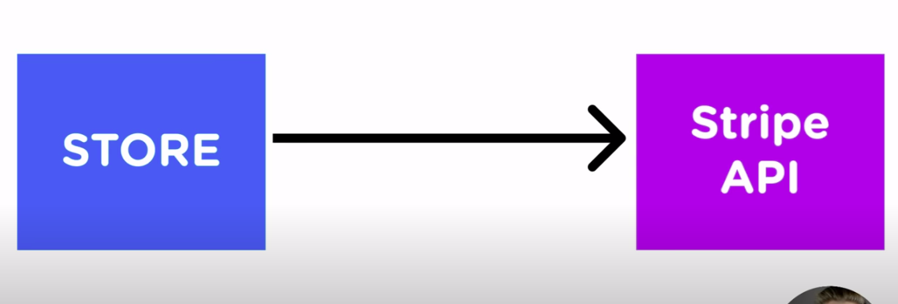

# OOD

## SOLID Principles

### Single-responsibility principle

### Open-closed principle

### Liskov substitution principle

### Interface segregation principle

### Dependency Inversion Principle

In traditional layer OOD design, high level modules consume low level modules directly. This has several drawbacks - 

- restricts re-use of high level modules
- changes to low level module will require changes in high level modules as well

Dependency inversion principle states that

1. High level module should not import anything from low level module. Both should depend on abstraction(interfaces).
2. Abstraction should not depend on details. Rather, details(concrete implementations) should depend on abstraction.

The idea behind points A and B of this principle is that when designing the interaction between a high-level module and a low-level one, the interaction should be thought of as an abstract interaction between them. This not only has implications on the design of the high-level module, but also on the low-level one: the low-level one should be designed with the interaction in mind and it may be necessary to change its usage interface.

#### Examples - 



```
class Store {
	constructor(user) {
		this.stripe = new Stripe(user);
	}

	purchaseHelmet(quantity) {
		this.stripe.makePayment(15 * quantity * 100);
	}

	purchaseBike(quantity) {
		this.stripe.makePayment(200 * quantity * 100);
	}

}

class Stripe {
	constructor(user) {
		this.user = user;
	}

	makePayment(amount) {
		console.log(`${this.user} has made payment of ${amount/100} with stripe`);
	}

}

const store = new Store("John");
store.purchaseBike(2);
store.purchaseBike(1);

```

The store is a high level module and Stripe is a low level. Store is dependent on Stripe directly. If stripe's implementation changes, store has to change. Also, if there is a need of changing the payment provider say Paypal, then, Store has to re-written again.


