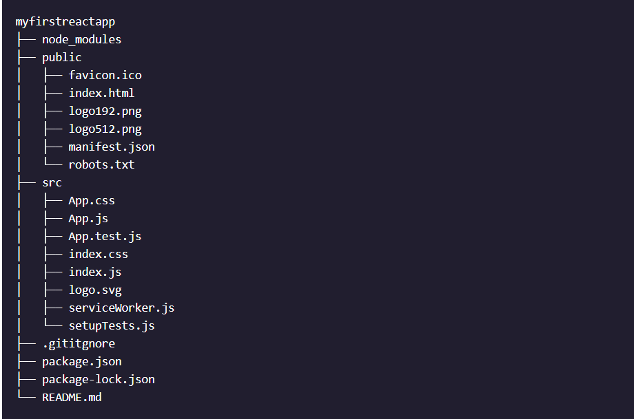

# React JS

## The Virtual DOM

### The problem with actual DOM
Browser constructs a tree like structure called DOM. Whenever, any section is changed, the DOM is re-constructed and then rendered. Modern web applications involve a lot of large and small changes. The DOM manipulation is slower and what makes it more slower is that most frameworks update DOM much more frequently.

### The saviour : Virtual DOM
Virtual DOM or VDOM is a lightweight copy of actual DOM object. More specifically, it is a javascript object representation of DOM. It has the same properties as DOM but lacks the real power to directly change what's on screen.

### How does it optimize the website?
Here’s what happens when we try to update the DOM in React:

1. The entire virtual DOM gets updated, each DOM object.
2. The virtual DOM gets compared to what it looked like before you updated it. React figures out which objects have changed.
3. The changed objects, and the changed objects only, get updated on the real DOM.
4. Changes on the real DOM cause the screen to change.

Diffing : Process of figuring out exactly which virutal DOM objects have changed. The algorithm is called Diffing Algorithm.

## Why React?
* React is fast. Apps made in React can handle complex updates and still feel quick and responsive.

* React is modular. Instead of writing large, dense files of code, you can write many smaller, reusable files. React’s modularity can be a beautiful solution to JavaScript’s maintainability problems.

* React is scalable. Large programs that display a lot of changing data are where React performs best.

* React is flexible. You can use React for interesting projects that have nothing to do with making a web app. People are still figuring out React’s potential.

* React is popular. While this reason has admittedly little to do with React’s quality, the truth is that understanding React will make you more employable.

## JSX
JSX is a syntax extension for JavaScript. It was written to be used with React. JSX code looks a lot like HTML.

What does “syntax extension” mean? In this case, it means that JSX is not valid JavaScript. Web browsers can’t read it!

If a JavaScript file contains JSX code, then that file will have to be compiled. That means that before the file reaches a web browser, a JSX compiler will translate any JSX into regular JavaScript. So, a browser doesn't read JSX.

* If a JSX expression takes up more than one line, then you must wrap the multi-line JSX expression in parentheses.

```
const jsx = (
  <a href="https://www.example.com">
    <h1>
      Click me!
    </h1>
  </a>
);
```

* A JSX expression must have exactly one outermost element.
```
// wrong
const paragraphs = (
  <p>I am a paragraph.</p>
  <p>I, too, am a paragraph.</p>
);

// right
const paragraphs = (
  <div id="i-am-the-outermost-element">
    <p>I am a paragraph.</p>
    <p>I, too, am a paragraph.</p>
  </div>
);
```

* Any code in between the tags of a JSX element will be read as JSX, not as regular JavaScript! JSX doesn’t add numbers - it reads them as text, just like HTML. To make it treat as javascript variable, expression to be evaluated, enclose them in curly brackets.

* If the expression on the left of the `&&` evaluates as true, then the JSX on the right of the `&&` will be rendered. If the first expression is false, however, then the JSX to the right of the && will be ignored and not rendered.
```
const tasty = (
  <ul>
    <li>Applesauce</li>
    { !baby && <li>Pizza</li> }
    { age > 15 && <li>Brussels Sprouts</li> }
    { age > 20 && <li>Oysters</li> }
    { age > 25 && <li>Grappa</li> }
  </ul>
);
```

* A list needs `keys` if either of the following are true:

1. The list-items have memory from one render to the next. For instance, when a to-do list renders, each item must “remember” whether it was checked off. The items shouldn’t get amnesia when they render.

2. A list’s order might be shuffled. For instance, a list of search results might be shuffled from one render to the next.

### Render JSX on screen
```ReactDOM.render(<h1>Render me!</h1>, document.getElementById('container'));```

## React Components

`React.Component` is a JavaScript class. To create your own component class, you must subclass `React.Component`. You can do this by using the syntax class `YourComponentNameGoesHere extends React.Component {}`.

Component class variable names must begin with capital letters!

`render()` method must be present in custom component. It must return a statement which is usually, JSX expression.

```
import React from 'react';
import ReactDOM from 'react-dom';

class MyComponentClass extends React.Component {
  render() {
    return <h1>Hello world</h1>;
  }
}

// component goes here:
ReactDOM.render(<MyComponentClass />, document.getElementById('app'));
```

## Create A React App with Boilerplate
```npm create-react-app myfirstreactapp``` is used to create an app.
`create-react-app` has taken care of setting up the main structure of the application as well as a couple of developer settings

Its directory structure is:


### Directory Importance

#### .gitignore
This is the standard file used by the source control tool git to determine which files and directories to ignore when committing code. While this file exists, create-react-app did not create a git repo within this folder. If you take a look at the file, it has taken care of ignoring a number of items (even .DS_Store for Mac users)

#### package.json
This file outlines all the settings for the React app.

* `name` is the name of your app
* `version` is the current version
* `"private": true` is a failsafe setting to avoid accidentally publishing your app as a public package within the npm ecosystem.
* `dependencies` contains all the required Node modules and versions required for the application. In the screenshot above, the react version specified is ^16.13.1. This means that npm will install the most recent major version matching 16.x.x. In contrast, you may also see something like ~1.2.3 in package.json, which will only install the most recent minor version matching 1.2.x.
* `scripts` specifies aliases that you can use to access some of the react-scripts commands in a more efficient manner. For example, running npm test in your command line will run react-scripts test --env=jsdom behind the scenes.
You will also see two more attributes, `eslintConfig` and `browserslist`. Both of these are Node modules having their own set of values. `browserslist` provides information about browser compatibility of the app, while `eslintConfig` takes care of the code linting.
#### node_modules
This directory contains dependencies and sub-dependencies of packages used by the current React app, as specified by package.json. If you take a look, you may be surprised by how many there are.
#### package-lock.json
This file contains the exact dependency tree installed in node_modules/. This provides a way for teams working on private apps to ensure that they have the same version of dependencies and sub-dependencies. It also contains a history of changes to package.json, so you can quickly look back at dependency changes.
#### public
This directory contains assets that will be served directly without additional processing by webpack. index.html provides the entry point for the web app. You will also see a favicon (header icon) and a manifest.json.

The manifest file configures how your web app will behave if it is added to an Android user’s home screen (Android users can “shortcut” web apps and load them directly from the Android UI).

## Interaction among React Components
When you use React.js, every JavaScript file in your application is invisible to every other JavaScript file by default.

### Through import and export
import syntax
```import { Component } from './somefile.js'```
export syntax
```export const fun();```
```export let variable=5```

### Through `props`
Accessing all props in a component: ```this.props```

Passing props to a component:
```
<Example message="This is some top secret info." />
<Greeting myInfo={["top", "secret", "lol"]} />
<Greeting name="Frarthur" town="Flundon" age={2} haunted={false} />
```

Every component’s props object has a property named children.
`this.props.children` will return everything in between a component’s opening and closing JSX tags.

```
// Example 1
<BigButton>
  I am a child of BigButton.
</BigButton>

// this.props.children return 'I am a child...'

// Example 2
<BigButton>
  <LilButton />
</BigButton>

// this.props.children return <LilButton />

// Example 3
<BigButton />  // returns undefined
```
__NOTE__: If a component has more than one child between its JSX tags, then this.props.children will return those children in an array. However, if a component has only one child, then this.props.children will return the single child, not wrapped in an array.

Default props
```
class Button extends React.Component {
  render() {
    return (
      <button>
        {this.props.text}
      </button>
    );
  }
}

// defaultProps goes here:
Button.defaultProps = { // always a object
  text: 'I am a button'
} // will be displayed if no props are passed

ReactDOM.render(
  <Button />,
  document.getElementById('app')
);
```

### Through state
```
import React from 'react';
import ReactDOM from 'react-dom';

class Mood extends React.Component {
  constructor(props) {
    super(props);
    this.state = { mood: 'good' }; //initialize the state
    this.toggleMood = this.toggleMood.bind(this); // binding event handler to this keyword
  }

  toggleMood() { //event handler
    const newMood = this.state.mood == 'good' ? 'bad' : 'good';
    this.setState({ mood: newMood });
  }

  render() {
    return (
      <div>
        <h1>I'm feeling {this.state.mood}!</h1>
        <button onClick={this.toggleMood}>
          Click Me
        </button>
      </div>
    );
  }
}

ReactDOM.render(<Mood />, document.getElementById('app'));
```
State are specific to components. They may be passed down to other components as props.
States are not changed in `render()` function. They are always chanded through `this.setState()` wrapped in a function that gets triggered once a event occured.

*Reason behing binding*: State changing methods need to be bind with `this` keyword in constructor due to the way event handlers functions in js.

__NOTE__: *Why `this.setState` doesn't work inside `render()`?*
Any time that you call this.setState(), this.setState() AUTOMATICALLY calls .render() as soon as the state has changed.
Think of this.setState() as actually being two things: this.setState(), immediately followed by .render().
That is why you can’t call this.setState() from inside of the .render() method! this.setState() automatically calls .render(). __If .render() calls this.setState(), then an infinite loop is created.__

## Stateless and stateful components
Stateful Component: Component that has state and passes props down to stateless component
Stateless Component: Component that has no state and receives props from stateful component

Key point while creating components:
A component should never update `this.props`.

A React component should use props to store information that can be changed, but can only be changed by a different component.

A React component should use state to store information that the component itself can change.

### How does a stateless, child component update the state of the parent component?

Stateful component passes down an event handler to stateless component. Child component then uses it to update parent's state.

1. The parent component class defines a method that calls this.setState().

2. The parent component binds the newly-defined method to the current instance of the component in its constructor. This ensures that when we pass the method to the child component, it will still update the parent component.

3. Once the parent has defined a method that updates its state and bound to it, the parent then passes that method down to a child.

4. The child receives the passed-down function, and uses it as an event handler

__Benefit of using this programatic approach__:
Breaking down complex logic into separate classes that each have one job to do helps with testing and makes code more reusable.

## Component Lifecycle
The component lifecycle has three high-level parts:

1. Mounting, when the component is being initialized and put into the DOM for the first time
2. Updating, when the component updates as a result of changed state or changed props
3. Unmounting, when the component is being removed from the DOM
Every React component you’ve ever interacted with does the first step at a minimum. If a component never mounted, you’d never see it!


## Functional Component and Hooks
React Hooks, plainly put, are functions that let us manage the internal state of components and handle post-rendering side effects directly from our function components. Hooks don’t work inside classes — they let us use fancy React features without classes. Keep in mind that function components and React Hooks do not replace class components. They are completely optional; just a new tool that we can take advantage of.

__Benefits over class components__
No need to worry about binding functions to class instances, working with constructors, or dealing with the this keyword. With the State Hook, updating state is as simple as calling a state setter function.

### useRef Hook

`useRef` returns a reference object on which `current` stores the present value. It is similar to useState but on change of its value, re-render doesn't occur.

Calling `const reference = useRef(initialValue)` with the initial value returns a special object named reference. The reference object has a property current: you can use this property to read the reference value reference.current, or update `reference.current = newValue`. The reference object can't be modified to contain any other key. It won't also throw error in case it is modified like `reference.someThing=somevalue`.

Between the component re-renderings, the value of the reference is persistent.

References can also access DOM elements. Assign the reference to ref attribute of the element you'd like to access: `<div ref={reference}>Element</div>` — and the element is available at `reference.current: <div>Element</div>`. To set its style, we can do `reference.current.focus();`.

### useMemo Hook

`useMemo` hook is similar to useEffect except it is used in case of heavy computation. So, if there is some cryptoanalysis function or any other heavy computation function in a component, you might don't want to compute it everytime rerender happens.

```
import { useMemo } from "react";

const fibonacci = (num) => {
	if(num<=1) return 1;
	return fibonacci(num-1)+fibonacci(num+1);
}

const Component = () => {
	const [isGreen, setIsGreen] = useState(0);
	const [num, setNum] = useState(1);
	const fib = fibonacci(num);
	const fib = useMemo(() => fibonacci(num), [num]); // only computes if num has changed
	return (
		<div>
			<h1 style={{color: isGreen?'green':'red'}}>This is something</h1>
			<h2>Fibonancci of {num} is {fib}</h2>
			<button onClick={() => setNum(num+1)}></button>
		</div>
	);
}
```

`useMemo` only recalculates a value if the elements in its dependency array change (if there are no dependencies - i.e. the array is empty, it will recalculate only once). If the array is left out, it will recalculate on every render. Calling the function does not cause a re-render. Also it runs during the render of the component and not before.

`useEffect` runs after a render happens, while `useMemo` runs before


### useState Hook

`useState` returns an array consisting of two values, one is the state variable and other is its setter. So, we can use our local variable as reference to modify the state. It can also accept a function like `useState(() => {})`

`const [mood, changeMood] = useState('happy');`

Often, the next value of our state is calculated using the current state. In this case, it is best practice to update state with a callback function. If we do not, we risk capturing outdated, or “stale”, state values.
See example for state using previous state values:
```
import React, { useState } from 'react';

export default function Counter() {
  const [count, setCount] = useState(0);

  const increment = () => setCount(prevCount => prevCount + 1);

  return (
    <div>
      <p>Wow, you've clicked that button: {count} times</p>
      <button onClick={increment}>Click here!</button>
    </div>
  );
}
```
#### Review of useState
* With React, we feed static and dynamic data models to JSX to render a view to the screen

* Use Hooks to “hook into” internal component state for managing dynamic data in function components

* We employ the State Hook by using the code below:

  * `currentState` to reference the current value of state

  * `stateSetter` to reference a function used to update the value of this state

  * the `initialState` argument to initialize the value of state for the component’s first render

```
const [currentState, stateSetter] = useState( initialState );
```

* Call state setters in event handlers

* Define simple event handlers inline with our JSX event listeners and define complex event handlers outside of our JSX

* Use a state setter callback function when our next value depends on our previous value

* Use arrays and objects to organize and manage related data that tends to change together

* Use the spread syntax on collections of dynamic data to copy the previous state into the next state like so: `setArrayState((prev) => [ ...prev ])` and `setObjectState((prev) => ({ ...prev }))`

* Split state into multiple, simpler variables instead of throwing it all into one state object

### useCallback


`useCallback` is quite similar and indeed it's implemented with the same mechanisms as `useMemo`. Our goal is that `ExpensiveComputationComponent` only re-renders whenever it absolutely must. Typically whenever React detects a change higher-up in an app, it re-renders everything underneath it. This normally isn't a big deal because React is quite fast at normal things. However you can run into performance issues sometimes where some components are bad to re-render without reason.

In this case, we're using a new feature of React called `React.memo`. This is similar to `PureComponent` where a component will do a simple check on its props to see if they've changed and if not it will not re-render this component (or its children, which can bite you.) `React.memo` provides this functionality for function components. Given that, we need to make sure that the function itself given to `ExpensiveComputationComponent` is the _same_ function every time. We can use `useCallback` to make sure that React is handing _the same fibonacci_ to `ExpensiveComputationComponent` every time so it passes its `React.memo` check every single time. Now it's only if `count` changes will it actually re-render (as evidenced by the time.)

Try removing the useCallback call and see if you get the the count to 40+ that the page crawls as it updates every second.

[callback](https://codesandbox.io/s/github/btholt/react-hooks-examples-v4/tree/main?file=/src/Callback.js)

```
import { useState, useEffect, useCallback, memo } from "react";

const ExpensiveComputationComponent = memo(({ compute, count }) => { // wrap expensive component in memo, re-renders only if props change for example, spreadsheet component with 1000 lines
  return (
    <div>
      <h1>computed: {compute(count)}</h1>
      <h4>last re-render {new Date().toLocaleTimeString()}</h4>
    </div>
  );
});

const CallbackComponent = () => {
  const [time, setTime] = useState(new Date());
  const [count, setCount] = useState(1);
  useEffect(() => {
    const timer = setTimeout(() => setTime(new Date()), 1000);
    return () => clearTimeout(timer);
  });

  const fibonacci = (n) => {
    if (n <= 1) {
      return 1;
    }

    return fibonacci(n - 1) + fibonacci(n - 2);
  };

  return (
    <div>
      <h1>useCallback Example {time.toLocaleTimeString()}</h1>
      <button onClick={() => setCount(count + 1)}>
        current count: {count}
      </button>
      <ExpensiveComputationComponent
        compute={useCallback(fibonacci, [])}
        count={count}
      />
    </div>
  );
};

export default CallbackComponent;

```


### useEffect
We use the Effect Hook to run some JavaScript code after each render, such as:

* fetching data from a backend service
* subscribing to a stream of data
* managing timers and intervals
* reading from and making changes to the DOM

There are three key moments when the Effect Hook can be utilized:
1. When the component is first added, or mounted, to the DOM and renders
2. When the state or props change, causing the component to re-render
3. When the component is removed, or unmounted, from the DOM.

The first argument is a function and second is dependecy array for selective rendering. The Effect Hook is used to call another function that does something for us so there is nothing returned when we call the useEffect() function.

#### Why clean up essentail for event handlers and how to do it with useEffect?
If our effect didn’t return a cleanup function, then a new event listener would be added to the DOM’s document object every time that our component re-renders. Not only would this cause bugs, but it could cause our application performance to diminish and maybe even crash!

```
useEffect(()=>{
  document.addEventListener('keydown', handleKeyPress);
  return () => {
    document.removeEventListener('keydown', handleKeyPress);
  };
})
```

Because effects run after every render and not just once, React calls our cleanup function before each re-render and before unmounting to clean up each effect call.

If our effect returns a function, then the useEffect() Hook always treats that as a cleanup function. React will call this cleanup function before the component re-renders or unmounts. Since this cleanup function is optional, it is our responsibility to return a cleanup function from our effect when our effect code could create memory leaks.

#### Dependency array
The dependency array is used to tell the useEffect() method when to call our effect and when to skip it. Our effect is always called after the first render but only called again if something in our dependency array has changed values between renders.

If dependency array is empty, it will call effect when a component first mounts and if a cleanup function is returned by effect, calling that when the component unmounts.

If dependency array has some variables, that means, re-render will happen every time the variables change.

### useLayoutEffect

`useLayoutEffect` is almost the same as `useEffect` except that it's synchronous to render as opposed to scheduled like `useEffect` is. If you're migrating from a class component to a hooks-using function component, this can be helpful too because `useLayout` runs at the same time as `componentDidMount` and `componentDidUpdate` whereas `useEffect` is scheduled after. This should be a temporary fix.

The only time you _should_ be using `useLayoutEffect` is to measure DOM nodes for things like animations. In the example, I measure the textarea after every time you click on it (the onClick is to force a re-render.) This means you're running render twice but it's also necessary to be able to capture the correct measurments.

```
import { useState, useLayoutEffect, useRef } from "react";

const LayoutEffectComponent = () => {
  const [width, setWidth] = useState(0);
  const [height, setHeight] = useState(0);
  const el = useRef();

  useLayoutEffect(() => {
    setWidth(el.current.clientWidth);
    setHeight(el.current.clientHeight);
  });

  return (
    <div>
      <h1>useLayoutEffect Example</h1>
      <h2>textarea width: {width}px</h2>
      <h2>textarea height: {height}px</h2>
      <textarea
        onClick={() => {
          setWidth(0);
        }}
        ref={el}
      />
    </div>
  );
};

export default LayoutEffectComponent;
```

It is generally used for animations and measuring accurate layouts. If we would be using `useEffect`, we don't know when it will be called.

### useDebugValue

Here's another hook that's baked into React that I don't foresee many of you using but I still want you to know it's there. It, like useImperativeHandle, is more built for library authors.

useDebugValue allows you to surface information from your custom hook into the dev tools. This allows the developer who is consuming your hook (possibly you, possibly your coworker) to have whatever debugging information you choose to surfaced to them. If you're doing a little custom hook for your app (like the breed one we did in the Intro course) this probably isn't necessary. However if you're consuming a library that has hooks (like how react-router-dom has hooks) these can be useful hints to developers.

Normally you'd just use the developer tools built into the browser but CodeSandbox has the dev tools built directly into it. Just know that normally you'd use the browser extension.

```
import { useState, useEffect, useDebugValue } from "react";

const useIsRaining = () => {
  const [isRaining, setIsRaining] = useState(false);

  useEffect(() => {
    // pretend here you'd make an API request to a weather API
    // instead we're just going to fake it

    setIsRaining(Math.random() > 0.5);
  }, []);

  useDebugValue(isRaining ? "Is Raining" : "Is Not Raining");

  return isRaining;
};

const DebugValueComponent = () => {
  const isRaining = useIsRaining();

  return (
    <div>
      <h1>useDebugValue Example</h1>
      <h2>Do you need a coat today? {isRaining ? "yes" : "maybe"}</h2>
    </div>
  );
};

export default DebugValueComponent;

```

### Rules of Hooks
There are two main rules to keep in mind when using Hooks:

1. only call Hooks at the top level: When React builds the Virtual DOM, the library calls the functions that define our components over and over again as the user interacts with the user interface. React keeps track of the data and functions that we are managing with Hooks based on their order in the function component’s definition. For this reason, we always call our Hooks at the top level; we never call hooks inside of loops, conditions, or nested functions.
2. only call Hooks from React functions

#### Hooks gives us the flexibility to organize our code in different ways, grouping related data as well as separating concerns to keep code simple, error-free, reusable, and testable!

## Advanced React

### Styling
#### Inline style
```
<h1 style={{ color: 'red' }}>Hello world</h1>
```
The outer curly braces inject JavaScript into JSX. They say, “everything between us should be read as JavaScript, not JSX.”

The inner curly braces create a JavaScript object literal. They make this a valid JavaScript object

#### Style Name syntax
In regular JavaScript, style names are written in hyphenated-lowercase:
```
const styles = {
  'margin-top': '20px',
  'background-color': 'green'
};
```
In React, those same names are instead written in camelCase:
```
const styles = {
  marginTop: '20px',
  backgroundColor: 'green'
};
```

#### Style value syntax
In React, if you write a style value as a number, then the unit "px" is assumed.
`{ fontSize: 30 }` means 30px.
In regular JS, style values are almost always strings. Even if a style value is numeric, you usually have to write it as a string so that you can specify a unit. For example, you have to write "450px" or "20%".

### Separate container components from presentational component
Separating container components from presentational components is a popular React programming pattern. It helps to answer that question. It shows you when it might be a good time to divide a component into smaller components. It also shows you how to perform that division.

If a component has to have state, make calculations based on props, or manage any other complex logic, then that component shouldn’t also have to render HTML-like JSX.

The functional part of a component (state, calculations, etc.) can be separated into a container component.

The presentational component’s only job is to contain HTML-like JSX. It should be an exported component and will not render itself because a presentational component will always get rendered by a container component.

You divided the GuineaPigs component into a container component and a presentational component: containers/GuineaPigsContainer.js and components/GuineaPigs.js.

Here are the steps we took:

1. Identified that the original component needed to be refactored: it was handling both calculations/logic and presentation/rendering
2. Copied the original component to a new containers/ folder and renamed it GuineaPigsContainer
3. Removed all of the presentation/rendering code from the container component
4. Removed all of the calculation/logic code from the presentational component
5. Accessed the presentational component from within the container using import and export
6. Edited the container’s render() method to render the presentational component with the proper props

In this programming pattern, the container component does the work of figuring out what to display. The presentational component does the work of actually displaying it. __If a component does a significant amount of work in both areas, then that’s a sign that you should use this pattern!__

### PropTypes
Components interact among each other with passing of props. So, it is essentials that props must be validated for what they are intended for. Also, __PropTypes serve documentation of props__. So, one way is to check their type.

```
import React from 'react';
import PropTypes from 'prop-types'; // must import

export class Runner extends React.Component {
  render() {
  	let miles = this.props.miles;
    let km = this.props.milesToKM(miles);
    let races = this.props.races.map(function(race, i){
      return <li key={race + i}>{race}</li>;
    });

    return (
      <div style={this.props.style}>
        <h1>{this.props.message}</h1>
        { this.props.isMetric &&
          <h2>One Time I Ran {km} Kilometers!</h2> }
        { !this.props.isMetric &&
          <h2>One Time I Ran {miles} Miles!</h2> }
        <h3>Races I've Run</h3>
        <ul id="races">{races}</ul>
      </div>
    );
  }
}

Runner.propTypes = { // always at last
  // prop: PropTypes.expected_datatype
  //isRequired for prop must to be passed else, a console warning appears
  message:   PropTypes.string.isRequired,
  style:     PropTypes.object.isRequired,
  isMetric:  PropTypes.bool.isRequired,
  miles:     PropTypes.number.isRequired,
  milesToKM: PropTypes.func.isRequired,
  races:     PropTypes.array.isRequired
};
```

Same way, propTypes for a functional component can also be validated.

### React Forms
Think about how forms work in a typical, non-React environment. A user types some data into a form’s input fields, and the server doesn’t know about it. The server remains clueless until the user hits a “submit” button, which sends all of the form’s data over to the server simultaneously.

In React, as in many other JavaScript environments, this is not the best way of doing things.

The problem is the period of time during which a form thinks that a user has typed one thing, but the server thinks that the user has typed a different thing. What if, during that time, a third part of the website needs to know what a user has typed? It could ask the form or the server and get two different answers. In a complex JavaScript app with many moving, interdependent parts, this kind of conflict can easily lead to problems.

In a React form, you want the server to know about every new character or deletion, as soon as it happens. That way, your screen will always be in sync with the rest of your application.

#### Controlled vs Uncontrolled
There are two terms that will probably come up when you talk about React forms: controlled component and uncontrolled component. Like automatic binding, controlled vs uncontrolled components is a topic that you should be familiar with, but don’t need to understand deeply at this point.

An uncontrolled component is a component that maintains its own internal state. A controlled component is a component that does not maintain any internal state. Since a controlled component has no state, it must be controlled by someone else.

Think of a typical `<input type='text' />` element. It appears onscreen as a text box. If you need to know what text is currently in the box, then you can ask the `<input />`, possibly with some code like this:

```
let input = document.querySelector('input[type="text"]');

let typedText = input.value; // input.value will be equal to whatever text is currently in the text box.
```
The important thing here is that the `<input />` keeps track of its own text. You can ask it what its text is at any time, and it will be able to tell you.

The fact that `<input />` keeps track of information makes it an uncontrolled component. It maintains its own internal state, by remembering data about itself.

A controlled component, on the other hand, has no memory. If you ask it for information about itself, then it will have to get that information through props. Most React components are controlled.

__In React, when you give an `<input />` a value attribute, then something strange happens: the `<input />` BECOMES controlled. It stops using its internal storage.__ This is a more ‘React’ way of doing things.
