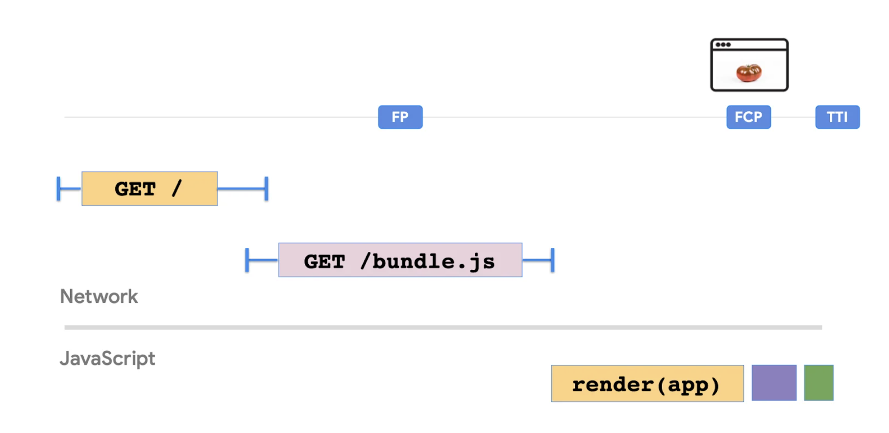

# React Patterns

There are several react patterns that make life easier. There is no compulsion to always use them, but using them at right places help in producing quality UI that has maintainable code.

The fundamental purpose of these patterns is to address concrete problems in component development by simplifying the management of state, logic and element composition. By providing predefined structures and proven methodologies, design patterns in React promote consistency, modularity and scalability in the code base.

It is important to emphasize that these patterns not only focus on solving technical problems, but also prioritize code efficiency, readability and maintainability. By adopting standardized practices and well-defined concepts, development teams can collaborate more effectively and build robust and adaptable React applications for the long term.

The use of design patterns in React is critical to developers because of their ability to reduce development time and costs, mitigate the accumulation of technical debt, ease code maintenance, and promote continuous and sustainable development over time. These patterns provide a consistent structure that streamlines the development process and improves overall software quality.

The patterns are broadly classified into two categories - 

1. Design Patterns
2. Rendering Patterns

Here are the design patterns - 

## Compound Pattern

In our application, we often have components that belong to each other. They’re dependent on each other through the shared state, and share logic together. You often see this with components like select, dropdown components, or menu items. The compound **component pattern** allows you to create components that all work together to perform a task.

    ```
    import React, { useState, ReactNode } from 'react';

    interface TabProps {
    label: string;
    children: ReactNode;
    }

    const Tab: React.FC<TabProps> = ({ children }) => {
    return <>{children}</>;
    };

    interface TabsProps {
    children: ReactNode;
    }

    const Tabs: React.FC<TabsProps> = ({ children }) => {
    const [activeTab, setActiveTab] = useState(0);

    return (
        <div>
        <div className="tab-header">
            {React.Children.map(children, (child, index) => {
            if (React.isValidElement(child)) {
                return (
                <div
                    className={`tab-item ${index === activeTab ? 'active' : ''}`}
                    onClick={() => setActiveTab(index)}
                >
                    {child.props.label}
                </div>
                );
            }
            })}
        </div>
        <div className="tab-content">
            {React.Children.map(children, (child, index) => {
            if (index === activeTab) {
                return <>{child}</>;
            }
            })}
        </div>
        </div>
    );
    };

    const Example: React.FC = () => {
    return (
        <Tabs>
        <Tab label="Tab 1">
            <div>Contenido de la pestaña 1</div>
        </Tab>
        <Tab label="Tab 2">
            <div>Contenido de la pestaña 2</div>
        </Tab>
        <Tab label="Tab 3">
            <div>Contenido de la pestaña 3</div>
        </Tab>
        </Tabs>
    );
    };

    export default Example;
    ```

## Higher Order Component

A Higher Order Component (HOC) is a component that receives another component. The HOC contains certain logic that we want to apply to the component that we pass as a parameter. After applying that logic, the HOC returns the element with the additional logic. 

Example - Say that we always wanted to add a certain styling to multiple components in our application. Instead of creating a style object locally each time, we can simply create a HOC that adds the style objects to the component that we pass to it

```
function withStyles(Component) {
  return props => {
    const style = { padding: '0.2rem', margin: '1rem' }
    return <Component style={style} {...props} />
  }
}

const Button = () = <button>Click me!</button>
const Text = () => <p>Hello World!</p>

const StyledButton = withStyles(Button)
const StyledText = withStyles(Text)
```

We can implement th HOC with hooks too.

```
// usehover.js
import { useState, useRef, useEffect } from "react";

export default function useHover() {
  const [hovering, setHover] = useState(false);
  const ref = useRef(null);

  const handleMouseOver = () => setHover(true);
  const handleMouseOut = () => setHover(false);

  useEffect(() => {
    const node = ref.current;
    if (node) {
      node.addEventListener("mouseover", handleMouseOver);
      node.addEventListener("mouseout", handleMouseOut);

      return () => {
        node.removeEventListener("mouseover", handleMouseOver);
        node.removeEventListener("mouseout", handleMouseOut);
      };
    }
  }, [ref.current]);

  return [ref, hovering];
}

// DogImages.js
import React from "react";
import withLoader from "./withLoader";
import useHover from "./useHover";

function DogImages(props) {
  const [hoverRef, hovering] = useHover();

  return (
    <div ref={hoverRef} {...props}>
      {hovering && <div id="hover">Hovering!</div>}
      <div id="list">
        {props.data.message.map((dog, index) => (
          
        ))}
      </div>
    </div>
  );
}

export default withLoader(
  DogImages,
  "https://dog.ceo/api/breed/labrador/images/random/6"
);
```


### Best use-cases of HOC - 
- The same, uncustomized behavior needs to be used by many components throughout the application.
- The component can work standalone, without the added custom logic.

### Best use-cases for hooks - 
- The behavior has to be customized for each component that uses it.
- The behavior is not spread throughout the application, only one or a few components use the behavior.
- The behavior adds many properties to the component


## Hooks Pattern

Custom Hooks are JavaScript functions that use the Hooks provided by React (such as useState, useEffect, useContext, etc.) and can be shared between components to effectively encapsulate and reuse logic.

```
import { useState, useEffect } from 'react';
import axios, { AxiosResponse, AxiosError } from 'axios';

type ApiResponse<T> = {
  data: T | null;
  loading: boolean;
  error: AxiosError | null;
};

function useFetch<T>(url: string): ApiResponse<T> {
  const [data, setData] = useState<T | null>(null);
  const [loading, setLoading] = useState<boolean>(true);
  const [error, setError] = useState<AxiosError | null>(null);

  useEffect(() => {
    const fetchData = async () => {
      try {
        const response: AxiosResponse<T> = await axios.get(url);
        setData(response.data);
      } catch (error) {
        setError(error);
      } finally {
        setLoading(false);
      }
    };

    fetchData();

    // Cleanup function
    return () => {
      // Cleanup logic, if necessary
    };
  }, [url]);

  return { data, loading, error };
}

// Using the Custom Hook on a component
function ExampleComponent() {
  const { data, loading, error } = useFetch<{ /* Expected data type */ }>('https://example.com/api/data');

  if (loading) {
    return <div>Loading...</div>;
  }

  if (error) {
    return <div>Error: {error.message}</div>;
  }

  if (!data) {
    return <div>No data.</div>;
  }

  return (
    <div>
      {/* Rendering of the obtained data */}
    </div>
  );
}

export default ExampleComponent;
```

In this example, the Custom Hook useFetch takes a URL as an argument and performs a GET request using Axios. It manages the load status, data and errors, returning an object with this information.

The ExampleComponent component uses the Custom Hook useFetch to fetch data from an API and render it in the user interface. Depending on the status of the request, a load indicator, an error message or the fetched data is displayed.

## Container/Presentations Pattern

In React, one way to enforce separation of concerns is by using the Container/Presentational pattern. With this pattern, we can separate the view from the application logic.

#### Presentational Component
A presentational component receives its data through props. Its primary function is to simply display the data it receives the way we want them to, including styles, without modifying that data. Presentational components receive their data from container components.

```
import React from "react";

export default function DogImages({ dogs }) {
  return dogs.map((dog, i) => );
}
```

#### Container Component
The primary function of container components is to pass data to presentational components, which they contain. Container components themselves usually don’t render any other components besides the presentational components that care about their data. Since they don’t render anything themselves, they usually do not contain any styling either.

```
import React from "react";
import DogImages from "./DogImages";

export default class DogImagesContainer extends React.Component {
  constructor() {
    super();
    this.state = {
      dogs: []
    };
  }

  componentDidMount() {
    fetch("https://dog.ceo/api/breed/labrador/images/random/6")
      .then(res => res.json())
      .then(({ message }) => this.setState({ dogs: message }));
  }

  render() {
    return <DogImages dogs={this.state.dogs} />;
  }
}
```

### Hooks
In many cases, the Container/Presentational pattern can be replaced with React Hooks. The introduction of Hooks made it easy for developers to add statefulness without needing a container component to provide that state.

Instead of having the data fetching logic in the DogImagesContainer component, we can create a custom hook that fetches the images, and returns the array of dogs.

```
export default function useDogImages() {
  const [dogs, setDogs] = useState([]);

  useEffect(() => {
    fetch("https://dog.ceo/api/breed/labrador/images/random/6")
      .then((res) => res.json())
      .then(({ message }) => setDogs(message));
  }, []);

  return dogs;
}
```


### Pros

1. The Container/Presentational pattern encourages the separation of concerns. Presentational components can be pure functions which are responsible for the UI, whereas container components are responsible for the state and data of the application. This makes it easy to enforce the separation of concerns.

2. Presentational components are easily made reusable, as they simply display data without altering this data. We can reuse the presentational components throughout our application for different purposes.

3. Since presentational components don’t alter the application logic, the appearance of presentational components can easily be altered by someone without knowledge of the codebase, for example a designer. If the presentational component was reused in many parts of the application, the change can be consistent throughout the app.

4. Testing presentational components is easy, as they are usually pure functions. We know what the components will render based on which data we pass, without having to mock a data store.


### Cons

The Container/Presentational pattern makes it easy to separate application logic from rendering logic. However, Hooks make it possible to achieve the same result without having to use the Container/Presentational pattern, and without having to rewrite a stateless functional component into a class component.Note that today, we don’t need to create class components to use state anymore.

Although we can still use the Container/Presentational pattern, even with React Hooks, this pattern can easily be an overkill in smaller sized application.


## Render Props Pattern

A render prop is a prop on a component, which value is a function that returns a JSX element. The component itself does not render anything besides the render prop. Instead, the component simply calls the render prop, instead of implementing its own rendering logic.

Imagine that we have a `Title` component. In this case, the `Title` component shouldn’t do anything besides rendering the value that we pass. We can use a render prop for this! Let’s pass the value that we want the `Title` component to render to the `render` prop.

```
<Title render={() => <h1>I am a render prop!</h1>} />
```

Within the Title component, we can render this data by returning the invoked render prop!

```
const Title = (props) => props.render();
```

```
import React from "react";
import { render } from "react-dom";

import "./styles.css";

const Title = (props) => props.render();

render(
  <div className="App">
    <Title
      render={() => (
        <h1>
          <span role="img" aria-label="emoji">
            ✨
          </span>
          I am a render prop!{" "}
          <span role="img" aria-label="emoji">
            ✨
          </span>
        </h1>
      )}
    />
  </div>,
  document.getElementById("root")
);
```

A component that takes a render prop usually does a lot more than simply invoking the render prop. Instead, we usually want to pass data from the component that takes the render prop, to the element that we pass as a render prop!

Let's look at another example - 

```
import React, { useState } from "react";
import "./styles.css";

function Input() {
  const [value, setValue] = useState("");

  return (
    <input
      type="text"
      value={value}
      onChange={e => setValue(e.target.value)}
      placeholder="Temp in °C"
    />
  );
}

export default function App() {
  return (
    <div className="App">
      <h1>☃️ Temperature Converter 🌞</h1>
      <Input />
      <Kelvin />
      <Fahrenheit />
    </div>
  );
}

function Kelvin({ value = 0 }) {
  return <div className="temp">{value + 273.15}K</div>;
}

function Fahrenheit({ value = 0 }) {
  return <div className="temp">{(value * 9) / 5 + 32}°F</div>;
}
```

Hmm.. Currently there’s a problem. The stateful Input component contains the value of the user’s input, meaning that the Fahrenheit and Kelvin component don’t have access to the user’s input!

Possible Solution - 

Lifting state
```
function Input({ value, handleChange }) {
  return <input value={value} onChange={(e) => handleChange(e.target.value)} />;
}

export default function App() {
  const [value, setValue] = useState("");

  return (
    <div className="App">
      <h1>☃️ Temperature Converter 🌞</h1>
      <Input value={value} handleChange={setValue} />
      <Kelvin value={value} />
      <Fahrenheit value={value} />
    </div>
  );
}
```


Render Props - 
```
function Input(props) {
  const [value, setValue] = useState("");

  return (
    <>
      <input
        type="text"
        value={value}
        onChange={(e) => setValue(e.target.value)}
        placeholder="Temp in °C"
      />
      {props.render(value)}
    </>
  );
}

export default function App() {
  return (
    <div className="App">
      <h1>☃️ Temperature Converter 🌞</h1>
      <Input
        render={(value) => (
          <>
            <Kelvin value={value} />
            <Fahrenheit value={value} />
          </>
        )}
      />
    </div>
  );
}
```

#### Children as function
Besides regular JSX components, we can pass functions as children to React components. This function is available to us through the children prop, which is technically also a render prop.

Let’s change the Input component. Instead of explicitly passing the render prop, we’ll just pass a function as a child for the Input component.

```
export default function App() {
  return (
    <div className="App">
      <h1>☃️ Temperature Converter 🌞</h1>
      <Input>
        {(value) => (
          <>
            <Kelvin value={value} />
            <Fahrenheit value={value} />
          </>
        )}
      </Input>
    </div>
  );
}
```

We have access to this function, through the props.children prop that’s available on the Input component. Instead of calling props.render with the value of the user input, we’ll call props.children with the value of the user input.

```
function Input(props) {
  const [value, setValue] = useState("");

  return (
    <>
      <input
        type="text"
        value={value}
        onChange={(e) => setValue(e.target.value)}
        placeholder="Temp in °C"
      />
      {props.children(value)}
    </>
  );
}
```


### Pros

1. Sharing logic and data among several components is easy with the render props pattern. Components can be made very reusable, by using a render or children prop. Although the Higher Order Component pattern mainly solves the same issues, namely reusability and sharing data, the render props pattern solves some of the issues we could encounter by using the HOC pattern.

2. The issue of naming collisions that we can run into by using the HOC pattern no longer applies by using the render props pattern, since we don’t automatically merge props. We explicitly pass the props down to the child components, with the value provided by the parent component.

3. Since we explicitly pass props, we solve the HOC’s implicit props issue. The props that should get passed down to the element, are all visible in the render prop’s arguments list. This way, we know exactly where certain props come from.

4. We can separate our app’s logic from rendering components through render props. The stateful component that receives a render prop can pass the data onto stateless components, which merely render the data.

### Cons

The issues that we tried to solve with render props, have largely been replaced by React Hooks. As Hooks changed the way we can add reusability and data sharing to components, they can replace the render props pattern in many cases.

Since we can’t add lifecycle methods to a render prop, we can only use it on components that don’t need to alter the data they receive.

## Props Getter Pattern

The Props Getters pattern is a technique in React that allows a child component to get and modify specific props from the parent component through special functions known as “props getters”. These functions are passed as arguments to child components and allow them to access specific props from the parent and, in some cases, modify them as needed.

Here is an example of how to implement the Props Getters pattern for a table that allows you to sort its columns in React.

```
import React, { useState } from 'react';

interface Column {
  id: string;
  label: string;
  sortable: boolean;
}

interface TableProps {
  columns: Column[];
  data: any[];
}

interface TableHeaderProps {
  column: Column;
  onSort: (columnId: string) => void;
}

const TableHeader: React.FC<TableHeaderProps> = ({ column, onSort }) => {
  const handleSort = () => {
    if (column.sortable) {
      onSort(column.id);
    }
  };

  return (
    <th onClick={handleSort} style={{ cursor: column.sortable ? 'pointer' : 'default' }}>
      {column.label}
    </th>
  );
};

const Table: React.FC<TableProps> = ({ columns, data }) => {
  const [sortColumn, setSortColumn] = useState('');

  const handleSort = (columnId: string) => {
    setSortColumn(columnId);
    // Sorting logic would go here according to the selected column
  };

  return (
    <table>
      <thead>
        <tr>
          {columns.map(column => (
            <TableHeader key={column.id} column={column} onSort={handleSort} />
          ))}
        </tr>
      </thead>
      <tbody>
        {data.map((row, index) => (
          <tr key={index}>
            {columns.map(column => (
              <td key={column.id}>{row[column.id]}</td>
            ))}
          </tr>
        ))}
      </tbody>
    </table>
  );
};

// Example usage
const Example: React.FC = () => {
  const columns: Column[] = [
    { id: 'name', label: 'Name', sortable: true },
    { id: 'age', label: 'Age', sortable: true },
    { id: 'country', label: 'Country', sortable: false },
  ];

  const data = [
    { name: 'John', age: 30, country: 'USA' },
    { name: 'Alice', age: 25, country: 'Canada' },
    { name: 'Bob', age: 35, country: 'UK' },
  ];

  return <Table columns={columns} data={data} />;
};

export default Example;
```

## State Initializer Pattern

The State Initializer pattern is a technique used in React to define and configure the initial state of a functional component. Instead of directly initializing the state within the component, a special function called a “state initializer” is used to define the initial state. This function is passed as an argument to the React state hook (useState), allowing for more flexible and dynamic setup of the component's initial state.

#### When to use

1. It is used when the initial state of the component depends on computed values or more complex logic.
2. For cases where initializing the state is based on props or other states.
3. When you want to keep the component cleaner and more modular by separating the state initialization logic from the rest of the component.

```
import React, { useState } from 'react';

// Interface definition for the form state
interface FormState {
  username: string;
  password: string;
}

// Custom hook to handle form state
const useFormState = (): [FormState, (e: React.ChangeEvent<HTMLInputElement>) => void] => {
  // Initial state of the form
  const initialFormState: FormState = {
    username: '',
    password: '',
  };

  // State hook for the form
  const [formState, setFormState] = useState<FormState>(initialFormState);

  // Function to handle changes in form fields
  const handleInputChange = (e: React.ChangeEvent<HTMLInputElement>) => {
    const { name, value } = e.target;
    setFormState(prevState => ({
      ...prevState,
      [name]: value,
    }));
  };

  return [formState, handleInputChange];
};

// Example component using the form hook
const FormExample: React.FC = () => {
  // Using the custom hook to get the form state and function to handle changes
  const [formState, handleInputChange] = useFormState();

  // Function to handle form submission
  const handleSubmit = (e: React.FormEvent) => {
    e.preventDefault();
    console.log('Form submitted:', formState);
  };

  return (
    <form onSubmit={handleSubmit}>
      <div>
        <label htmlFor="username">Username:</label>
        <input
          type="text"
          id="username"
          name="username"
          value={formState.username}
          onChange={handleInputChange}
        />
      </div>
      <div>
        <label htmlFor="password">Password:</label>
        <input
          type="password"
          id="password"
          name="password"
          value={formState.password}
          onChange={handleInputChange}
        />
      </div>
      <button type="submit">Submit</button>
    </form>
  );
};

export default FormExample;
```

## State Reducer Pattern

The State Reducer Pattern is a technique used in React to manage component state by delegating control of the state to a “reducer” similar to that used in Redux. This reducer is a function that receives an action and the current state, and returns the new state. This approach allows for centralizing state update logic in one place, which improves maintainability and scalability of the application.

#### When to use

1. It is used when more advanced state management is needed, especially in applications with complex state logic.
2. For applications that benefit from predictability and traceability of state updates.
3. When you want to centralize state update logic in one place.


```
import React, { useReducer } from 'react';

// Definition of the action type for the reducer
type Action =
  | { type: 'ADD_TODO'; payload: string }
  | { type: 'TOGGLE_TODO'; payload: number }
  | { type: 'REMOVE_TODO'; payload: number };

// Interface definition for the todo state
interface Todo {
  id: number;
  text: string;
  completed: boolean;
}

// Interface definition for the global state
interface State {
  todos: Todo[];
}

// Reducing function to handle actions and update state
const reducer = (state: State, action: Action): State => {
  switch (action.type) {
    case 'ADD_TODO':
      return {
        ...state,
        todos: [
          ...state.todos,
          {
            id: state.todos.length + 1,
            text: action.payload,
            completed: false,
          },
        ],
      };
    case 'TOGGLE_TODO':
      return {
        ...state,
        todos: state.todos.map(todo =>
          todo.id === action.payload ? { ...todo, completed: !todo.completed } : todo
        ),
      };
    case 'REMOVE_TODO':
      return {
        ...state,
        todos: state.todos.filter(todo => todo.id !== action.payload),
      };
    default:
      return state;
  }
};

// Example component using the State Reducer Pattern
const TodoList: React.FC = () => {
  // Use the useReducer hook to manage state with the defined reducer
  const [state, dispatch] = useReducer(reducer, { todos: [] });

  // Functions to handle user interactions
  const addTodo = (text: string) => {
    dispatch({ type: 'ADD_TODO', payload: text });
  };

  const toggleTodo = (id: number) => {
    dispatch({ type: 'TOGGLE_TODO', payload: id });
  };

  const removeTodo = (id: number) => {
    dispatch({ type: 'REMOVE_TODO', payload: id });
  };

  return (
    <div>
      <h2>Todo List</h2>
      <ul>
        {state.todos.map(todo => (
          <li key={todo.id}>
            <span
              style={{ textDecoration: todo.completed ? 'line-through' : 'none' }}
              onClick={() => toggleTodo(todo.id)}
            >
              {todo.text}
            </span>
            <button onClick={() => removeTodo(todo.id)}>Remove</button>
          </li>
        ))}
      </ul>
      <input
        type="text"
        placeholder="Add todo..."
        onKeyDown={(e) => {
          if (e.key === 'Enter' && e.currentTarget.value.trim() !== '') {
            addTodo(e.currentTarget.value.trim());
            e.currentTarget.value = '';
          }
        }}
      />
    </div>
  );
};

export default TodoList;
```


Now, coming to rendering patterns -

## Client-side rendering - 
In Client-Side Rendering (CSR) only the barebones HTML container for a page is rendered by the server. The logic, data fetching, templating and routing required to display content on the page is handled by JavaScript code that executes in the browser/client. CSR became popular as a method of building single-page applications. It helped to blur the difference between websites and installed applications.

To better appreciate the benefits provided by other patterns, let us first take a deeper look at Client-Side Rendering (CSR) and find out which are the situations where it works great and what are its drawbacks.

```
// index.js
function tick() {
  const element = (
    <div>
      <h1>Hello, world!</h1>
      <h2>It is {new Date().toLocaleTimeString()}.</h2>
    </div>
  );
  ReactDOM.render(element, document.getElementById("root"));
}

setInterval(tick, 1000);

// index.html
<div id="root"></div>
```

The HTML consists of just a single root <div> tag. Content display and updates on the other hand are handled completely in JavaScript. There is no round trip to the server and rendered HTML is updated in-place. Here time could be replaced by any other real-time information like exchange rates or stock prices obtained from an API and displayed without refreshing the page or a round trip to the server.

### JS bundles and performance
As the complexity of the page increases to show images, display data from a data store and include event handling, the complexity and size of the JavaScript code required to render the page will also increase. CSR resulted in large JavaScript bundles which increased the FCP and TTI of the page.


### Pros and Cons

With React most of the application logic is executed on the client and it interacts with the server through API calls to fetch or save data. Almost all of the UI is thus generated on the client. The entire web application is loaded on the first request. As the user navigates by clicking on links, no new request is generated to the server for rendering the pages. The code runs on the client to change the view/data.

CSR allows us to have a Single-Page Application that supports navigation without page refresh and provides a great user experience. As the data processed to change the view is limited, routing between pages is generally faster making the CSR application seem more responsive. CSR also allows developers to achieve a clear separation between client and server code.

Despite the great interactive experience that it provides, there are a few pitfalls to this CSR.

1. SEO considerations: Most web crawlers can interpret server rendered websites in a straight-forward manner. Things get slightly complicated in the case of client-side rendering as large payloads and a waterfall of network requests (e.g for API responses) may result in meaningful content not being rendered fast enough for a crawler to index it. Crawlers may understand JavaScript but there are limitations. As such, some workarounds are required to make a client-rendered website SEO friendly.

2. Performance: With client-side rendering, the response time during interactions is greatly improved as there is no round trip to the server. However, for browsers to render content on client-side the first time, they have to wait for the JavaScript to load first and start processing. Thus users will experience some lag before the initial page loads. This may affect the user experience as the size of JS bundles get bigger and/or the client does not have sufficient processing power.

3. Code Maintainability: Some elements of code may get repeated across client and server (APIs) in different languages. In other cases, clean separation of business logic may not be possible. Examples of this could include validations and formatting logic for currency and date fields.

4. Data Fetching: With client-side rendering, data fetching is usually event-driven. The page could initially be loaded without any data. Data may be subsequently fetched on the occurrence of events like page-load or button-clicks using API calls. Depending on the size of data this could add to the load/interaction time of the application.

### Improving CSR

Since performance for CSR is inversely proportional to the size of the JavaScript bundle, the best thing we can do is structure our JavaScript code for optimal performance. Following is a list of pointers that could help.

- Budgeting JavaScript: Ensure that you have a reasonably tight JavaScript budget for your initial page loads. An initial bundle of < 100-170KB minified and gzipped is a good starting point. Code can then be loaded on-demand as features are needed

- Preloading: This technique can be used to preload critical resources that would be required by the page, earlier in the page lifecycle. Critical resources may include JavaScript which can be preloaded by including the following directive in the <head> section of the HTML.
   ```
   <link rel="preload" as="script" href="critical.js" />
   ```
   This informs the browser to start loading the critical.js file before the page rendering mechanism starts. The script will thus be available earlier and will not block the page rendering mechanism thereby improving the performance.
- Lazy loading: With lazy loading, you can identify resources that are non-critical and load these only when needed. Initial page load times can be improved using this approach as the size of resources loaded initially is reduced. For example., a chat widget component would generally not be needed immediately on page load and can be lazy loaded.

- Code Splitting: To avoid a large bundle of JavaScript code, you could start splitting your bundles. Code-Splitting is supported by bundlers like Webpack where it can be used to create multiple bundles that can be dynamically loaded at runtime. Code splitting also enables you to lazy load JavaScript resources.

- Application shell caching with service workers: This technique involves caching the application shell which is the minimal HTML, CSS, and JavaScript powering a user interface. Service workers can be used to cache the application shell offline. This can be useful in providing a native single-page app experience where the remaining content is loaded progressively as needed.


## Incremental Static generation

Static Site Generation (SSG) addresses most of the concerns of SSR and CSR but is suitable for rendering mostly static content. It poses limitations when the content to be rendered is dynamic or changing frequently.

Think of a growing blog with multiple posts. You wouldn’t possibly want to rebuild and redeploy the site just because you want to correct a typo in one of the posts. Similarly, one new blog post should also not require a rebuild for all the existing pages. Thus, SSG on its own is not enough for rendering large websites or applications.

The Incremental Static Generation (iSSG) pattern was introduced as an upgrade to SSG, to help solve the dynamic data problem and help static sites scale for large amounts of frequently changing data. iSSG allows you to update existing pages and add new ones by pre-rendering a subset of pages in the background even while fresh requests for pages are coming in.

iSSG works on two fronts to incrementally introduce updates to an existing static site after it has been built.

- Allows addition of new pages
- Allows updates to existing pages also known as Incremental Static “Re”generation

### Adding new pages
The lazy loading concept is used to include new pages on the website after the build. This means that the new page is generated immediately on the first request. While the generation takes place, a fallback page or a loading indicator can be shown to the user on the front-end. Compare this to the SSG scenario discussed earlier for individual details page per product. The 404 error page was shown here as a fallback for non-existent pages.

### Updating existing pages

To re-render an existing page, a suitable timeout is defined for the page. This will ensure that the page is revalidated whenever the defined timeout period has elapsed. The timeout could be set to as low as 1 second. The user will continue to see the previous version of the page, till the page has finished revalidation. Thus, iSSG uses the stale-while-revalidate strategy where the user receives the cached or stale version while the revalidation takes place. The revalidation takes place completely in the background without the need for a full rebuild.

### Advantages

iSSG provides all the advantages of SSG and then some more. The following list covers them in detail.

- Dynamic data: The first advantage is obviously why iSSG was envisioned. Its ability to support dynamic data without a need to rebuild the site.

- Speed: iSSG is at least as fast as SSG because data retrieval and rendering still takes place in the background. There is little processing required on the client or the server.

- Availability: A fairly recent version of any page will always be available online for users to access. Even if the regeneration fails in the background, the old version remains unaltered.

-0 Consistent: As the regeneration takes place on the server one page at a time, the load on the database and the backend is low and performance is consistent. As a result, there are no spikes in latency.

- Ease of Distribution: Just like SSG sites, iSSG sites can also be distributed through a network of CDN’s used to serve pre-rendered web pages.

## Progressive hydration

A server rendered application uses the server to generate the HTML for the current navigation. Once the server has completed generating the HTML contents, which also contains the necessary CSS and JSON data to display the static UI correctly, it sends the data down to the client. Since the server generated the markup for us, the client can quickly parse this and display it on the screen, which produces a fast First Contentful Paint!

Although server rendering provides a faster First Contentful Paint, it doesn’t always provide a faster Time To Interactive. The necessary JavaScript in order to be able to interact with our website hasn’t been loaded yet. Buttons may look interactive, but they aren’t interactive (yet). The handlers will only get attached once the JavaScript bundle has been loaded and processed. This process is called hydration: React checks the current DOM nodes, and hydrates the nodes with the corresponding JavaScript.

The time that the user sees non-interactive UI on the screen is also refered to as the uncanny valley: although users may think that they can interact with the website, there are no handlers attached to the components yet. This can be a frustrating experience for the user, as the UI may look like it’s frozen!

It can take a while before the DOM components that were received from the server are fully hydrated. Before the components can be hydrated, the JavaScript file needs to be loaded, processed, and executed. Instead of hydrating the entire application at once, like we did previously, we can also progressively hydrate the DOM nodes. Progressive hydration makes it possible to individually hydrate nodes over time, which makes it possible to only request the minimum necessary JavaScript.

By progressively hydrating the application, we can delay the hydration of less important parts of the page. This way, we can reduce the amount of JavaScript we have to request in order to make the page interactive, and only hydrate the nodes once the user needs it. Progressive hydration also helps avoid the most common SSR Rehydration pitfalls where a server-rendered DOM tree gets destroyed and then immediately rebuilt.

Progressive hydration allows us to only hydrate components based on a certain condition, for example when a component is visible in the viewport. In the following example, we have a list of users that gets progressively hydrated once the list is in the viewport. The purple flash shows when the component has been hydrated!

Although it happens fast, you can see that the initial UI is the same as the UI in its hydrated state! Since the initial HTML contained the same information and styles, we can seamlessly make the components interactive without any flashy or jumpy UI. Progressive hydration makes it possible to conditionally make certain components interactive, while this can go completely unnoticed to your app’s users.