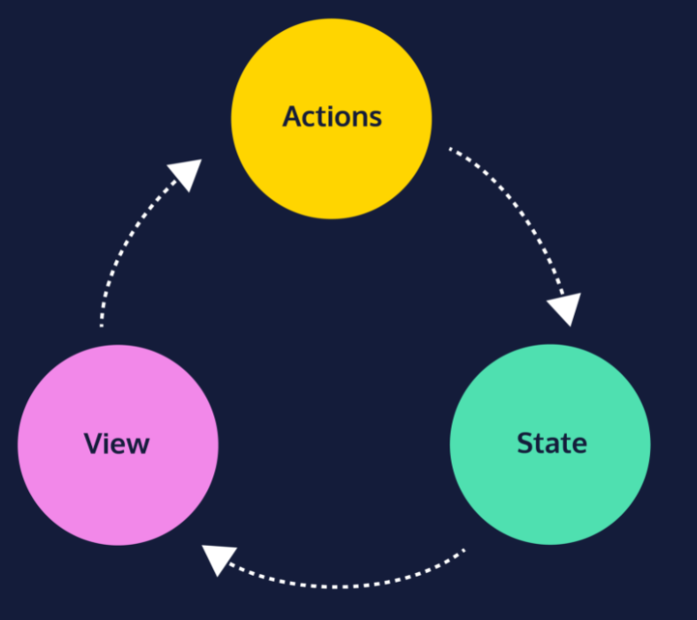
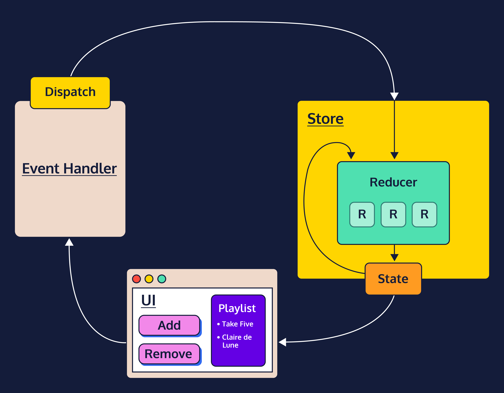
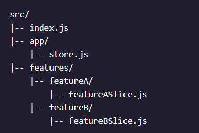

# Redux

Redux is a state management library that follows a pattern known as the Flux architecture. In the Flux pattern, and in Redux, shared information is not stored in components but in a single object. Components are just given data to render and can request changes using events called actions. The state is available throughout the application and updates are made in a predictable manner: components are “notified” whenever a change is made to the state.

To put it another way, here’s the description from the Redux documentation: “The patterns and tools provided by Redux make it easier to understand when, where, why, and how the state in your application is being updated, and how your application logic will behave when those changes occur. Redux guides you towards writing code that is predictable and testable, which helps give you confidence that your application will work as expected.”

Other similar tools like Recoil, MobX, Apollo Client but Redux is the tried and true tool for state management in React.

### Example:
Imagine a calendar app. One part of the app lists all of the events. Another part of the app sets filters on which types of events are shown. A third part of the app sets the current time zone and a fourth part creates new events. Whew, that’s a lot to keep track of!

### One-way data flow



In most applications, there are three parts:

* State – the current data used in the app
* View – the user interface displayed to users
* Actions – events that a user can take to change the state


The flow of information would go like this:

* The state holds the current data used by the app’s components.
* The view components display that state data.
* When a user interacts with the view, like clicking a button, the state will be updated in some way.
* The view is updated to display the new state.

With plain React, these three parts overlap quite a bit. Components not only render the user interface, but they also may manage their own state. When actions that may change the state occur, components need to directly communicate these changes to each other.

__Redux helps separate the state, the view, and actions by requiring that the state be managed by a single source.__ Requests to change the state are sent to this single source by view components in the form of an action. Any components of the view that would be affected by these changes are informed by this single source. __By imposing this structure, Redux makes our code more readable, reliable, and maintainable.__

### State
State is the current information behind a web application.

For a calendar application it includes the events (name, date, label, etc.), the current timezone, and the display filters. For a todo app it includes the todo items (description, completed/not completed), the current order of the items, and display filters. For a word editor, it includes the contents of the document, the print settings, and comments.

With Redux, state can be any JavaScript type, including: number, string, boolean, array, and object.

Here’s an example state for a todo app:
```
const state = [ 'Print trail map', 'Pack snacks', 'Summit the mountain' ];
```

### Actions
Most well-designed applications will have separate components that need to communicate and share data with each other.

A todo list might have an input field where the user can type in a new todo item. The application might transfer this data from the input field, add it to an array of all todos, and then render them as text on the screen. This entire interaction can be defined as an action. In Redux, actions are represented as plain JS objects.

Here’s what that action might look like:
```
const action = {
  type: 'todos/addTodo',
  payload: 'Take selfies'
};
```
* Every action must have a `type` property with a string value. This describes the action.
* Typically, an action has a `payload` property with an object value. This includes any information related to the action. In this case, the payload is the todo text.
* When an action is generated and notifies other parts of the application, we say that the action is dispatched.

### Reducers
So far, we’ve defined the state of our application and the actions representing requests to change that state, but we haven’t seen how these changes are carried out in JavaScript. The answer is a reducer.

A reducer, or reducer function, is a plain JavaScript function that defines how the current state and an action are used in combination to create the new state.

Here’s an example of a reducer function for a todo app:
```
const initialState = [ 'Print trail map', 'Pack snacks', 'Summit the mountain' ];
 
const todoReducer = (state = initialState, action) => {
  switch (action.type) {
    case 'todos/addTodo': {
      return [ ...state, action.payload];
    }
    case 'todos/removeAll': {
      return [];
    }
    default: {
      return state;
    }
  }
}
```
There a few things about this reducer that are true for all reducers:

* It’s a plain JavaScript function
* It defines the application’s next state given a current state and a specific action
* It returns a default initial state if no action is provided
* It returns the current state if the action is not recognized

### Rules of reducers

Some of the consistent rules to be followed while writing code of reducers are:
1. They should only calculate the new `state` value based on the state and `action` arguments. Don't assign new state from any variable,it must be based on `type` and `action.payload` of the event/action.
2. They are not allowed to modify the existing state. Instead, they must copy the existing state and make changes to the copied values. Use the spread operator to make changes and copy them.
3. They must not do any asynchronous logic or have other “side effects” like setting timer, making HTTP request, generating random numbers, saving a file etc.
4. A reducer must be a pure function and it must update state immutably. Being a pure function means they must not generate any side effects like making HTTP requests. And immutably means they must receive current state and make a copy and then make changes to it. So, it combination of Rule 2 and Rule 3.

### Store

Redux uses a special object called the store. The store acts as a container for state, it provides a way to dispatch actions, and it calls the reducer when actions are dispatched. In nearly every Redux application, there will only be one store.

We can rephrase our data flow using the new term:

1. The store initializes the state with a default value.
2. The view displays that state.
3. When a user interacts with the view, like clicking a button, an action is dispatched to the store.
4. The dispatched action and the current state are combined in the store’s reducer to determine the next state.
5. The view is updated to display the new state.

## Redux API

### `createStore`
Store enforces the one-way data flow model that Redux is built upon. It holds the current state inside, receives action dispatches, executes the reducer to get the next state, and provides access to the current state for the UI to re-render.

Redux exports a valuable helper function for creating this store object called `createStore()`. The `createStore()` helper function has a single argument, a reducer function.

```
import { createStore } from 'redux'
 
const initialState = 'on';
const lightSwitchReducer = (state = initialState, action) => {
  switch (action.type) {
    case 'toggle':
      return state === 'on' ? 'off' : 'on';
    default:
      return state;
  }
}
 
const store = createStore(lightSwitchReducer); //store type: object
```

### `store.dispatch()`
It can be used to dispatch an action to the store, indicating to update the state. It's only argument is `type` object. 
```
const action = { type: 'actionDescriptor' }; 
store.dispatch(action);
```
Each time store.dispatch() is called with an action object, the store’s reducer function will be executed with the same action object. Assuming that the action.type is recognized by the reducer, the state will be updated and returned.

Often, developers write dispatchers first so that reducer store is developed in planned manner.

```
import { createStore } from 'redux';
 
const initialState = 'on';
const lightSwitchReducer = (state = initialState, action) => {
  switch (action.type) {
    case 'toggle':
      return state === 'on' ? 'off' : 'on';
    default:
      return state;
  }
}
 
const store = createStore(lightSwitchReducer);
 
console.log(store.getState()); // Prints 'on'
 
store.dispatch({ type: 'toggle' }); 
console.log(store.getState()); // Prints 'off'
 
store.dispatch({ type: 'toggle' });
console.log(store.getState()); // Prints 'on'
```

### `store.subsribe()`

Like event listeners in javascript, this method binds events to every action. It accepts a function that gets executed everytime a state is changed.

```
// lightSwitchReducer(), toggle(), and store omitted...
 
const reactToChange = () => {
  console.log(`The light was switched ${store.getState()}!`);
}
const unsubscribe = store.subscribe(reactToChange);
 
store.dispatch(toggle());
// reactToChange() is called, printing:
// 'The light was switched off!'
 
store.dispatch(toggle());
// reactToChange() is called, printing:
// 'The light was switched on!'
 
unsubscribe(); 
// reactToChange() is now unsubscribed
 
store.dispatch(toggle());
// no print statement!
 
console.log(store.getState()); // Prints 'off'
```

### Connecting redux store to UI

Connecting a Redux store with any UI requires a few consistent steps, regardless of how the UI is implemented:

Create a Redux store
* Render the initial state of the application.
* Subscribe to updates. Inside the subscription callback:
  * Get the current store state
  * Select the data needed by this piece of UI
  * Update the UI with the data
* Respond to UI events by dispatching Redux actions

These same steps are followed when building an interface using React, Angular, or jQuery.

## Strategies for complex state applications

### slices
```
state = {
  todos: [
    {
      id: 0, 
      text: 'Complete the Learn Redux course', 
      isCompleted: false
    },
    {
      id: 1, 
      text: 'Build a counter app', 
      isCompleted: true
    },
  ],
  visibilityFilter: 'SHOW_INCOMPLETE'
};
```
In a Redux application, the top-level state properties, `state.todos` and `state.visibilityFilter`, are known as slices. Each slice typically represents a different feature of the entire application. Notice that a slice can be any data value, like an array of objects (`state.todos`) or just a string (`state.visibilityFilter`).

As a best practice, most Redux applications begin with an initialState that allows the programmer to do two key things:

1. Plan out the general structure of the state
2. Provide an initial state value to the reducer function

```
const initialState = {
  todos: [],
  visibilityFilter: 'SHOW_ALL'
};
const todosReducer = (state = initialState, action) => {
  // rest of todosReducer logic omitted
};
```

### Actions and payloads
When an application state has multiple slices, individual actions typically only change one slice at a time. Therefore, it is recommended that each action’s `type` follows the pattern '`sliceName/actionDescriptor`', to clarify which slice of state should be updated.

For example, in a todo application with a state.todos slice, the action type for adding a new todo might be 'todos/addTodo'

### Immutable Updates and complex state
In the following code, we can see that first a copy of current state is made (though it is a shallow copy) and updation is performed on it only. Carefully look `addRecipe()`, `removeRecipe()`.
```
const recipesReducer = (state = initialState, action) => {
  switch(action.type) {
    case 'allRecipes/loadData':
      return { 
        ...state,
        allRecipes: action.payload
      }
    case 'searchTerm/clearSearchTerm':
      return {
        ...state,
        searchTerm: ''
      }
    
    case 'searchTerm/setSearchTerm':
      return {...state, searchTerm: action.payload} // fix me!

    case 'favoriteRecipes/addRecipe':
      return {...state, favoriteRecipes: [...state.favoriteRecipes, action.payload]}; // fix me!

    case 'favoriteRecipes/removeRecipe':
      return {...state, favoriteRecipes: state.favoriteRecipes.filter((recipe) => recipe.id !== action.payload.id)};

    default:
      return state;
  }
};
```

### Reducer Composition or Multiple Reducers

A store can only be passed a single reducer. But, we can fragment our reducer based on slices and provide each slice with part of state(slice) and complete action. 

Individual slice reducers then are responsible for updating only one slice of the application and their results are combined by a `rootReducer` to form a single state object.

Consider the following example:
```
// Handles only `state.todos`.
const initialTodos = [
  { id: 0, text: 'learn redux', completed: false },
  { id: 1, text: 'build a redux app', completed: true },
  { id: 2, text: 'do a dance', completed: false },
];
const todosReducer = (todos = initialTodos, action) => {
  switch (action.type) {
    case 'todos/addTodo': 
      return [...todos, action.payload]
    case 'todos/toggleTodo':
      return todos.map(todo => {
        return (todo.id === action.payload.id) ? 
          { ...todo, completed: !todo.completed } : 
          {...todo};
      });
    default:
      return todos;
  }
};
 
// Handles only `state.filter`
const initialFilter = 'SHOW_INCOMPLETE',
const filterReducer = (filter = initialFilter, action) => {
  switch (action.type) {
    case 'filter/setFilter':
      return action.payload;
    default:
      return filter;
};
 
const rootReducer = (state = {}, action) => {
  const nextState = {
    todos: todosReducer(state.todos, action),
    filter: filterReducer(state.filter, action)
  };
  return nextState;
};
 
const store = createStore(rootReducer);
```
In this, 
* The `rootReducer` calls each slice reducer, regardless of the `action.type` with incoming action and appropriate slice of state as arguments.
* The slice reducers then determine and update state and returns it.
* The root reducer combines it in a new state and returns it.

### combineReducers
We can also use `combineReducers()` method to combine all reducers and pass its result as argument to `store`. For example, for last example,
```
import { createStore, combineReducers } from 'redux'
 
// todosReducer and filterReducer omitted.
 
const reducers = {
    todos: todosReducer,
    filter: filterReducer
};
const rootReducer = combineReducers(reducers);
const store = createStore(rootReducer);
```

### File structure for redux



Separate slices can be created and kept inside the folder of the specific features or view with name of their slices and then, in store, they can imported and combined.

## React in combination with Redux

### Problems associated earlier
1. We have to pass states and dispatch as props to highest component that is passed to all lower components making it an overhead. Also, called props drilling.
2. A seperate render function has to be designed which renders and subscribed to actions. 
3. App is not scalable.

### `react-redux` - Core Redux API
We are going to use react redux API specially developed for react apps. In this architecture, we are going to give all components access to store and all specific components to dispatch.

To implement this, wrap the <Provider> component around the top-level component and pass store through the store prop of the `<Provider>`:

```
import React from 'react';
import ReactDOM from 'react-dom';
import { App } from './app/App.js';
import { store } from './app/store.js';
 
import { Provider } from 'react-redux'
 
ReactDOM.render(
  <Provider store={store}>
    <App />
  </Provider>,
  document.getElementById("root")
);
```

`ReactDOM.render()` is no longer inside a `render()` function and therefore nothing is subscribed to changes in the Redux store. 

### Selectors
The Redux store is provided to the React components of the application using the <Provider>component. Now, for each React component, you need to define which data from the store that component needs access to. This can be done by creating selector functions. These are not provided by the react-redux library but instead are user-defined.

A selector function, or selector, is a pure function that selects data from the Redux store’s state. Each component in an application that needs access to the state will have one or more selectors that extract only the necessary data for that component.

As pure functions, selectors should output the same data given the same input. This means that no randomness or side effects can occur inside the function.

A selector:

* Takes `state` as an argument.
* Returns what is needed by the component from state.

```
// Select the current filter
export const selectFilter = state => state.filter;
 
// Select the `text` from each todo in an array.
export const selectTodoText = state => state.todos.map(
  todo => todo.text);
 
// Select the id values of completed todos in an array.
export const selectIsCompleteIDs = state => state.todos.filter(
  todo => todo.isComplete).map(todo => todo.id)
```

### useSelector() Hook
With selectors, you have given your application the instructions to access data from the Redux store. To use these instructions the useSelector() hook is provided by react-redux. useSelector() accomplishes two things:

* It returns data from the Redux store using selectors
* It subscribes a child component of <Provider /> to changes in the store. React, not Redux, will re-render the component if the data from the selector changes.

These tasks are both accomplished by calling useSelector() inside a component definition and assigning its returned value to a variable.
```
// Todos.js
import { useSelector } from 'react-redux';
import { selectTodos } from 'todosSlice.js';
 
export const Todos = () => {
  const todos = useSelector(selectTodos);
 
  return (
    <p>{todos}</p>
  )
};
```

Calling useSelector()inside the component definition also subscribes the Todos component to re-render if any changes occur in the todos portion of the Redux store. This optimizes the performance of the application by only re-rendering components that have had their data change and not the entire application.

useSelector() can also use an inline selector as an argument:
```
const todos = useSelector(state => state.todos);
```

Inline selectors can be useful if you need to use props for data retrieval.

```
export const Todo = (props) => {
  const todo = useSelector(state => state.todos[props.id]);
```

### useDispatch() Hook
```
import { useSelector, useDispatch } from 'react-redux';
import { selectTodo } from './todoSlice.js';
import { removeTodo } from './todoSlice.js';
 
const Todo = () => {
  const todo = useSelector(selectTodo);
  const dispatch = useDispatch();
 
  return (
    <button onClick={() => dispatch(removeTodo(todo))}>
      {todo}
    </button>
  )
}
```

The useDispatch hook allows you to dispatch actions from any component that is a descendent of the `<Provider>` component, therefore avoiding passing a reference to `store.dispatch` through props. Both approaches accomplish the same thing but `useDispatch()` avoids props drilling.

### Review : React with Redux
* React and Redux work well together but need more to support React’s UI optimization and Redux’s one-way data flow.
* The react-redux library provides React application components access to the Redux store
* The `<Provider>` component wraps around the root component to give its descendants access to the - Redux store without props drilling
* Selectors are pure function used to access all or part of the state in the Redux store
* useSelector() retrieves the application state through selectors. It must be called from within a component
* useSelector() subscribes components to data retrieved from the selectors. React, not Redux, re-renders those components when the selected data changes
* useDispatch() returns a reference to Redux store dispatch() function

__While react-redux is the official Redux-UI binding for React, there are many ways to manage state in React applications.__

## Redux Toolkit

Some common issues/complaints when using redux:
* “Configuring a Redux store is too complicated.”
* “I have to add a lot of packages to get Redux to do anything useful.”
* “Redux requires too much boilerplate code.”
* “Writing immutable updates is too error-prone.”

__Redux Toolkit__ contains packages and functions that are essential for building a Redux app. It builds in the best practices, simplifies most Redux tasks, prevents common mistakes, and makes it easier to write Redux applications.

Because of how effective it has proven to be at addressing the concerns of the verbose “hand-written” logic of the past, Redux Toolkit has become the preferred way to write Redux application logic.

### Refactoring with createSlice()

```
/* todosSlice.js  */
const addTodo = (todo) => {
 // logic omitted...
}
 
const toggleTodo = (todo) => {
  // logic omitted...
}
 
const todos = (state = [], action) => {
  // logic omitted...
}
```

We can do the same work, but more simply, with `createSlice()`! `createSlice()` has one parameter, options, which is an object with the following properties

* name: a string that is used as the prefix for generated action types
* initialState: the initial state value for the reducer
* reducers: an object of methods, where the keys determine the action type strings that can update the state, and whose methods are reducers that will be executed when that action type is dispatched. These are sometimes referred to as “case reducers”, because they’re similar to a case in a switch statement.

```
/* todosSlice.js */
const options = {
 name: 'todos',
 initialState: [],
 reducers: {
   addTodo: (state, action) => {
     return [
       ...state,
       {
         id: action.payload.id,
         text: action.payload.text,
         completed: false
       }
     ]
   },
   toggleTodo: (state, action) => {
     return state.map(todo =>
       (todo.id === action.payload.id) ? { ...todo, completed: !todo.completed } : todo
     )
   }
 }
}
 
const todosSlice = createSlice(options);
```

With `createSlice()`…

* We can write the case reducers as functions inside of an object, instead of having to write a switch/case statement.
* Action creators that correspond to each case reducer function we provide will be automatically generated, so we don’t need to worry about defining those ourselves.
* No default handler needs to be written. The reducer generated by createSlice() will automatically handle all other action types by returning the current state, so we don’t have to list that ourselves.

### Writing Mutable code with `Immer`

Because Redux reducers must never mutate state, we often write immutable updates by using JavaScript’s array and object spread operators and other functions that return copies of the original values. However, accidentally mutating state in reducers is the single most common mistake Redux users make!

While you still have the option of writing immutable updates the old fashioned way, Redux Toolkit’s `createSlice()` function uses a library called Immer inside of it which helps avoid this mistake.

Immer uses a special JS object called a Proxy to wrap the data you provide and lets you write code that “mutates” that wrapped data. Immer does this by tracking all the changes you’ve made and then uses that list of changes to return an immutably updated value as if you’d written all the immutable update logic by hand.

```
const todosSlice = createSlice({
  name: 'todos',
  initialState: [],
  reducers: {
    addTodo: (state, action) => {
      state.push({ 
        ...action.payload, 
        completed: false 
      })
    },
    toggleTodo: (state, action) => {
      const todo = state.find(todo => todo.id === action.payload.id)
      if (todo) {
        todo.completed = !todo.completed
      }
    }
  }
})
```

### Return object-actions

Using todosSlice from the previous exercise as an example, createSlice() would return an object that looks like this:

```
const todosSlice = createSlice({
 name: 'todos',
 initialState: [],
 reducers: {
   addTodo(state, action) {
     const { id, text } = action.payload
     state.push({ id, text, completed: false })
   },
   toggleTodo(state, action) {
     const todo = state.find(todo => todo.id === action.payload)
     if (todo) {
       todo.completed = !todo.completed
     }
   }
 }
})
 
/* Object returned by todosSlice */
{
 name: 'todos',
 reducer: (state, action) => newState,
 actions: {
   addTodo: (payload) => ({type: 'todos/addTodo', payload}),
   toggleTodo: (payload) => ({type: 'todos/toggleTodo', payload})
 },
 // case reducers field omitted
}
```

Let’s break this down:

* name holds the value of the string that is used as the prefix for the generated action types.
* reducer is the complete reducer function (we’ll take a closer look at this in the next exercise).
* actions holds the the auto-generated action creators.

So, what do these auto-generated action objects look like?

By default, the action creator accepts one argument, which it puts into the action object as action.payload. The action.type string is generated for us by combining the slice’s name field with the name of the case reducer function.

```
console.log(todosSlice.actions.addTodo('walk dog'))
// {type: 'todos/addTodo', payload: 'walk dog'}
```

You’ll need to use the action creators in other files, so at a minimum you could export the entire slice object returned by createSlice(). However, we’ll use a Redux community code convention called the “ducks” pattern, which suggests that we use named exports for the action creators and export them separately from the reducer.

```
console.log(favoriteRecipesSlice.name);

for(const action in favoriteRecipesSlice.actions) {
  console.log(action);
}

export const { addRecipe, removeRecipe } = favoriteRecipesSlice.actions;
```

### Return object-reducers

```
const options = {
  // options fields omitted.
}
const todosSlice = createSlice(options);
 
/* Object returned by todosSlice */
{
 name: 'todos',
 reducer: (state, action) => newState,
 actions: {
   addTodo: (payload) => ({type: 'todos/addTodo', payload}),
   toggleTodo: (payload) => ({type: 'todos/toggleTodo', payload})
 },
 // case reducers field omitted
}
```

`todosSlice.reducer` is the complete reducer function, a.k.a the “slice reducer”.

When an action with the type `'todos/addTodo'` is dispatched, todosSlice will execute `todosSlice.reducer()` to check if the dispatched action’s type matches one of `todos.actions` case reducers. If so, it will run the matching case reducer function and if not, it will return the current state. This is exactly the same pattern that we had previously implemented with `switch/case` statements!

Finally, `todosSlice.reducer` needs to be exported so that it can be passed to the store and be used as the todos slice of state. While the `todosSlice.actions` are exported as named exports, the `todosSlice.reducer` value is used as the default export.

```
export const { addTodo, toggleTodo } = todosSlice.actions;
export default todosSlice.reducer
```

### Converting the Store to use `configureStore()`

Redux Toolkit has a configureStore() method that simplifies the store setup process. configureStore() wraps around the Redux library’s createStore() method and the combineReducers() method, and handles most of the store setup for us automatically.

```
// rootReducer.js
 
import { combineReducers } from 'redux'
 
import todosReducer from './features/todos/todosSlice'
import filtersReducer from './features/filters/filtersSlice'
 
const rootReducer = combineReducers({
 // Define a top-level state field named `todos`, handled by `todosReducer`
 todos: todosReducer,
 visibilityFilter: visibilityFilterReducer
})
 
export default rootReducer
```

Now, let’s take a look at how we can refactor these two files using `configureStore()`. `configureStore()` accepts a single configuration object parameter. The input object should have a reducer property that defines either a function to be used as the root reducer, or an object of slice reducers which will be combined to create a root reducer.

```
import { configureStore } from '@reduxjs/toolkit'
 
import todosReducer from './features/todos/todosSlice'
import filtersReducer from './features/filters/filtersSlice'
 
const store = configureStore({
 reducer: {
   // Define a top-level state field named `todos`, handled by `todosReducer`
   todos: todosReducer,
   filters: filtersReducer
 }
})
 
export default store
```

__Without Redux Toolkit, you have to write all your action creators and reducers by hand.__


## Middleware in Redux

Out of the box, Redux may meet most of your app’s state management needs. But every project is different, and so Redux provides some ways to customize its behavior. One of the ways we can customize Redux is by adding middleware.

You may be familiar with middleware from experiences working with other frameworks. As the name suggests, middleware is the code that runs in the middle—usually between a framework receiving a request and producing a response. Middleware is a powerful tool for extending, modifying, or customizing a framework or library’s default behavior to meet an application’s specific needs.

In Redux, middleware runs between the moment when an action is dispatched and the moment when that action is passed along to the reducer. By this point you’re familiar with the way data flows through Redux: actions are dispatched to the store, where they are processed by reducers that produce new state; that new state becomes accessible to all the components that reference it, causing those components update.

__Middleware intercepts actions after they are dispatched and before they are passed along to the reducer.__ Some common tasks that middleware perform include logging, caching, adding auth tokens to request headers, crash reporting, routing, and making asynchronous requests for data. You can add any of these functionalities to your apps by using popular open-source middleware. Of course, you can also write your own middleware to solve problems that are specific to your application and its architecture.

To make asynchronous requests in our recipe app, we’re using redux-thunk, a middleware for handling asynchronous requests. There are several popular middleware that make asynchronous functionality compatible with Redux; we chose this one because it’s one of the most widely-employed, and it is included with Redux Toolkit by default.

### Writing own middleware

To add a middleware to our project, we use Redux’s `applyMiddleware` function like so.

```
import { createStore, applyMiddleware } from 'redux';
import { middleware1, middleware2, middleware3 } from './exampleMiddlewares';
import { exampleReducer } from './exampleReducer';
import { initialState} from './initialState';
 
const store = createStore(
  exampleReducer, 
  initialState, 
  applyMiddleware(
    middleware1, 
    middleware2, 
    middleware3
  )
);
```

The specifics of how applyMiddleware works are outside the scope of this lesson. All you need to know is that once middleware has been added to a Redux project, calls to dispatch are actually calls to the middleware pipeline (the chain of all added middlewares). This means that any actions we dispatch will be passed from middleware to middleware before they hit an app’s reducers.

Middlewares must conform to a specific, nested function structure in order to work as part of the pipeline (this nested structure is also called a higher-order function, if you’d like to read more). That structure looks like this:

```
const exampleMiddleware = storeAPI => next => action => {
  // do stuff here
  return next(action);  // pass the action on to the next middleware in the pipeline
}
```

Each middleware has access to the storeAPI (which consists of the dispatch and getState functions), as well as the next middleware in the pipeline, and the action that is to be dispatched. The body of the middleware function performs the middleware’s specific task before calling the next middleware in the pipeline with the current action (note that if the middleware is the last in the pipeline, then next is storeAPI.dispatch so calling next(action) is the same as dispatching the action to the store).

### Intro to thunks

A thunk is a higher-order function that wraps computation we want to perform later. For example, this add function returns a thunk that will perform x+y when called.
```
const add = (x,y) => {
  return () => {
    return x + y; 
  } 
}
```
Thunks are helpful because they allow us to bundle up bits of computation we want to delay into packages that can be passed around in code. Consider these two function calls, which rely on the add function above:

```
const delayedAddition = add(2,2)
delayedAddition() // => 4
```
Note that calling add does not cause the addition to happen – it merely returns a function that will perform the addition when called. To perform the addition, we must called delayedAddition.

### `redux-thunk`

To appreciate how thunks can help us integrate asynchronous actions into our Redux apps, let’s review the barriers to performing asynchronous operations that exist within traditional Redux. First, asynchronous logic returns promises, and store.dispatch expects to receive a plain object with a type property. Second, asynchronous operations create side effects. And so including them in our reducers would violate a core tenet of Redux, which is that reducers must be pure functions.

Redux recommends making code with side effects part of the action creation process. It would be great if we could write action creators that return thunks, which would handle our asynchronous operations, in addition to the plain objects we’ve returned from our action creators thus far.

As it turns out, redux-thunk is a middleware that lets you do exactly that. redux-thunk makes it simple for you to write asynchronous logic that interacts with the store by allowing you to write action creators that return thunks instead of objects. These thunks can perform asynchronous operations, and per the redux-thunk documentation, “can be used to delay dispatching an action” (for example, until after an API response is received), or “to dispatch an action only if certain conditions are met”.

For example, imagine we’ve written a simple counter whose reducer contains a single value, which is updated by a single reducer. Without redux-thunk we are limited to writing synchronous action creators like this one:

```
const increment = () => {
  return {
    type: 'counter/increment',
  }
}
```

When we call `dispatch(increment())`, the value in our store immediately increases. With redux-thunk, we can extend our counter app to accommodate asynchronous action creators, like asyncIncrement, in addition to synchronous ones.

```
const incrementLater = async () => {
  setTimeout(() => {
    dispatch(increment())    
  }, 1000)    
};
 
const asyncIncrement = () => {
  return incrementLater;
}
```

`redux-thunk` is such a popular solution for handling asynchronous logic that it is included in Redux Toolkit. It also exists as a standalone package, but you won’t need to install redux-thunk separately if you use Redux Toolkit. This is because Redux Toolkit’s configureStore function, which you learned about in a previous lesson, will apply redux-thunk to the store by default.

### Writing thunks in redux

To better appreciate redux-thunk, let’s review the process of retrieving data from a Redux store. For example, suppose we have a list of users’ data, and want to retrieve the data corresponding to the user with a particular id = 32. Assuming we have that user’s data in the store, we can access the user’s data by writing a selector to retrieve the information we need.

```
useSelector((state) => state.users.byId[32]);
```

But what if we don’t have that particular user in the store? Say, for example, that we need to fetch the user’s data from an API. Ideally, we would like to be able to dispatch an action creator that would first perform an asynchronous operation (fetching the data), and then dispatch a synchronous action (adding the data to the store) after the asynchronous operation completes.

This is where thunks come in handy. Up to this point, we’ve only written action creators that returned plain objects. But redux-thunk allows us to write action creators that return thunks, within which we can perform any asynchronous operations we like. Consider the following asynchronous action creator:

```
import { fetchUser } from './api'
const getUser = (id) => {
  return async (dispatch, getState) => {
    const payload = await fetchUser(id);
    dispatch({type: 'users/addUser', payload: payload});
  }
}
```

`getUser` has two key parts: the synchronous outer function (otherwise known as the thunk action creator) which returns the inner, asynchronous thunk. The thunk receives dispatch and getState as arguments, and dispatches a synchronous action after the asynchronous operation (fetchUser) completes.

To get the user with id = 32, we can call `dispatch(getUser(32))`. Note that the argument to dispatch is not an object, but an asynchronous function that will first fetch the user’s data and then dispatch a synchronous action once the user’s information has been retrieved.

### `redux-think` source code

At this point, you are ready to use thunks to define asynchronous operations in Redux. But you may be curious about how redux-thunk works. In order to allow us to write action creators that return thunks in addition to plain objects, the redux-thunk middleware performs a simple check to the argument passed to dispatch. If dispatch receives a function, the middleware invokes it; if it receives a plain object, then it passes that action along to reducers to trigger state updates.

```
const getUser = (id) => {
  return async (dispatch, getState) => {
    const payload = await fetchUser(id)
    dispatch({type: 'users/addUser', payload: payload})
  }
}
```

Suppose we were to call dispatch(getUser(7)) with the thunk middleware applied. We know that getUser(7) returns a thunk, so on line 3 of the thunk middleware, `typeof action === 'function'` will evaluate to true. On line 4, the middleware will then invoke getUser(7) with the arguments dispatch and getState. This invocation will initiate the asynchronous fetching performed by the thunk. When that asynchronous fetching is complete, the thunk will dispatch the synchronous action `{type: ‘users/addUser’, payload: payload}`.

For contrast, let’s walk through what happens when we dispatch that synchronous action. Since the action is a plain object, `typeof action === 'function'` will evaluate to false. The redux-thunk middleware therefore skips to line 7, and invokes the next middleware in the pipeline, passing the action along.

### Review

* Learned about Redux middleware and wrote your own simple logging middleware
* Encountered thunks and learned about how valuable thunks are for deferring computation
```
const remindMeLater = task => { 
  return () => {
    remindMeTo(task)
  } 
} 
```
* Discovered redux-thunk, a middleware that allows you to write asynchronous action creators that return thunks instead of objects
* Automatically enabled redux-thunk by using configureStore ```Discovered redux-thunk, a middleware that allows you to write asynchronous action creators that return thunks instead of objects```
* Took a deep dive into the middleware’s source code, in order to understand how the middleware actually works
* Wrote your own asynchronous action creators in the format that redux-thunk expects
```
const getUser = (id) => {
  return async (dispatch, getState) => {
    const payload = await fetchUser(id)
    dispatch({type: 'users/addUser', payload: payload})
  }
}
```

## Managing promise lifecycle actions

[interactive lifecycle demostration](https://static-assets.codecademy.com/Courses/Learn-Redux/lesson-assets/interactive-image-async-data-flow/index.html)

### Introduction
At this point, you can write a Redux app that uses `redux-thunk`—a middleware included in Redux toolkit—to permit asynchronous operations, such as fetching data from an API. In this lesson, we will explore some common patterns for managing asynchronous operations and the state changes they cause. We will learn about two Redux toolkit utilities—`createAsyncThunk` and the `extraReducers` option you can pass to the createSlice function—that simplify the process of performing asynchronous operations and reflecting their results in state.

### Promise Lifecycle Actions

In a perfect world, every network request we make would yield an immediate and successful response. But network requests can be slow, and sometimes fail. As developers, we need to account for these realities in order to create the best possible experience for our users. If we know a request is pending, we can make our application more user-friendly by displaying a loading state. Similarly, if we know a request has failed, we can display an appropriate error state.

In order to create these satisfying user experiences, we need to keep track of the state our async requests are in at any given moment so that we can reflect those states for the user. It is common to dispatch a “pending” action right before performing an asynchronous operation, and “fulfilled” or “rejected” actions depending on the results of the completed operation. Take this simple thunk action creator, fetchUserById.

```
import { fetchUser } from './api';
 
const fetchUserById = (id) => {
  return async (dispatch, getState) => {
    const payload = await fetchUser(id);
    dispatch({type: 'users/addUser', payload: payload});
  }
}
```

Rewritten to include pending and rejected actions, it might look like this:

```
import { fetchUser } from './api'
const fetchUserById = (id) => {
  return async (dispatch, getState) => {
    dispatch({type: 'users/requestPending'})
    try {
      const payload = await fetchUser(id)
      dispatch({type: 'users/addUser', payload: payload})
    } catch(err) {
      dispatch({type: 'users/error', payload: err})
    }
  }
}
```
We call these pending/fulfilled/rejected actions promise lifecycle actions. This pattern is so common that Redux Toolkit provides a neat abstraction, createAsyncThunk, for including promise lifecycle actions in your Redux apps.

### `createAsyncThunk()`

`createAsyncThunk` is a function with two parameters—an action type string and an asynchronous callback—that generates a thunk action creator that will run the provided callback and automatically dispatch promise lifecycle actions as appropriate so that you don’t have to dispatch pending/fulfilled/rejected actions by hand.

Next, you’ll need to call `createAsyncThunk`, passing two arguments. The first is a string representing the asynchronous action’s type. Conventionally, type strings take the form `"resourceType/actionName"`. In this case, since we are getting an individual user by their id, our action type will be `users/fetchUserById`. The second argument to createAsyncThunk is the payload creator: an asynchronous function that returns a promise resolving to the result of an asynchronous operation. Here is `fetchUserById` rewritten using `createAsyncThunk`:

```
import { createAsyncThunk } from '@reduxjs/toolkit'
import { fetchUser } from './api'
const fetchUserById = createAsyncThunk(
  'users/fetchUserById', // action type
  async (arg, thunkAPI) => { // payload creator
    const response = await fetchUser(arg);
    return response.json();
  }
)
```

There are a few things worth highlighting here. First, observe that the payload creator receives two arguments—`arg` and `thunkAPI`. We will elaborate on those in the next exercise. Second, note that the payload creator we provided doesn’t dispatch any actions at all. It just returns the result of an asynchronous operation.

As you can see, `createAsyncThunk` makes defining thunk action creators more concise. All you have to write is an asynchronous thunk function; `createAsyncThunk` takes care of the rest, returning an action creator that will dispatch pending/fulfilled/rejected actions as appropriate.

### Passing arguments to thunks

 The first argument, arg, will be equal to the first argument passed to the thunk action creator itself. For example, if we call fetchUserById(7), then inside the payload creator, arg will be equal to 7.

 But what if you need to pass multiple arguments to your thunk? Since the payload creator only receives the first argument passed to the thunk action creator, you’ll want to bundle multiple arguments into a single object. For example, say we want to search our app’s users by first and last name. If the thunk action creator is called searchUsers, we would call it like this: searchUsers({firstName: 'Ada', lastName: 'Lovelace'}).

If you need to access these variables individually, you can use ES6 destructuring assignment to unpack the object when you declare the payload creator and pass it to createAsyncThunk, like this :

```
const searchUsers = createAsyncThunk(
    'users/searchUsers',
    async ({ firstName, lastName}, thunkAPI) => {
        // perform the asynchronous search request here    
    }
)
```

If your thunk requires no arguments, you can just call your thunk action creator without, and the arg argument will be undefined. In the event the thunk requires only one param (for example, fetching a specific resource by id) you should name that first param semantically. Here’s the fetchUserById example from the last exercise, with the arg parameter semantically renamed to userId.

```
import { createAsyncThunk } from '@reduxjs/toolkit'
import { fetchUser } from './api'
const fetchUserById = createAsyncThunk(
    'users/fetchUserById', // action type
    async (userId, thunkAPI) => { // payload creator
        const response = await fetchUser(userId)
        return response.data
    }
)
```

The payload creator’s second argument, thunkAPI, is an object containing several useful methods, including the store’s dispatch and getState. For an exhaustive list of methods available in the thunkAPI object, you can read the documentation [here](https://redux-toolkit.js.org/api/createAsyncThunk#payloadcreator)

### Actions Generated by `createAsyncThunk`

As you know, createAsyncThunk takes care of dispatching actions for each of the promise lifecycle states: pending, fulfilled, and rejected. But what exactly do these actions look like?

Building off the action type string you pass to it, createAsyncThunk produces an action type for each promise lifecycle states. If you pass the action type string 'resourceType/actionType' to createAsyncThunk, it will produce these three action types:

* 'resourceType/actionType/pending'
* 'resourceType/actionType/fulfilled'
* 'resourceType/actionType/rejected'

To use our earlier example:

```
import { createAsyncThunk } from '@reduxjs/toolkit'
import { fetchUser } from './api'
 
const fetchUserById = createAsyncThunk(
  'users/fetchUserById', // action type
  async (userId, thunkAPI) => { // payload creator
    const response = await fetchUser(userId)
    return response.data
  }
)
```

When you pass createAsyncThunk the action type string 'users/fetchUserById', createAsyncThunk producers these three actions types:

* 'users/fetchUserById/pending'
* 'users/fetchUserById/fulfilled'
* 'users/fetchUserById/rejected'

If you need to access the individual pending/fulfilled/rejected action creators, you can reference them like this:

* fetchUserById.pending
* fetchUserById.fulfilled
* fetchUserById.rejected

You will have to handle these action types in your reducers if you want to reflect these promise lifecycle states in your app. In the next exercise, we will show you how to do that.

### Using `createSlice()` with Async Action Creators

The asynchronous action creator in previous example will generate three action types: `'users/fetchUserById/pending'`, `'users/fetchUserById/fulfilled'`, and `'users/fetchUserById/rejected'`. Currently, these action types have no effect on our users slice, which only responds to the `users/addUser` action type generated by `createSlice`. How can we account for these promise lifecycle action types in our user slice? This is exactly the problem that `extraReducers`, an optional property on the configuration object passed to `createSlice`, was designed to solve.

`extraReducers` allows `createSlice` to respond to action types generated elsewhere. To make the users slice respond to promise lifecycle action types, we pass them to `createSlice` in the `extraReducers` property. Open `usersSlice.js` in your code editor to see an example of the extraReducers property in context.

Note that in addition to using the `extraReducers` property, we also added some extra fields to our state object: a boolean, `isLoading`, which will be true when a request is pending, and otherwise false, and a boolean `hasError`, which we will set to `true` if our request to fetch a user is rejected. These additions will allow us to simply track promise lifecycle states so that we can create satisfying and informative user interfaces.

```
import { createAsyncThunk, createSlice } from "@reduxjs/toolkit";
import {
  addFavoriteRecipe,
  removeFavoriteRecipe,
} from "../favoriteRecipes/favoriteRecipesSlice";
import { selectSearchTerm } from "../search/searchSlice";
export const loadRecipes = createAsyncThunk(
  "allRecipes/getAllRecipes",
  async () => {
    const data = await fetch("api/recipes?limit=10");
    const json = await data.json();
    return json;
  }
);

const sliceOptions = {
  name: "allRecipes",
  initialState: {
    recipes: [],
    isLoading: false,
    hasError: false
  },
  reducers: {},
  extraReducers: {
    [loadRecipes.pending]: (state, action) => {
      state.isLoading = true;
      state.hasError = false;
    },
    [loadRecipes.fulfilled]: (state, action) => {
      state.recipes = action.payload;
      state.isLoading = false;
      state.hasError = false;
    },
    [loadRecipes.rejected]: (state, action) => {
      state.isLoading = false;
      state.hasError = true;
    }
  }
}

export const allRecipesSlice = createSlice(sliceOptions);

export const selectAllRecipes = (state) => state.allRecipes.recipes;

export const selectFilteredAllRecipes = (state) => {
  const allRecipes = selectAllRecipes(state);
  const searchTerm = selectSearchTerm(state);

  return allRecipes.filter((recipe) =>
    recipe.name.toLowerCase().includes(searchTerm.toLowerCase())
  );
};

export default allRecipesSlice.reducer;

```

Other Example - 
```
import { createSlice, createAsyncThunk } from "@reduxjs/toolkit";

const initialState = {
	data: [],
	loading: true
};

const ENDPOINT = "https://star-wars-characters.glitch.me/api/search/";

export const fetchCharactersFromAPI = createAsyncThunk('characters/fetch', async(searchTerm) => {
	const response = await fetch(ENDPOINT+searchTerm).then((response) => response.json());
	return response.results;
});

export const characterSlice = createSlice({
	name: 'characters',
	initialState,
	reducers: {
		add: (state,action) => {
			state.characters = action.payload;
		}
	},
	extraReducers: {
		[fetchCharactersFromAPI.fulfilled]: (state,action) => {
			state.data = action.payload;
		},
	}
});

//In UI
const handleSubmit = (event) => {
	event.preventDefault();
	dispatch(fetchCharactersFromAPI(characterValue));
}
```

### Review

* Learned the three promise lifecycle actions: pending, fulfilled, and rejected
* Learned how to use `createAsyncThunk`, which abstracts the process of handling promise lifecycle states according to best practices/common design paradigms
* Imported `createAsyncThunk` from the Redux Toolkit:
```
import { createAsyncThunk } from '@reduxjs/toolkit';
```
* Refactored existing asynchronous action creators using `createAsyncThunk`.
* Made your reducers respond to pending/fulfilled/rejected promise lifecycle actions by supplying the extraReducers property to `createSlice`

## Testing Redux

1. [Writing Tests](https://redux.js.org/usage/writing-tests)
2. [Testing strategies for react and redux](https://hacks.mozilla.org/2018/04/testing-strategies-for-react-and-redux/)
3. [How to test React-Redux connected Components](https://www.robinwieruch.de/react-connected-component-test)
4. [How to test redux - video](https://www.youtube.com/watch?v=h7ukDItVN_o)
5. [Best practices for unit testing with a React/Redux approach](https://willowtreeapps.com/ideas/best-practices-for-unit-testing-with-a-react-redux-approach)
