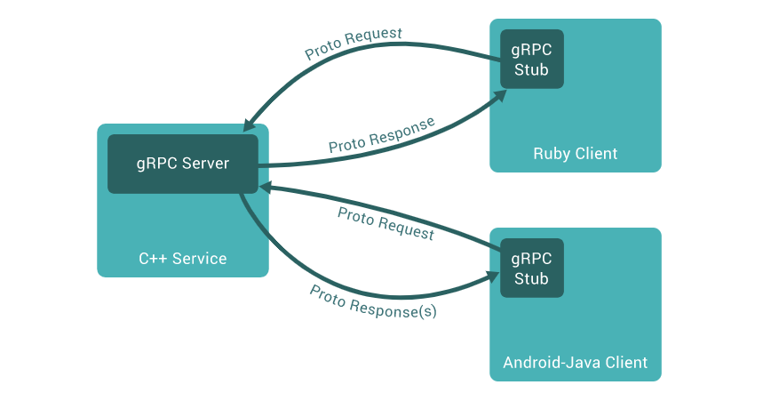
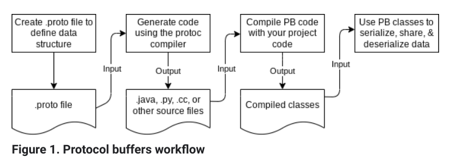

# gRPC

It stands for **g**RPC **R**emote **P**rocedure **C**alls

Microservices must exchange information and need to agree on :
- The API to exchange data
- The data format
- The error pattern
- Load balancing
- many other

While building an API, we need to think about data model, endpoints, how to invoke them and handle errors, efficiency of API, latency, scalblity, authentication, monitoring, logging and lots of other factors.

### What's an API?
At its core, an API is a contract between client and server.
- Send me this REQUEST(client)
- I'll send you this RESPONSE(server)

We will be handling this core and rest all other aspects of API will be handled by gRPC.

### What's gRPC?

gRPC is free and open-source framework developed by Google. It's a part of Cloud Native Computation Foundation(CNCF) - like Docker and Kubernetes for example.

At a high level, it allows us to define REQUEST and RESPONSE for RPC calls and handles the rest for us.

On top of it, it is modern, fast and efficient, build on top of HTTP/2, low latency, supports streaming, language independent and makes it super easy to plug in authentication, load balancing, logging and monitoring. Also, gRPC requests can be cancelled and no further work is done. Warning: Changes made before a cancellation are not rolled back.

### What's an RPC?
RPC is a call from on machine to other machine over a network. For example, frontend app residing in client call a function present on backend residing on server over the internet.

It's not a new concept(CORBA had it before). With gRPC, it's implemented very cleanly and solves a lot of problems.



### Motivation behind gRPC

Conventionally, we have SOAP, REST architectures through which we design and implement APIs. But these all use a client library to make calls.

For instance, a REST application on server, now client which is browser forms the header, make TLS, use HTTP2 or fallback to HTTP1, then make the request. So, all these need a HTTP client.

Now, for an application to communicate with other application, we will need a HTTP client library/SOAP library as there is no browser. Also, its hard to maintain and patch client libraries. These libraries are language dependent. This dependency on client libraries is solved by gRPC.

### Why gRPC was invented?
- Client Library: One library for popular languages
- Protocol: HTTP/2 (hidden implementation)
- Message format: Protocol buffers

### What are protocol buffers?

It provides a language-neutral, platform-neutral, extensible mechanism for serializing structured data in a forward-compatible and backward-compatible way. It’s like JSON, except it's smaller and faster, and it generates native language bindings.

Protocol buffers are a combination of the definition language (created in `.proto` files), the code that the proto compiler generates to interface with data, language-specific runtime libraries, and the serialization format for data that is written to a file (or sent across a network connection).

#### What PB solves?

Protocol buffers provide a serialization format for packets of typed, structured data that are up to a few megabytes in size. The format is suitable for both ephemeral network traffic and long-term data storage. Protocol buffers can be extended with new information without invalidating existing data or requiring code to be updated.

The proto compiler is invoked at build time on .proto files to generate code in various programming languages to manipulate the corresponding protocol buffer. Each generated class contains simple accessors for each field and methods to serialize and parse the whole structure to and from raw bytes. The following shows you an example that uses those generated methods:

```
Person john = Person.newBuilder()
    .setId(1234)
    .setName("John Doe")
    .setEmail("jdoe@example.com")
    .build();
output = new FileOutputStream(args[0]);
john.writeTo(output);
```

#### Benefits of PB
- Compact data storage (much less than JSON)
- Fast parsing
- Availability in many programming languages
- Optimized functionality through automatically generated classes

#### How do PB work?



The code generated by protocol buffers provides utility methods to retrieve data from files and streams, extract individual values from the data, check if data exists, serialize data back to a file or stream, and other useful functions.

#### PB Definition syntax

When defining .proto files, you can specify that a field is either optional or repeated (proto2 and proto3) or singular (proto3).
After setting it, we need to specify the data type.

A field can be of many types. For full list, see [here](https://developers.google.com/protocol-buffers/docs/proto#scalar)

A field can also be of:

- A `message` type, so that you can nest parts of the definition, such as for repeating sets of data.
- An `enum` type, so you can specify a set of values to choose from.
- A `oneof` type, which you can use when a message has many optional fields and at most one field will be set at the same time.
- A `map` type, to add key-value pairs to your definition.

After setting optionality and field type, we assign a field number. Field numbers cannot be repurposed or reused. **If we delete a field, we should reserve its field number to prevent someone from accidentally reusing the number.**

There are also [additional data type support](https://developers.google.com/protocol-buffers/docs/overview#data-types) like Duration, Timestamp, Date etc.

```
syntax="version"
```

### Get started

At the core of gRPC, we need to define messages and services using protocol buffers. The rest of gRPC code will be generated for us and we'll have to provide an implementation for it.

The reason for usage of protocol buffers in gRPC is that it works across languages and platforms. We write protocol buffers that are language independent. then, depending on language, we compile it and use the class generated.

One `.proto` file works for over 12 programming languages and allows us to use a framework that scales to millions of RPC per seconds.

### Why protocol buffers?
- protocol buffers are language agnostic
- code can be generated for pretty much any language
- data is binary and efficiently serialized
- very convinient for transporting a lot of data
- allows for easy API evolution using rules
- payload is binary, therefore very efficient to send/receive on a network and serialize/de-serialize on a CPU

### Protocol buffer in gRPC

By default gRPC uses protocol buffers, but there are other alternatives if desired like JSON, msgpack, thrift apache etc.

We first define the structure of data we want to serialize in a *proto* file. Then, we define gRPC services. Services are endpoints that would be called by client.

```
// The greeter service definition.
service Greeter {
  // Sends a greeting
  rpc SayHello (HelloRequest) returns (HelloReply) {}
}

// The request message containing the user's name.
message HelloRequest {
  string name = 1;
}

// The response message containing the greetings
message HelloReply {
  string message = 1;
}
```

gRPC uses `protoc` with a special gRPC plugin to generate code from your proto file: you get generated gRPC client and server code, as well as the regular protocol buffer code for populating, serializing, and retrieving your message types.

### Types of API/services in gRPC

gRPC lets us define four kinds of service methods -
- Unary RPCs - client sends a single request to server and server sends a single response back
```
rpc SayHello(HelloRequest) returns (HelloResponse);
```

- Server Streaming RPC - client sends a single request and servers sends a stream of data as messages back. Client reads messages until no more messages. gRPC guarantees message order within an individual RPC call.
```
rpc LotsOfReplies(HelloRequest) returns (stream HelloResponse);
```

- Client Streaming RPC- similar to server streaming, now client sends a stream of data to server and server responds with a single message. After client finishes sending messages, it waits for server to read them and return a response.
```
rpc LotsOfGreetings(stream HelloRequest) returns (HelloResponse);
```

- Bidirectional streaming RPC - both sides send a sequence of messages using a read-write stream. The two streams operate independently, so clients and servers can read and write in whatever order they like: for example, the server could wait to receive all the client messages before writing its responses, or it could alternately read a message then write a message, or some other combination of reads and writes. The order of messages in each stream is preserved.
```
rpc BidiHello(stream HelloRequest) returns (stream HelloResponse);
```

### Deadlines/timeouts

gRPC allows clients to specify how long they are willing to wait for an RPC to complete before the RPC is terminated with a DEADLINE_EXCEEDED error. On the server side, the server can query to see if a particular RPC has timed out, or how much time is left to complete the RPC.

Specifying a deadline or timeout is language specific: some language APIs work in terms of timeouts (durations of time), and some language APIs work in terms of a deadline (a fixed point in time) and may or may not have a default deadline.

### RPC termination

In gRPC, both the client and server make independent and local determinations of the success of the call, and their conclusions may not match. This means that, for example, you could have an RPC that finishes successfully on the server side (“I have sent all my responses!”) but fails on the client side (“The responses arrived after my deadline!”). It’s also possible for a server to decide to complete before a client has sent all its requests.
