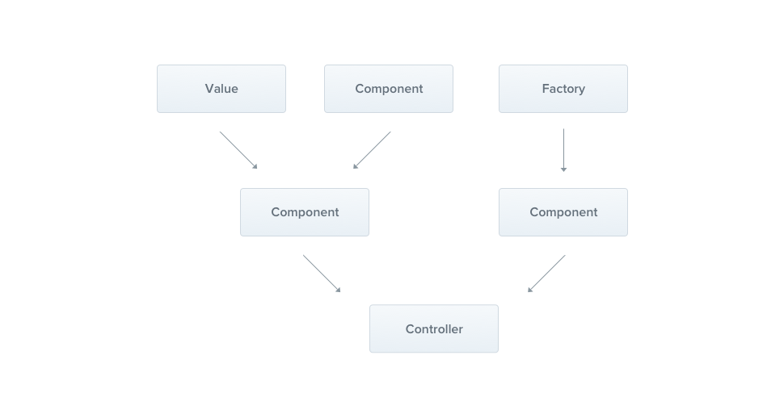

# Nest JS

## Introduction

Nest is a framework for building efficient, scalable Node.js server side applications. It uses modern Js, is build with TypeScript, combines elements of OOP, FP, FRP(functional reactive programming).

Under the hood, it uses Express, but can also use other libraries like Fastify etc. That's why called platform agnostic.

### Philosophy
Nest aims to provide an application architecture out of the box which allows for effortless creation of highly testable, scalable, loosely coupled and easily maintainable applications. The architecture is heavily inspired by Angular.

### Features
- Scalable
- Loosely-coupled
- testable
- maintainable

### Usage
can be used to create
- REST API
- microservice
- websocket
- GraphQL
- cli
- cron jobs

## Overview

### Bootstrap a nest.js application first time

```
import { NestFactory } from '@nestjs/core';
import { AppModule } from './app.module';

async function bootstrap() {
  const app = await NestFactory.create(AppModule);
  await app.listen(3000);
}
bootstrap();
```

To create a Nest application instance, we use the core `NestFactory` class. `NestFactory` exposes a few static methods that allow creating an application instance. The `create()` method returns an application object, which fulfills the `INestApplication` interface. This object provides a set of methods which are described in the coming chapters. In the `main.ts` example above, we simply start up our HTTP listener, which lets the application await inbound HTTP requests.

#### Platform

Nest aims to be platform agnostic framework. Technically, Nest is able to work with any Node HTTP framework once an adapter is created. There are two HTTP platforms supported out-of-the-box: express and fastify. You can choose the one that best suits your needs.

When you pass a type to the `NestFactory.create()` method, as in the example below, the app object will have methods available exclusively for that specific platform. Note, however, you don't need to specify a type unless you actually want to access the underlying platform API.

```
const app = await NestFactory.create<NestExpressApplication>(AppModule);

```

### Controllers

These are responsible for handling incoming requests and returning responses to client.


A controller's purpose is to receive specific requests for the application. The routing mechanism controls which controller receives which requests. Frequently, each controller has more than one route, and different routes can perform different actions.

In order to create a basic controller, we use classes and decorators. Decorators associate classes with required metadata and enable Nest to create a routing map (tie requests to the corresponding controllers).

To create a controller using the CLI, simply execute the `$ nest g controller cats` command.

#### Decorators

Below is a list of the provided decorators and the plain platform-specific objects they represent.

| Decorator         | Description       |
|-------------------|-------------------|
|`@Request()`, `@Req()` | `req` |
| `@Response()`, `@Res()` | `res` |
| `@Next()`   | `next` |
| `@Session()`  | `req.session` |
| `@Param(key?: string)` | `req.params` / `req.params[key]` |
| `@Body(key?: string)` | `req.body` / `req.body[key]` |
| `@Query(key?: string)` | `req.query` / `req.query[key]` |
| `@Headers(name?: string)` |  `req.headers` / `req.headers[name]` |
| `@Ip()` | `req.ip` |
| `@HostParam()` | `req.hosts` |
| `@Get(key?: string)` | get request |
| `@Post(key?: string)` | post request |
| `@Patch(key?: string)` | patch request |
| `@Head()` | head request |
| `@Options()` | options request |
| `@All()` | any type of request |
| `@HttpCode(status: number)` | set status code |

#### Route wildcard

Pattern based routes are supported as well. For instance, the asterisk is used as a wildcard, and will match any combination of characters.

```
@Get('ab*cd')
findAll() {
  return 'This route uses a wildcard';
}
```

The `'ab*cd'` route path will match `abcd`, `ab_cd`, `abecd`, and so on. The characters `?`, `+`, `*`, and `()` may be used in a route path, and are subsets of their regular expression counterparts. The hyphen (`-`) and the dot (`.`) are interpreted literally by string-based paths.

#### Status code

The response status code is always 200 by default, except for POST requests which are 201. We can easily change this behavior by adding the @HttpCode(...) decorator at a handler level.

```
@Post()
@HttpCode(204)
create() {
  return 'This action adds a new cat';
}
```

Often, your status code isn't static but depends on various factors. In that case, you can use a library-specific response (inject using `@Res()`) object (or, in case of an error, throw an exception).


#### Headers

To specify a custom response header, you can either use a `@Header()` decorator or a library-specific response object (and call `res.header()` directly).

```
@Post()
@Header('Cache-Control', 'none')
create() {
  return 'This action adds a new cat';
}
```

#### Redirects

To redirect a response to a specific URL, you can either use a `@Redirect()` decorator or a library-specific response object (and call `res.redirect()` directly).

`@Redirect()` takes two arguments, `url` and `statusCode`, both are optional. The default value of `statusCode` is `302` (`Found`) if omitted.

```
@Get()
@Redirect('https://nestjs.com', 301)
```

Sometimes you may want to determine the HTTP status code or the redirect URL dynamically. Do this by returning an object from the route handler method with the shape:

```
{
  "url": string,
  "statusCode": number
}
```

Returned values will override any arguments passed to the `@Redirect()` decorator. For example:

```
@Get('docs')
@Redirect('https://docs.nestjs.com', 302)
getDocs(@Query('version') version) {
  if (version && version === '5') {
    return { url: 'https://docs.nestjs.com/v5/' };
  }
}

```

#### Route parameters

`@Param()` is used to decorate a method parameter, and makes the route parameters available as properties of that decorated method parameter inside the body of the method. As seen in the code above, we can access the id parameter by referencing `params.id`. You can also pass in a particular parameter token to the decorator, and then reference the route parameter directly by name in the method body.

```
@Get(':id')
findOne(@Param() params): string {
  console.log(params.id);
  return `This action returns a #${params.id} cat`;
}

OR

@Get(':id')
findOne(@Param('id') id: string): string {
  return `This action returns a #${id} cat`;
}

```

#### Request payloads(DTO)

A DTO is an object that defines how the data will be sent over the network. We could determine the DTO schema by using TypeScript interfaces, or by simple classes. Interestingly, we recommend using classes here. Why? Classes are part of the JavaScript ES6 standard, and therefore they are preserved as real entities in the compiled JavaScript. On the other hand, since TypeScript interfaces are removed during the transpilation, Nest can't refer to them at runtime. This is important because features such as Pipes enable additional possibilities when they have access to the metatype of the variable at runtime.

```
export class CreateCatDto {
  name: string;
  age: number;
  breed: string;
}
```

### Providers

Providers are a fundamental concept in Nest. Many of the basic Nest classes may be treated as a provider – services, repositories, factories, helpers, and so on. The main idea of a provider is that it can be injected as a dependency; this means objects can create various relationships with each other, and the function of "wiring up" instances of objects can largely be delegated to the Nest runtime system.



Providers are plain JavaScript classes that are declared as `providers` in a module.

#### Services

```
import { Injectable } from '@nestjs/common';
import { Cat } from './interfaces/cat.interface';

@Injectable()
export class CatsService {
  private readonly cats: Cat[] = [];

  create(cat: Cat) {
    this.cats.push(cat);
  }

  findAll(): Cat[] {
    return this.cats;
  }
}
```

CatsService is a basic class with one property and two methods. The only new feature is that it uses the `@Injectable()` decorator. The `@Injectable()` decorator attaches metadata, which declares that CatsService is a class that can be managed by the Nest IoC container.

```
@Controller('cats')
export class CatsController {
  constructor(private catsService: CatsService) {}
  ....
 }
}
```

The `CatsService` is injected through the class constructor. Notice the use of the `private` syntax. This shorthand allows us to both declare and initialize the `catsService` member immediately in the same location.

#### Dependency Injection

Dependencies are services or objects that a class needs to perform its function. Dependency injection, or DI, is a design pattern in which a class requests dependencies from external sources rather than creating them. Injecting services lets a component access their features and data.

In Nest, thanks to TypeScript capabilities, it's extremely easy to manage dependencies because they are resolved just by type. In the example below, Nest will resolve the `catsService` by creating and returning an instance of `CatsService` (or, in the normal case of a singleton, returning the existing instance if it has already been requested elsewhere). This dependency is resolved and passed to your controller's constructor (or assigned to the indicated property):

```
constructor(private catsService: CatsService) {}
```

#### Scopes

Providers normally have a lifetime ("scope") synchronized with the application lifecycle. When the application is bootstrapped, every dependency must be resolved, and therefore every provider has to be instantiated. Similarly, when the application shuts down, each provider will be destroyed. However, there are ways to make your provider lifetime request-scoped as well. You can read more about these techniques [here](https://docs.nestjs.com/fundamentals/injection-scopes).

#### Property-based injection

The technique we've used so far is called constructor-based injection, as providers are injected via the constructor method. In some very specific cases, property-based injection might be useful. For instance, if your top-level class depends on either one or multiple providers, passing them all the way up by calling `super()` in sub-classes from the constructor can be very tedious. In order to avoid this, you can use the `@Inject()` decorator at the property level.

```
import { Injectable, Inject } from '@nestjs/common';

@Injectable()
export class HttpService<T> {
  @Inject('HTTP_OPTIONS')
  private readonly httpClient: T;
}
```

#### Provider registration

Now that we have defined a provider (`CatsService`), and we have a consumer of that service (`CatsController`), we need to register the service with Nest so that it can perform the injection. We do this by editing our module file (`app.module.ts`) and adding the service to the providers array of the `@Module()` decorator.

```
import { Module } from '@nestjs/common';
import { CatsController } from './cats/cats.controller';
import { CatsService } from './cats/cats.service';

@Module({
  controllers: [CatsController],
  providers: [CatsService],
})
export class AppModule {}
```

Nest will now be able to resolve the dependencies of the `CatsController` class.

### Modules

A module is a class annotated with a `@Module()` decorator. The `@Module()` decorator provides metadata that Nest makes use of to organize the application structure.


Each application has at least one module, a root module. The root module is the starting point Nest uses to build the application graph - the internal data structure Nest uses to resolve module and provider relationships and dependencies.

The `@Module()` decorator takes a single object whose properties describe the module:

| Key | Description |
|-----|-------------|
| providers | the providers that will be instantiated by the Nest injector and that may be shared at least across this module |
| controllers | the set of controllers defined in this module which have to be instantiated |
| imports | the list of imported modules that export the providers which are required in this module |
| exports | the subset of `providers` that are provided by this module and should be available in other modules which import this module. You can use either the provider itself or just its token (`provide` value)

The module encapsulates providers by default. This means that it's impossible to inject providers that are neither directly part of the current module nor exported from the imported modules. Thus, you may consider the exported providers from a module as the module's public interface, or API.


#### Shared modules

In Nest, modules are singletons by default, and thus you can share the same instance of any provider between multiple modules effortlessly.

Every module is automatically a shared module. Once created it can be reused by any module. Let's imagine that we want to share an instance of the `CatsService` between several other modules. In order to do that, we first need to export the `CatsService` provider by adding it to the module's `exports` array, as shown below:

```
import { Module } from '@nestjs/common';
import { CatsController } from './cats.controller';
import { CatsService } from './cats.service';

@Module({
  controllers: [CatsController],
  providers: [CatsService],
  exports: [CatsService]
})
export class CatsModule {}
```

Now any module that imports the `CatsModule` has access to the `CatsService` and will share the same instance with all other modules that import it as well.

#### Dependency injection

A module class can inject providers as well (e.g., for configuration purposes):
```
import { Module } from '@nestjs/common';
import { CatsController } from './cats.controller';
import { CatsService } from './cats.service';

@Module({
  controllers: [CatsController],
  providers: [CatsService],
})
export class CatsModule {
  constructor(private catsService: CatsService) {}
}
```

#### Global Modules
If you have to import the same set of modules everywhere, it can get tedious. Unlike in Nest, Angular providers are registered in the global scope. Once defined, they're available everywhere. Nest, however, encapsulates providers inside the module scope. You aren't able to use a module's providers elsewhere without first importing the encapsulating module.

When you want to provide a set of providers which should be available everywhere out-of-the-box (e.g., helpers, database connections, etc.), make the module global with the `@Global()` decorator.

```
import { Module, Global } from '@nestjs/common';
import { CatsController } from './cats.controller';
import { CatsService } from './cats.service';

@Global()
@Module({
  controllers: [CatsController],
  providers: [CatsService],
  exports: [CatsService],
})
export class CatsModule {}
```

The `@Global()` decorator makes the module global-scoped. Global modules should be registered only once, generally by the root or core module.

#### Dynamic modules
This feature enables you to easily create customizable modules that can register and configure providers dynamically.

Following is an example of a dynamic module definition for a `DatabaseModule` :
```
import { Module, DynamicModule } from '@nestjs/common';
import { createDatabaseProviders } from './database.providers';
import { Connection } from './connection.provider';

@Module({
  providers: [Connection],
})
export class DatabaseModule {
  static forRoot(entities = [], options?): DynamicModule {
    const providers = createDatabaseProviders(options, entities);
    return {
      module: DatabaseModule,
      providers: providers,
      exports: providers,
    };
  }
}
```

This module defines the `Connection` provider by default (in the `@Module()` decorator metadata), but additionally - depending on the `entities` and `options` objects passed into the `forRoot()` method - exposes a collection of providers, for example, repositories. Note that the properties returned by the dynamic module extend (rather than override) the base module metadata defined in the `@Module()` decorator. That's how both the statically declared Connection provider and the dynamically generated repository providers are exported from the module.

If you want to register a dynamic module in the global scope, set the `global` property to `true`.

```
{
  global: true,
  module: DatabaseModule,
  providers: providers,
  exports: providers,
}
```

The `DatabaseModule` can be imported and configured in the following manner:

```
import { Module } from '@nestjs/common';
import { DatabaseModule } from './database/database.module';
import { User } from './users/entities/user.entity';

@Module({
  imports: [DatabaseModule.forRoot([User])],
})
export class AppModule {}
```

If you want to in turn re-export a dynamic module, you can omit the `forRoot()` method call in the exports array:

```
import { Module } from '@nestjs/common';
import { DatabaseModule } from './database/database.module';
import { User } from './users/entities/user.entity';

@Module({
  imports: [DatabaseModule.forRoot([User])],
  exports: [DatabaseModule],
})
export class AppModule {}
```


### Middleware

Middleware is a function which is called before the route handler. Middleware functions have access to the request and response objects, and the `next()` middleware function in the application’s request-response cycle. The next middleware function is commonly denoted by a variable named `next`.


Nest middleware are, by default, equivalent to express middleware.

We implement custom Nest middleware in either a function, or in a class with an `@Injectable()` decorator. The class should implement the `NestMiddleware` interface, while the function does not have any special requirements. Let's start by implementing a simple middleware feature using the class method.

```
import { Injectable, NestMiddleware } from '@nestjs/common';
import { Request, Response, NextFunction } from 'express';

@Injectable()
export class LoggerMiddleware implements NestMiddleware {
  use(req: Request, res: Response, next: NextFunction) {
    console.log('Request...');
    next();
  }
}
```
Nest middleware supports dependency injection.

#### Applying middleware

There is no place for middleware in the `@Module()` decorator. Instead, we set them up using the configure() method of the module class. Modules that include middleware have to implement the NestModule interface. Let's set up the `LoggerMiddleware` at the `AppModule` level.

```
import { Module, NestModule, RequestMethod, MiddlewareConsumer } from '@nestjs/common';
import { LoggerMiddleware } from './common/middleware/logger.middleware';
import { CatsModule } from './cats/cats.module';

@Module({
  imports: [CatsModule],
})
export class AppModule implements NestModule {
  configure(consumer: MiddlewareConsumer) {
    consumer
      .apply(LoggerMiddleware)
      .forRoutes({ path: 'cats', method: RequestMethod.GET });
  }
}
```
In path, we can have wildcards. If middleware has to be applied to all routes, use `RequestMethod.ALL`
*The `configure()` method can be made asynchronous using `async/await` (e.g., you can await completion of an asynchronous operation inside the `configure()` method body).*

#### Middleware consumer

The `MiddlewareConsumer` is a helper class. It provides several built-in methods to manage middleware. All of them can be simply chained in the fluent style. The `forRoutes()` method can take a single string, multiple strings, a `RouteInfo` object, a controller class and even multiple controller classes. In most cases you'll probably just pass a list of controllers separated by commas. Below is an example with a single controller:

```
@Module({
  imports: [CatsModule],
})
export class AppModule implements NestModule {
  configure(consumer: MiddlewareConsumer) {
    consumer
      .apply(LoggerMiddleware)
      .forRoutes(CatsController);
  }
}
```

#### Excluding routes

```
consumer
  .apply(LoggerMiddleware)
  .exclude(
    { path: 'cats', method: RequestMethod.GET },
    { path: 'cats', method: RequestMethod.POST },
    'cats/(.*)',
  )
  .forRoutes(CatsController);
```

#### Functional Middleware

```
import { Request, Response, NextFunction } from 'express';

export function logger(req: Request, res: Response, next: NextFunction) {
  console.log(`Request...`);
  next();
};
```

It is used similarily to class middleware in consumer.

```
consumer
  .apply(logger)
  .forRoutes(CatsController);
```

#### Multiple middleware

In order to bind multiple middleware that are executed sequentially, provide a comma separated list inside the `apply()` method.

```
consumer.apply(cors(), helmet(), logger).forRoutes(CatsController);
```

#### Global Middleware

If we want to bind middleware to every registered route at once, we can use the use() method that is supplied by the INestApplication instance:

```
const app = await NestFactory.create(AppModule);
app.use(logger);
await app.listen(3000);
```

### Pipes

A pipe is a class annotated with the `@Injectable()` decorator, which implements the `PipeTransform` interface.


Pipes have two typical use cases:

1. transformation: transform input data to the desired form (e.g., from string to integer)
2. validation: evaluate input data and if valid, simply pass it through unchanged; otherwise, throw an exception when the data is incorrect

In both cases, pipes operate on the `arguments` being processed by a controller route handler. Nest interposes a pipe just before a method is invoked, and the pipe receives the arguments destined for the method and operates on them. Any transformation or validation operation takes place at that time, after which the route handler is invoked with any (potentially) transformed arguments.

#### Built-in pipes

Nest comes with nine pipes available out-for-the-box:

- ValidationPipe
- ParseIntPipe
- ParseFloatPipe
- ParseBoolPipe
- ParseUUIDPipe
- ParseEnumPipe
- DefaultValuePipe
- ParseFilePipe

#### Binding pipes
To use a pipe, we need to bind an instance of the pipe class to the appropriate context.
```
@Get(':id')
async findOne(@Param('id', ParseIntPipe) id: number) {
  return this.catsService.findOne(id);
}
```

In the example above, we pass a class (`ParseIntPipe`), not an instance, leaving responsibility for instantiation to the framework and enabling dependency injection. As with pipes and guards, we can instead pass an in-place instance. Passing an in-place instance is useful if we want to customize the built-in pipe's behavior by passing options:

```
@Get(':id')
async findOne(
  @Param('id', new ParseIntPipe({ errorHttpStatusCode: HttpStatus.NOT_ACCEPTABLE }))
  id: number,
) {
  return this.catsService.findOne(id);
}
```

#### Custom pipes

```
import { PipeTransform, Injectable, ArgumentMetadata } from '@nestjs/common';

@Injectable()
export class ValidationPipe implements PipeTransform {
  transform(value: any, metadata: ArgumentMetadata) {
    return value;
  }
}
```

Every pipe must implement the `transform()` method to fulfill the PipeTransform interface contract. This method has two parameters: value, metadata

The `value` parameter is the currently processed method argument (before it is received by the route handling method), and metadata is the currently processed method argument's metadata. These properties describe the currently processed argument:

| arg | description|
|------|-----|
|type|Indicates whether the argument is a body `@Body()`, query `@Query()`, param `@Param()`, or a custom parameter|
|metatype | Provides the metatype of the argument, for example, `String`. Note: the value is undefined if you either omit a type declaration in the route handler method signature, or use vanilla JavaScript. |
| data | The string passed to the decorator, for example `@Body('string')`. It's undefined if you leave the decorator parenthesis empty. |

#### Binding validation pipes

In this case, we want to bind the pipe at the method call level. In our current example, we need to do the following to use the JoiValidationPipe:

1. Create an instance of the JoiValidationPipe
2. Pass the context-specific Joi schema in the class constructor of the pipe
3. Bind the pipe to the method
We do that using the `@UsePipes()` decorator as shown below:

```
@Post()
@UsePipes(new JoiValidationPipe(createCatSchema))
async create(@Body() createCatDto: CreateCatDto) {
  this.catsService.create(createCatDto);
}
```

#### Class Validator

Nest works well with the class-validator library. This powerful library allows you to use decorator-based validation. Decorator-based validation is extremely powerful, especially when combined with Nest's Pipe capabilities since we have access to the `metatype` of the processed property.

```
import { IsString, IsInt } from 'class-validator';

export class CreateCatDto {
  @IsString()
  name: string;

  @IsInt()
  age: number;

  @IsString()
  breed: string;
}
```

### Guards

A guard is a class annotated with the `@Injectable()` decorator, which implements the `CanActivate` interface.


Guards have a single responsibility. They determine whether a request will be handled by route handler or not depending upon certain conditions like permissions, roles, ACL present at run-time. This is often referred to as authorization.

Authorization has been typically been handled by middleware traditionally. It's a fine choice for authentication but, for it's dumb by nature when it comes to authorization. It doesn't know which handler will be executed after calling the `next()` function.

Guards have access to `ExecutionContext` instance and know exactly what's going to be executed next. They're designed, much like exception filters, pipes, and interceptors, to let you interpose processing logic at exactly the right point in the request/response cycle, and to do so declaratively. This helps keep your code DRY and declarative.

**Guards are executed after all middleware, but before any interceptor or pipe**

#### Authorization guard

Here is a simple auth guard which validates user permissions -

```
import { Injectable, CanActivate, ExecutionContext } from '@nestjs/common';
import { Observable } from 'rxjs';

@Injectable()
export class AuthGuard implements CanActivate {
  canActivate(
    context: ExecutionContext,
  ): boolean | Promise<boolean> | Observable<boolean> {
    const request = context.switchToHttp().getRequest();
    return validateRequest(request);
  }
}
```

The logic inside `validateRequest` can be simple or sophisticated.

Every guard must implement a `canActivate()` function. This function should return a boolean, indicating whether the current request is allowed or not. It can return the response either synchronously or asynchronously (via a `Promise` or Observable). Nest uses the return value to control the next action:

- if returns `true`, request will be processed.


## REST API Application

### GET request

use `@GET` decorator from `nestjs/common`.
```
@Get('')
	findAll() {
		return 'This is coffees';
	}
```

With request parameters
```
@Get('flavors/:id')
	findOne(@Param('id') id:string) {
		return `This is a ${id} flavor`;
	}
```

### Post request
```
@Post()
	create(@Body('message') body) {
		return body;
	}
```

### Setting a custom status code
By default, nest js uses the designated HTTP code. We can also set custom status code with `@HttpCode` decorator.

```
@Post()
	@HttpCode(HttpStatus.BAD_REQUEST)
	create(@Body('message') body) {
		return body;
	}
```

Or we can use the in-built library functions like express or fastify with `@Res` decorator.

```
@Get('')
	findAll(@Res() response) {
		response.status(200).send('This is coffee');
		return 'This is coffees';
	}
```

It should be avoided as it posses challenges for its integration with other nest.js features.

### Patch request

```
@Patch(':id')
	update(@Param('id') id: string, @Body('name') newName) {
		return `This updates ${id} coffee with ${newName}`;
	}
```

### Delete request

```
@Delete(':id')
	remove(@Param('id') id: string) {
		return `This deletes ${id} coffee`;
	}
```

### Pagination

```
@Get('')
	findAll(@Query() queryParam) {
		const {limit, offset} = queryParam;
		return `This is coffees. Limit: ${limit}, offset: ${offset}`;
	}
```


### Error handling
We can catch erros & exception with HTTPException or any third party handlers. Also, Nest.js even catches all errors that are not handled and sends a user friendly message.

```
findOne(id: string) {
		const coffee = this.coffees.find(coffee => coffee.id === +id);
		if(!coffee) {
			throw new HttpException(`Not found ${id}`, HttpStatus.NOT_FOUND);
		}
		return coffee
	}
```

If not handled -

```
findOne(id: string) {
		throw 'a new error';
	}
```

results -
```
{
	"statusCode": 500,
	"message": "Internal server error"
}
```

### Modules

Business logic is encompassed in modules. Modules organizes the controllers, services and imports into one bundle. When a nest js app starts, it already have a `AppModule` by default.
Coffees module can be bundled in a module like this -
```
@Module({
	controllers: [CoffeesController],
	providers: [CoffeesService],
})
export class CoffeesModule {}

```

### Data transfer objects

DTO are classes that ensures what input we expected like in body.Dtos are like interfaces but their whole goal is to transfer data and validate it.

```
/**
 * Generate a DTO class with the Nest CLI
 * --no-spec (no test file needed for DTO's)
 */
nest g class coffees/dto/create-coffee.dto --no-spec

/* CreateCoffeeDto */
export class CreateCoffeeDto {
  readonly name: string;
  readonly brand: string;
  readonly flavors: string[];
}

/* UpdateCoffeeDto */
export class UpdateCoffeeDto {
  readonly name?: string;
  readonly brand?: string;
  readonly flavors?: string[];
}
```


### Validating input data with DTO

Nest.js offers a global validation pipe which will validate all the incoming data.

```
// Apply the ValidationPipe globally in our main.ts file
app.useGlobalPipes(new ValidationPipe());

// Install needed dependencies
npm i class-validator class-transformer

// Implement validation rules in our CreateCoffeeDto
import { IsString } from 'class-validator';

export class CreateCoffeeDto {
  @IsString()
  readonly name: string;

  @IsString()
  readonly brand: string;

  @IsString({ each: true })  // this is how array is typed
  readonly flavors: string[];
}

// Install @nestjs/mapped-types
npm i @nestjs/mapped-types

/* UpdateCoffeeDto - FINAL CODE  */
import { PartialType } from '@nestjs/mapped-types';
import { CreateCoffeeDto } from './create-coffee.dto';

export class UpdateCoffeeDto extends PartialType(CreateCoffeeDto) {}   // PartialType converts every property of CreateCoffeeDto into optional(adds @IsOptional decorator) and applies the same validation
```

### Handling malicious request data
User input can contain unwanted key-value pairs. To avoid them from being processed, nest.js offers some options to be used in validation pipe to either stripe them or throw errors if present.

```
/* Enabling "whitelist" feature of ValidationPipe */
app.useGlobalPipes(new ValidationPipe({
    whitelist: true, // 👈 this will stipe off any unwanted property not present in DTO
}));

/* Throw errors when whitelisted properties are found */
app.useGlobalPipes(new ValidationPipe({
   forbidNonWhitelisted: true, // 👈
   whitelist: true,
}));
```

### Auto-transform payloads to DTO instances
By default, the body input isn't an instance of the DTO specified. But we might need it to be. For example, the id on update endpoint. We want to be number not string. This can be done through the validation pipe.

```
// Enabling auto transform feature of ValidationPipe
app.useGlobalPipes(
  new ValidationPipe({
    transform: true, // 👈
  }),
);
```

This will transform the input to the desired DTO


## To Read

- To get existing instances, or instantiate providers dynamically, you can use [Module reference](https://docs.nestjs.com/fundamentals/module-ref).
